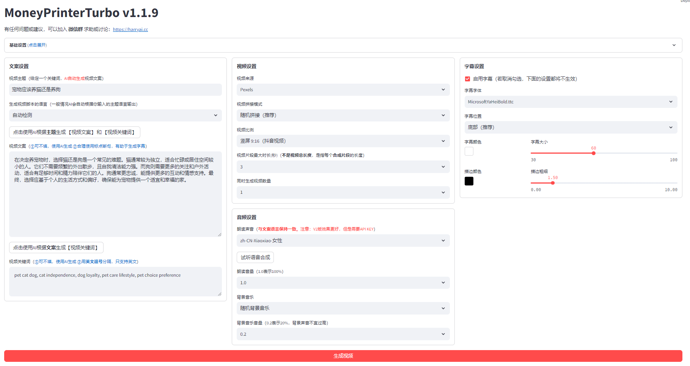

+++
title = '[AI MoneyPrinterTurbo] One-Click Video Creation, The Super Money Printer'
date = 2024-06-26T16:24:00+08:00
draft = false
categories = ['AI', 'Video Generation']
tags = ['AI', 'Video Generation', 'MoneyPrinterTurbo']
description = 'Embark on a journey to explore MoneyPrinterTurbo, a video generation tool that allows you to experience the entire process from installation to configuration to creating high-definition short videos with just one click.'
keywords = ['AI', 'Video Generation', 'MoneyPrinterTurbo', 'HD Short Videos', 'One-Click Creation']
+++

Today, we're embarking on an exploration journey of **MoneyPrinterTurbo**, a video generation tool designed to make video creation easy and fun.

## The Beginning of the Story

Imagine providing just a video topic or keyword, and the rest—video script, footage, subtitles, background music—is all automatically generated, culminating in a high-definition short video. This sounds like magic, but **MoneyPrinterTurbo** makes it a reality.

## Installation and Configuration

Our journey begins with installation. First, we need to install **ImageMagick**, a powerful image processing tool:

```bash
sudo apt-get install imagemagick
```

Next, we clone the **MoneyPrinterTurbo** repository and set up the Python environment:

```bash
git clone   
cd MoneyPrinterTurbo
conda create -n MoneyPrinterTurbo python=3.10
conda activate MoneyPrinterTurbo
pip install -r requirements.txt
```

In the **config.toml** file, you need to configure the following to kickstart your video creation journey:

- pexels_api_keys
- llm_provider
- llm api keys

## Launching the Application

Now, you can launch your video creation engine via the UI or API:

- UI interface:
  ```bash
  sh webui.sh
  ```
- API interface:
  ```bash
  python main.py
  ```

The interface is clear, and the operation is simple. It's truly just inputting a topic and everything else is generated with one click.



## Witnessing the Miracle

Finally, let's take a look at the generated video. The effect is quite standard.



## Principle

The principle seems quite simple:

- You provide a theme, the LLM generates descriptions and keywords.
- Videos and images are downloaded from platforms like Pexels and Pixabay.
- TTS generates speech.
- Subtitles are added.
- Background music is selected from a few default options.

In the end, all these elements are combined to complete the video.

## Conclusion

At this stage, AI can only achieve this level. It seems there's still much work to be done.

---

- [github](https://github.com/harry0703/MoneyPrinterTurbo)
- [AI Blog - Learn AI from scratch](https://ai-blog.aihub2022.top/post/ai-moneyprinterturbo-intro/)
