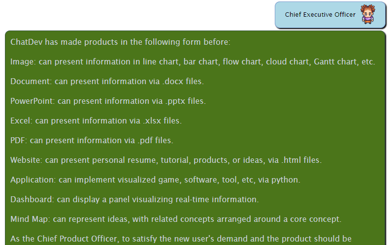
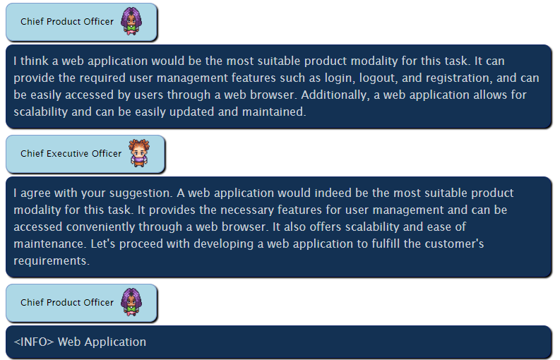
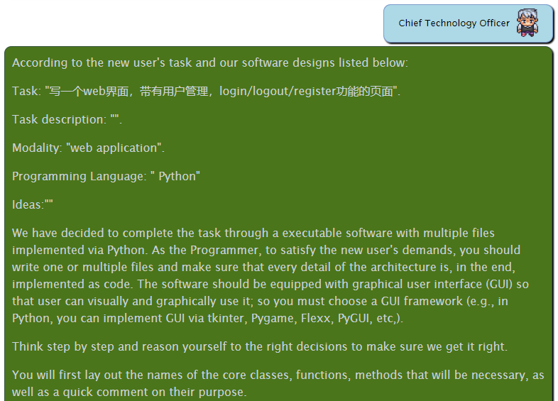
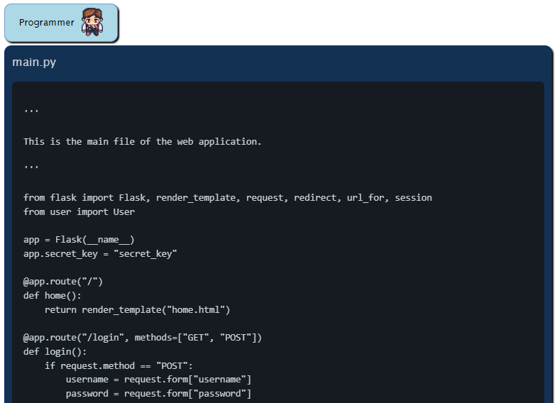
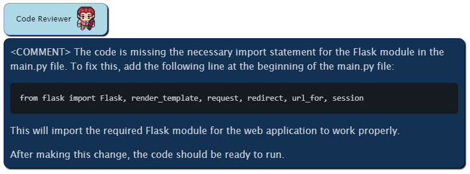
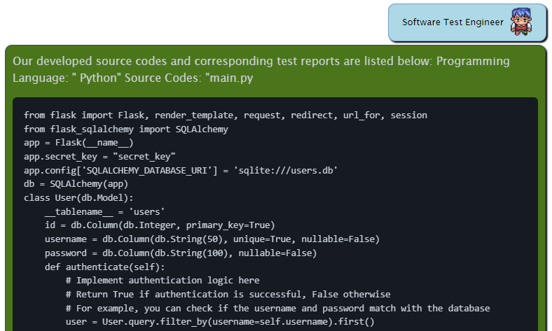
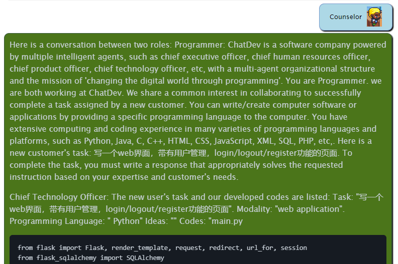
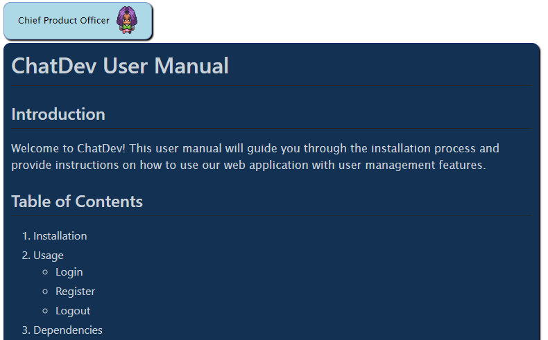
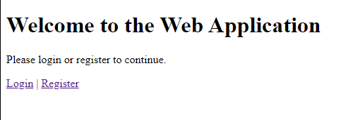

+++
title = '[AI ChatDev] 你当投资人，让AI帮你在几分钟内完成程序开发'
date = 2024-04-04T13:11:21+08:00
draft = false
categories = ['AI', 'AI程序员']
tags = ['AI', 'AI程序员', 'ChatDev']
description = "ChatDev是一家虚拟软件公司，通过各种智能代理扮演不同的角色，包括首席执行官、首席产品官、首席技术官、程序员、评审员、测试员、艺术设计师。本文介绍了ChatDev的安装、使用效果和高级技能，以及如何分享您的软件。"
keywords = ["ChatDev", "软件开发", "交流代理", "智能代理", "虚拟软件公司", "多智能体组织", "LLMs", "易于使用", "可定制", "可扩展"]
+++

最近，斯坦福大学教授吴恩达分享了一些他对Agent的看法。提到了Agentic Workflow。接着，提到了四种设计模式。

- Reflection
- Tool use
- Planning
- Multi-agent collaboration

在Multi-agent collaboration中，提到了ChatDev。今天，我们一起来看下ChatDev。

ChatDev的安装比较简单，详细步骤看下文。我们这里直接看使用效果。

# 简单的web登录功能

## 开发

我们想让ChatDev写一个简单的web登录功能，包含登录、登出、注册功能。

```bash
python run.py --name "demo" --task "写一个web界面，带有用户管理，login/logout/register功能的页面"
```

然后程序就开始运行了。。。

CEO，CPO，CTO相继出马给你干活。。。你是投资人，他们都是打工人。。。







需求分析，技术方案确定后，程序员开始写代码。。。



代码写完，代码审核。。。



循环几次，dev，review。。。

之后，软件测试。。。也是n轮。。。



顾问给意见。。。



CPO把用户手册都写了。。。



整个过程，5分钟，程序就开发完了。。。

## 运行 Error

程序写完了，试下，看看有没有问题。

发现了3个问题：

1. 代码报错

原来是flask版本太老，更新至最新版本

2. RuntimeError: Working outside of application context.
    This typically means that you attempted to use functionality that needed
    the current application. To solve this, set up an application context
    with app.app_context(). See the documentation for more information.

代码报错，修改一下，搞定。

3. jinja2.exceptions.TemplateNotFound: home.html

新建templates目录，将html模板移至其中

人工解决3个问题后，程序终于正常运行。

## 展示

功能都正常，还有db，强大。




---

最后，我们来看下ChatDev的readme文档，其中包含安装步骤

# 软件开发中的交流代理


## 📖 概览

- **ChatDev** 是一家**虚拟软件公司**，通过各种**智能代理**扮演不同的角色，包括首席执行官、首席产品官、首席技术官、程序员、评审员、测试员、艺术设计师。这些代理形成了一个多智能体组织结构，并且他们的使命是通过编程"彻底改变数字世界"。ChatDev 内部的代理通过参加专门的功能研讨会来**协作**，包括设计、编码、测试和文档编写等任务。
- ChatDev 的主要目标是提供一个基于大型语言模型（LLMs）的**易于使用**、**高度可定制**和**可扩展**的框架，这个框架为研究集体智能提供了一个理想的场景。


## 🎉 新闻
* **2024年1月25日：我们已经将经验共同学习模块整合到ChatDev中。请查看[经验共同学习指南](wiki.md#co-tracking)。**
* 2023年12月28日：我们提出了经验共同学习，这是一种创新方法，其中教师和助教代理积累了以快捷方式为导向的经验，以有效地解决新任务，减少重复错误并提高效率。在 https://arxiv.org/abs/2312.17025 查看我们的预印本论文，这项技术很快将整合到ChatDev中。
* 2023年11月15日：我们将ChatDev作为一种SaaS平台推出，该平台使软件开发人员和创新企业家能够以极低的成本和准入门槛高效构建软件。在 https://chatdev.modelbest.cn/ 尝试它。
* 2023年11月2日：ChatDev现在支持一个新功能：增量开发，允许代理在现有代码的基础上开发。尝试 `--config "incremental" --path "[source_code_directory_path]"` 来启动它。
* 2023年10月26日：ChatDev现在支持Docker以进行安全执行（感谢[ManindraDeMel](https://github.com/ManindraDeMel)的贡献）。请查看[Docker入门指南](wiki.md#docker-start)。
- 2023年9月25日：**Git**模式现已可用，使程序员能够利用Git进行版本控制。要启用此功能，只需在``ChatChainConfig.json``中将``"git_management"``设置为``"True"``。请参阅[指南](wiki.md#git-mode)。
- 2023年9月20日：**人-代交互**模式现已可用！您可以通过扮演评审员的角色并向程序员提出建议来参与ChatDev团队；尝试``python3 run.py --task [description_of_your_idea] --config "Human"``。请参阅[指南](wiki.md#human-agent-interaction)和[示例](WareHouse/Gomoku_HumanAgentInteraction_20230920135038)。
- 2023年9月1日：**艺术**模式现已可用！您可以激活设计师代理生成软件中使用的图像；尝试``python3 run.py --task [description_of_your_idea] --config "Art"``。请参阅[指南](wiki.md#art)和[示例](WareHouse/gomokugameArtExample_THUNLP_20230831122822)。
- 2023年8月28日：系统已公开可用。
- 2023年8月17日：v1.0.0版本已准备就绪发布。
- 2023年7月30日：用户可以自定义ChatChain、Phase和Role设置。此外，现在支持在线日志模式和回放模式。
- 2023年7月16日：与该项目相关的[预印本论文](https://arxiv.org/abs/2307.07924)已发表。
- 2023年6月30日：ChatDev存储库的初始版本已发布。

## ❓ ChatDev能做什么？




## ⚡️ 快速入门

### 💻️ 通过Web进行快速入门

访问网页进行可视化和配置使用：https://chatdev.modelbest.cn/

### 🖥️ 通过终端进行快速入门

要开始使用，请按照以下步骤进行操作：

1. **克隆GitHub存储库：** 使用以下命令克隆存储库：

   ```
   git clone https://github.com/OpenBMB/ChatDev.git
   ```

2. **设置Python环境：** 确保您拥有版本为3.9或更高的Python环境。您可以使用以下命令创建和激活此环境，将`ChatDev_conda_env`替换为您喜欢的环境名称：

   ```
   conda create -n ChatDev_conda_env python=3.9 -y
   conda activate ChatDev_conda_env
   ```

3. **安装依赖项：** 进入`ChatDev`目录，并通过运行以下命令安装所需的依赖项：

   ```
   cd ChatDev
   pip3 install -r requirements.txt
   ```

4. **设置OpenAI API密钥：** 将您的OpenAI API密钥导出为环境变量。将`"your_OpenAI_API_key"`替换为您的实际API密钥。请注意，此环境变量是会话特定的，因此如果您打开新的终端会话，则需要再次设置它。
   在Unix/Linux中：

   ```
   export OPENAI_API_KEY="your_OpenAI_API_key"
   ```

   在Windows中：

   ```
   $env:OPENAI_API_KEY="your_OpenAI_API_key"
   ```

5. **构建您的软件：** 使用以下命令启动构建您的软件，将`[description_of_your_idea]`替换为您的想法描述，将`[project_name]`替换为您想要的项目名称。
   在Unix/Linux中：

   ```
   python3 run.py --task "[description_of_your_idea]" --name "[project_name]"
   ```

   在Windows中：

   ```
   python run.py --task "[description_of_your_idea]" --name "[project_name]"
   ```

6. **运行您的软件：** 生成后，您可以在`WareHouse`目录下找到您的软件，位于特定项目文件夹中，例如`project_name_DefaultOrganization_timestamp`。在该目录中使用以下命令运行您的软件：
   在Unix/Linux中：

   ```
   cd WareHouse/project_name_DefaultOrganization_timestamp
   python3 main.py
   ```

   在Windows中：

   ```
   cd WareHouse/project_name_DefaultOrganization_timestamp
   python main.py
   ```

### 🐳 通过Docker进行快速入门

- 我们感谢[ManindraDeMel](https://github.com/ManindraDeMel)提供的Docker支持。请参阅[Docker入门指南](wiki.md#docker-start)。

## ✨️ 高级技能

欲了解更详细的信息，请参阅我们的[Wiki](wiki.md)，您可以找到：

- 所有命令运行参数的介绍。
- 设置本地Web可视化演示的简明指南，可可视化实时日志、回放日志和ChatChain。
- ChatDev框架的概述。
- ChatChain配置中所有高级参数的全面介绍。
- 自定义ChatDev的指南，包括：
  - ChatChain：设计自己的软件开发流程（或任何其他流程），例如``需求分析 -> 编码 -> 测试 -> 手动``。
  - Phase：在ChatChain中设计自己的阶段，比如``需求分析``。
  - Role：定义公司中各种代理人，比如``首席执行官``。

## 🤗 分享您的软件

**代码**: 我们对您对参与我们的开源项目感兴趣感到非常兴奋。如果您遇到任何问题，请毫不犹豫地报告它们。如果您有任何疑问或准备与我们分享您的工作，请随时创建拉取请求！我们非常重视您的贡献。如果您需要其他帮助，请告诉我！

**公司**: 创建自己定制的"ChatDev公司"轻而易举。这个个性化设置涉及三个简单的配置JSON文件。请查看``CompanyConfig/Default``目录中提供的示例。有关自定义的详细说明，请参阅我们的[Wiki](wiki.md)。

**软件**: 每当您使用ChatDev开发软件时，都会生成一个相应的文件夹，其中包含所有必要的信息。与我们分享您的工作就像创建一个拉取请求一样简单。以下是一个示例：执行命令``python3 run.py --task "设计一个2048游戏" --name "2048"  --org "THUNLP" --config "Default"``。这将创建一个软件包并生成一个名为``/WareHouse/2048_THUNLP_timestamp``的文件夹。其中，您将找到：

- 与2048游戏软件相关的所有文件和文档
- 负责此软件的公司的配置文件，包括来自``CompanyConfig/Default``的三个JSON配置文件
- 详细的日志，记录了软件构建过程，可用于回放（``timestamp.log``）
- 用于创建此软件的初始提示（``2048.prompt``）

**查看社区贡献的软件[在此](Contribution.md)!**

## 👨‍💻‍ 贡献者

[](https://github.com/OpenBMB/ChatDev/graphs/contributors)


由 [contrib.rocks](https://contrib.rocks) 制作。

## 🔎 引用

```
@misc{qian2023communicative,
      title={软件开发中的交流代理},
      author={Chen Qian and Xin Cong and Wei Liu and Cheng Yang and Weize Chen and Yusheng Su and Yufan Dang and Jiahao Li and Juyuan Xu and Dahai Li and Zhiyuan Liu and Maosong Sun},
      year={2023},
      eprint={2307.07924},
      archivePrefix={arXiv},
      primaryClass={cs.SE}
}

@misc{qian2023experiential,
      title={软件开发代理的经验共同学习}, 
      author={Chen Qian and Yufan Dang and Jiahao Li and Wei Liu and Weize Chen and Cheng Yang and Zhiyuan Liu and Maosong Sun},
      year={2023},
      eprint={2312.17025},
      archivePrefix={arXiv},
      primaryClass={cs.CL}
}
```

## ⚖️ 许可

- 源代码许可：我们项目的源代码根据Apache 2.0许可证进行许可。该许可证允许使用、修改和分发代码，但需遵守Apache 2.0许可证中规定的某些条件。
- 数据许可：我们项目中使用的相关数据根据CC BY-NC 4.0许可证进行许可。该许可证明确允许数据的非商业使用。我们要强调，使用这些数据集训练的任何模型都应严格遵守非商业使用限制，并且应仅用于研究目的。

## 📬 联系

如果您有任何问题、反馈或想要联系我们，请随时通过电子邮件 [chatdev.openbmb@outlook.com](mailto:chatdev.openbmb@outlook.com) 联系我们。

---

- [官网](https://github.com/OpenBMB/ChatDev)
- 本文
    - [AI 博客 - 从零开始学AI](https://ai-blog.aihub2022.top/post/ai-chatdev-intro/)
    - [微信 - 从零开始学AI](https://mp.weixin.qq.com/s?__biz=MzA3MDIyNTgzNA==&mid=2649976783&idx=1&sn=9dfcac76ae2c0f7396f9e1e1b7efd5d4&chksm=86c7d50ab1b05c1c3364b27c364b04f2f1d3cd4992f1757c0d04f3a7aa566b2b317c274af342#rd)
    - [CSDN - 从零开始学AI](https://blog.csdn.net/mahone3297/article/details/137424700)
    - [知乎 - 从零开始学AI](https://zhuanlan.zhihu.com/p/690921503)