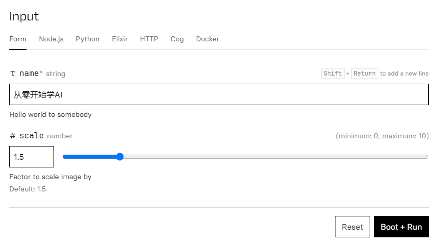
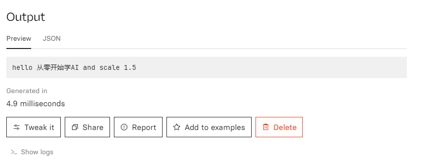

+++
title = '[AI Cog] Want to Run an AI Business but Lack a GPU? Can't Set Up the Environment? Use Cog to Easily Deploy Your Business to the Cloud'
date = 2024-07-16T14:24:34+08:00
draft = false
categories = ['AI', 'Cog']
tags = ['AI', 'Cog']
description = 'Explore how to deploy your AI business to the cloud using Cog, achieving serverless deployment without a GPU.'
keywords = ['AI', 'Cog', 'No GPU', 'Cloud Deployment', 'Serverless']
+++

When you want to start an AI business but lack a GPU, what should you do?

Consider using Cog to deploy AI services to the cloud, serverless.

Let's see how to use Cog to get it on the cloud.

Find a development server.

## Cog
### Installation

```bash
sudo curl -o /usr/local/bin/cog -L https://github.com/replicate/cog/releases/latest/download/cog_`uname -s`_`uname -m`
sudo chmod +x /usr/local/bin/cog
```

### Verification
This step is optional, mainly to verify if your environment is okay.

```bash
sudo cog predict r8.im/stability-ai/stable-diffusion@sha256:f178fa7a1ae43a9a9af01b833b9d2ecf97b1bcb0acfd2dc5dd04895e042863f1 -i prompt="a pot of gold"
```

## Initialization

```bash
cog init
```

Generate the main files.

```bash
├── cog.yaml # Similar to Docker file, defining the environment
├── predict.py # Inference code
```

## Writing Code

Modify the code as follows.

`cog.yaml` is similar to a Docker file, defining the environment.

```yaml
# Configuration for Cog ⚙️
# Reference: https://cog.run/yaml

build:
  # set to true if your model requires a GPU
  gpu: false

  # a list of ubuntu apt packages to install
  # system_packages:
  #   - "libgl1-mesa-glx"
  #   - "libglib2.0-0"

  # python version in the form '3.11' or '3.11.4'
  python_version: "3.10"

  # a list of packages in the format <package-name>==<version>
  # python_packages:
  #   - "numpy==1.19.4"
  #   - "torch==1.8.0"
  #   - "torchvision==0.9.0"

  # commands run after the environment is setup
  # run:
  #   - "echo env is ready!"
  #   - "echo another command if needed"

# predict.py defines how predictions are run on your model
predict: "predict.py:Predictor"
```

`predict.py` defines the inputs (name: str, scale: float), outputs (str), and the inference process.

```python
# Prediction interface for Cog ⚙️
# https://cog.run/python

from cog import BasePredictor, Input, Path

class Predictor(BasePredictor):
    def setup(self) -> None:
        """Load the model into memory to make running multiple predictions efficient"""
        # self.model = torch.load("./weights.pth")

    def predict(
        self,
        name: str = Input(description="Your name"),
        # image: Path = Input(description="Grayscale input image"),
        scale: float = Input(
            description="Factor to scale image by", ge=0, le=10, default=1.5
        ),
    ) -> str:
        """Run a single prediction on the model"""
        # processed_input = preprocess(image)
        # output = self.model(processed_image, scale)
        # return postprocess(output)
        return "hello " + name + " and scale " + str(scale)
```

## Local Testing

Test it out.

```bash
cog predict -i name=Learn AI from Scratch
```

Output.

```bash
Starting Docker image cog-git-base and running setup()...
Running prediction...
hello Learn AI from Scratch and scale 1.5
```

## Deployment

On the cloud [create model](https://replicate.com/create)

Push the model to the cloud.

```bash
cog login
cog push r8.im/<your-username>/<your-model-name>
```

## Cloud Testing





Test successful!

Afterwards, you can call it via API.

## Conclusion

This article demonstrates the entire process of using Cog to deploy to the cloud.

The example does not use a GPU. Check the documentation if needed.

---

- [get-a-gpu-machine](https://replicate.com/docs/guides/get-a-gpu-machine)
    - [cog.run](https://cog.run/)
    - [cog github](https://github.com/replicate/cog)
    - [container-toolkit](https://docs.nvidia.com/datacenter/cloud-native/container-toolkit/latest/install-guide.html)
- [push-a-model](https://replicate.com/docs/guides/push-a-model)
    - [docker install](https://docs.docker.com/engine/install/ubuntu/)

---

<!-- - [AI Blog - Learn AI from Scratch](...) -->
<!-- - [WeChat Public Account - Learn AI from Scratch](...) -->
<!-- - [CSDN - Learn AI from Scratch](...) -->
<!-- - [Juejin - Learn AI from Scratch](...) -->
<!-- - [Zhihu - Learn AI from Scratch](...) -->
<!-- - [Alibaba Cloud - Learn AI from Scratch](...) -->
<!-- - [Tencent Cloud - Learn AI from Scratch](...) -->
