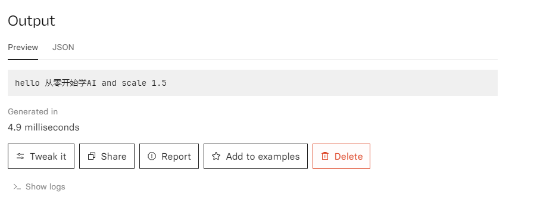

+++
title = '[AI Cog] 想要运营AI业务，但没有GPU？环境搞不定？使用Cog帮您轻松将业务部署上云'
date = 2024-07-16T14:24:34+08:00
draft = false
categories = ['AI', 'Cog']
tags = ['AI', 'Cog']
description = '探索如何在没有GPU的情况下，通过使用Cog将AI业务部署到云上，实现serverless部署。'
keywords = ['AI', 'Cog', '无GPU', '云部署', 'serverless']
+++

当你想开展AI业务，却没有GPU，你该怎么办？

可以考虑用Cog，将AI服务部署在云上，serverless。

我们来看下，如何用Cog将其上云。

找一台开发服务器

## Cog
### 安装

```bash
sudo curl -o /usr/local/bin/cog -L https://github.com/replicate/cog/releases/latest/download/cog_`uname -s`_`uname -m`
sudo chmod +x /usr/local/bin/cog
```

### 验证
这一步可以省略，非必须。主要用于验证你的环境是否ok。

```bash
sudo cog predict r8.im/stability-ai/stable-diffusion@sha256:f178fa7a1ae43a9a9af01b833b9d2ecf97b1bcb0acfd2dc5dd04895e042863f1 -i prompt="a pot of gold"
```

## 初始化

```bash
cog init
```

生成主要文件

```bash
├── cog.yaml # 类似 docker file，定义环境
├── predict.py # 推理代码
```

## 写代码

修改代码如下

`cog.yaml` 类似 docker file，定义环境

```yaml
# Configuration for Cog ⚙️
# Reference: https://cog.run/yaml

build:
  # set to true if your model requires a GPU
  gpu: false

  # a list of ubuntu apt packages to install
  # system_packages:
  #   - "libgl1-mesa-glx"
  #   - "libglib2.0-0"

  # python version in the form '3.11' or '3.11.4'
  python_version: "3.10"

  # a list of packages in the format <package-name>==<version>
  # python_packages:
  #   - "numpy==1.19.4"
  #   - "torch==1.8.0"
  #   - "torchvision==0.9.0"

  # commands run after the environment is setup
  # run:
  #   - "echo env is ready!"
  #   - "echo another command if needed"

# predict.py defines how predictions are run on your model
predict: "predict.py:Predictor"
```

`predict.py` 定义了输入(name: str, scale: float)，输出(str)，推理过程

```python
# Prediction interface for Cog ⚙️
# https://cog.run/python

from cog import BasePredictor, Input, Path

class Predictor(BasePredictor):
    def setup(self) -> None:
        """Load the model into memory to make running multiple predictions efficient"""
        # self.model = torch.load("./weights.pth")

    def predict(
        self,
        name: str = Input(description="Your name"),
        # image: Path = Input(description="Grayscale input image"),
        scale: float = Input(
            description="Factor to scale image by", ge=0, le=10, default=1.5
        ),
    ) -> str:
        """Run a single prediction on the model"""
        # processed_input = preprocess(image)
        # output = self.model(processed_image, scale)
        # return postprocess(output)
        return "hello " + name + " and scale " + str(scale)
```

## 本地测试

测试一下

```bash
cog predict -i name=从零开始学AI
```

输出

```bash
Starting Docker image cog-git-base and running setup()...
Running prediction...
hello 从零开始学AI and scale 1.5
```

## 部署

在云上 [create model](https://replicate.com/create)

push model 到云上

```bash
cog login
cog push r8.im/<your-username>/<your-model-name>
```

## 云上测试




测试成功！

之后，就可以用 api 调用

## 结论

本文主要演示如何用 Cog 上云的整个流程。

文中的例子，未使用 GPU 。如有需要，可查文档。

---

- [get-a-gpu-machine](https://replicate.com/docs/guides/get-a-gpu-machine)
    - [cog.run](https://cog.run/)
    - [cog github](https://github.com/replicate/cog)
    - [container-toolkit](https://docs.nvidia.com/datacenter/cloud-native/container-toolkit/latest/install-guide.html)
- [push-a-model](https://replicate.com/docs/guides/push-a-model)
    - [docker install](https://docs.docker.com/engine/install/ubuntu/)

---

<!-- - [AI 博客 - 从零开始学AI](...) -->
<!-- - [AI Blog - Learn AI from scratch](...) -->
<!-- - [公众号 - 从零开始学AI](...) -->
<!-- - [CSDN - 从零开始学AI](...) -->
<!-- - [掘金 - 从零开始学AI](...) -->
<!-- - [知乎 - 从零开始学AI](...) -->
<!-- - [阿里云 - 从零开始学AI](...) -->
<!-- - [腾讯云 - 从零开始学AI](...) -->
