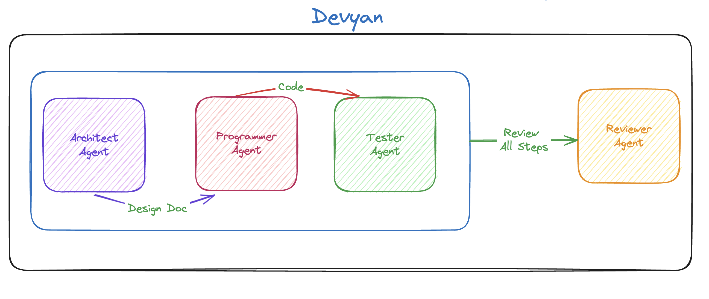

+++
title = '[AI Programmer Devyan] Finally Found Someone to Write Code for Me'
date = 2024-07-12T13:02:30+08:00
draft = false
categories = ['AI', 'CrewAI']
tags = ['AI', 'AI Programmer', 'Devyan', 'CrewAI']
description = 'Learn how Devyan, an AI-driven programming assistant, simplifies and optimizes the software development process by coordinating multiple roles.'
keywords = ['AI', 'Artificial Intelligence', 'Programming Assistant', 'Software Development', 'Devyan', 'crewai']
+++

Today, let's take a look at a project, Devyan.

## Overview

Devyan is an AI-driven software development assistant that coordinates a group of agents to solve programming tasks. It uses OpenAI's GPT-based agents to perform various roles such as architecture design, implementation, testing, and review.

## Features
- Architect Agent: Designs the solution architecture based on user input.
- Programmer Agent: Implements the solution according to the architecture design.
- Tester Agent: Tests the implemented solution to ensure it meets requirements and is error-free.
- Reviewer Agent: Reviews the architecture, implementation, and testing results, providing comprehensive analysis.



## Installation

```bash
git clone https://github.com/your-username/devain.git
cd devain

python -m venv venv
source venv/bin/activate  # On Windows use `venv\Scripts\activate`

pip install -r requirements.txt
```

`.env` file
```conf
OPENAI_API_KEY=your_openai_api_key_here
SERPER_API_KEY=your_serper_api_key_here
```

## Usage

```bash
python main.py
```

## Highlights

- Utilizes the `crewai` framework
- Creates four roles (Architect, Programmer, Tester, Reviewer) based on business needs

---

- [github](https://github.com/theyashwanthsai/Devyan)
- [AI Blog - Learn AI from scratch](https://ai-blog.aihub2022.top/post/ai-programmer-devyan-intro/)
<!-- - [WeChat Official Account - Learn AI from scratch](...) -->
<!-- - [CSDN - Learn AI from scratch](...) -->
<!-- - [Juejin - Learn AI from scratch](...) -->
<!-- - [Zhihu - Learn AI from scratch](...) -->
<!-- - [Alibaba Cloud - Learn AI from scratch](...) -->
<!-- - [Tencent Cloud - Learn AI from scratch](...) -->
