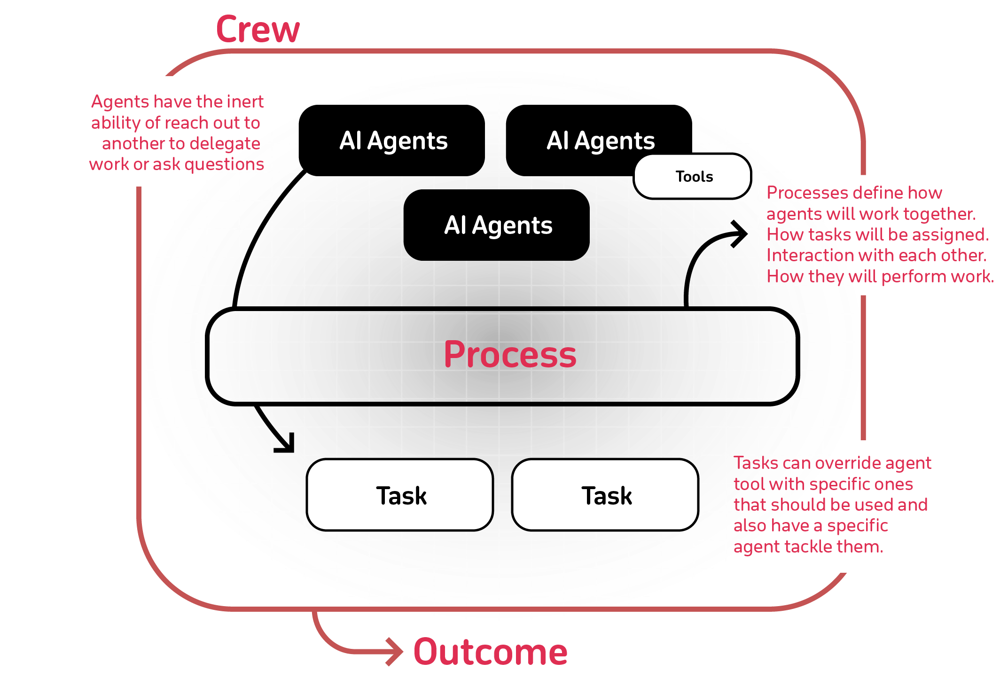

+++
title = '[AI CrewAI] 组建AI团队，协作AI Agent完成任务'
date = 2024-07-13T12:43:34+08:00
draft = false
categories = ['AI', 'CrewAI']
tags = ['AI', 'CrewAI']
description = "了解如何通过CrewAI实现AI代理的协同工作，提升生产力和效率。CrewAI为构建智能助手平台、自动化客户服务组合以及多代理研究团队提供了坚实的基础。"
keywords = ["AI", "CrewAI", "AI代理", "自动化", "智能助手"]
+++

## 为什么要使用CrewAI？
AI协作的力量不容小觑。CrewAI旨在让AI代理能够扮演角色、共享目标并作为一个协调的单元运作——就像一支训练有素的团队。无论您是在构建智能助手平台、自动化客户服务组合，还是多代理研究团队，CrewAI都提供了复杂多代理交互的基础。

## 开始

### 安装

```bash
pip install crewai
pip install crewai[tools]
```

### 代码

```python
import os
from crewai import Agent, Task, Crew, Process
from crewai_tools import SerperDevTool

os.environ["OPENAI_API_KEY"] = "YOUR_API_KEY"
os.environ["SERPER_API_KEY"] = "Your Key" # serper.dev API key

# You can choose to use a local model through Ollama for example. See https://docs.crewai.com/how-to/LLM-Connections/ for more information.

# os.environ["OPENAI_API_BASE"] = 'http://localhost:11434/v1'
# os.environ["OPENAI_MODEL_NAME"] ='openhermes'  # Adjust based on available model
# os.environ["OPENAI_API_KEY"] ='sk-111111111111111111111111111111111111111111111111'

# You can pass an optional llm attribute specifying what model you wanna use.
# It can be a local model through Ollama / LM Studio or a remote
# model like OpenAI, Mistral, Antrophic or others (https://docs.crewai.com/how-to/LLM-Connections/)
#
# import os
# os.environ['OPENAI_MODEL_NAME'] = 'gpt-3.5-turbo'
#
# OR
#
# from langchain_openai import ChatOpenAI

search_tool = SerperDevTool()

# Define your agents with roles and goals
researcher = Agent(
  role='Senior Research Analyst',
  goal='Uncover cutting-edge developments in AI and data science',
  backstory="""You work at a leading tech think tank.
  Your expertise lies in identifying emerging trends.
  You have a knack for dissecting complex data and presenting actionable insights.""",
  verbose=True,
  allow_delegation=False,
  # You can pass an optional llm attribute specifying what model you wanna use.
  # llm=ChatOpenAI(model_name="gpt-3.5", temperature=0.7),
  tools=[search_tool]
)
writer = Agent(
  role='Tech Content Strategist',
  goal='Craft compelling content on tech advancements',
  backstory="""You are a renowned Content Strategist, known for your insightful and engaging articles.
  You transform complex concepts into compelling narratives.""",
  verbose=True,
  allow_delegation=True
)

# Create tasks for your agents
task1 = Task(
  description="""Conduct a comprehensive analysis of the latest advancements in AI in 2024.
  Identify key trends, breakthrough technologies, and potential industry impacts.""",
  expected_output="Full analysis report in bullet points",
  agent=researcher
)

task2 = Task(
  description="""Using the insights provided, develop an engaging blog
  post that highlights the most significant AI advancements.
  Your post should be informative yet accessible, catering to a tech-savvy audience.
  Make it sound cool, avoid complex words so it doesn't sound like AI.""",
  expected_output="Full blog post of at least 4 paragraphs",
  agent=writer
)

# Instantiate your crew with a sequential process
crew = Crew(
  agents=[researcher, writer],
  tasks=[task1, task2],
  verbose=2, # You can set it to 1 or 2 to different logging levels
  process = Process.sequential
)

# Get your crew to work!
result = crew.kickoff()

print("######################")
print(result)
```

## 关键特性
- 基于角色的代理设计：根据特定角色、目标和工具定制代理。
- 自主代理间委托：代理可以自主地委托任务并在彼此之间进行询问，提高问题解决效率。
- 灵活的任务管理：使用可定制工具定义任务，并动态地将它们分配给代理。
- 流程驱动：目前仅支持顺序任务执行和层次化流程，但更复杂的流程（如共识和自主流程）正在开发中。
- 保存输出为文件：将单个任务的输出保存为文件，以便您稍后使用。
- 解析输出为Pydantic或Json：可以将单个任务的输出解析为Pydantic模型或Json，如果您愿意的话。
- 与开源模型兼容：使用Open AI或开源模型运行您的团队，请参阅将crewAI连接到LLMs页面，了解有关配置代理与模型连接的详细信息，甚至包括在本地运行的模型！



## CrewAI与其它产品的比较
- Autogen：虽然Autogen在创建能够协同工作的对话代理方面做得很好，但它缺乏固有的流程概念。在Autogen中，协调代理之间的交互需要额外的编程，随着任务规模的增长，这可能会变得复杂和笨重。
- ChatDev：ChatDev将流程的概念引入到AI代理领域，但其实现相当僵硬。ChatDev的定制化有限，并不适合生产环境，这可能会阻碍现实世界应用中的可扩展性和灵活性。

CrewAI的优势：CrewAI是专为生产环境设计的。它提供了与Autogen对话代理相当的灵活性，以及ChatDev的结构化流程方法，但却没有那种僵硬。CrewAI的流程旨在动态和适应性强，无缝融入开发和生产工作流程中。

## 亮点

我们只需要写一些如上的代码，定义一些角色代理(agent)和任务(task)，然后让CrewAI来协调他们，完成任务，达到目的。

这样我们就可以专注于任务本身，而不是代理之间的交互。这是一个非常有趣的概念，我很期待看到CrewAI在未来的发展中能够发挥出更大的作用。

---

- [github](https://github.com/crewAIInc/crewAI)
- https://github.com/joaomdmoura/crewai-examples
<!-- - [AI 博客 - 从零开始学AI](...) -->
<!-- - [AI Blog - Learn AI from scratch](...) -->
<!-- - [公众号 - 从零开始学AI](...) -->
<!-- - [CSDN - 从零开始学AI](...) -->
<!-- - [掘金 - 从零开始学AI](...) -->
<!-- - [知乎 - 从零开始学AI](...) -->
<!-- - [阿里云 - 从零开始学AI](...) -->
<!-- - [腾讯云 - 从零开始学AI](...) -->
