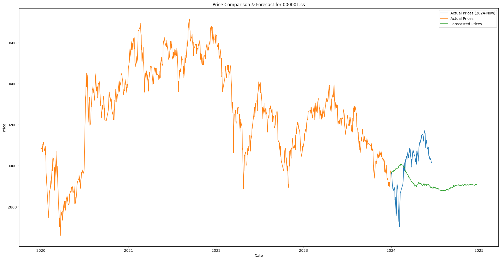
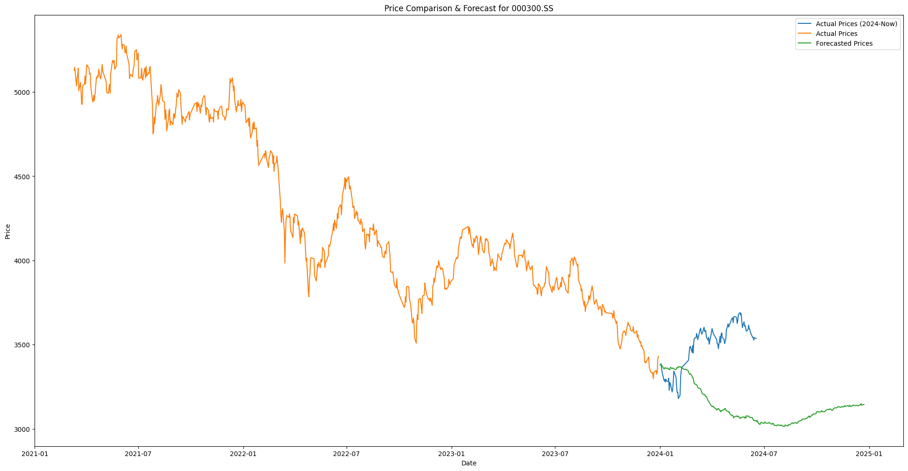

+++
title = '[AI Google] TimesFM: Can AI Predict Stock Prices for Financial Freedom?'
date = 2024-06-18T14:11:41+08:00
draft = false
categories = ['AI', 'Google', 'Timesfm']
tags = ['AI', 'Google', 'Timesfm']
description = 'Exploring Google TimesFM to see if it can predict stock prices and help achieve financial freedom.'
keywords = ['AI', 'Google', 'TimesFM', 'Time Series Forecasting', 'Stock Price Prediction']
+++

Today, I stumbled upon a model named TimesFM, which can predict time series data. This sparked a bold idea: if this model can predict stock prices, could it make me a stock market guru?

## Introduction
TimesFM (Time Series Foundation Model) is a pre-trained model developed by Google Research, specialized in time series forecasting. Its powerful features and potential applications intrigued me deeply.

## Installation
To start using TimesFM, follow these steps to set up the environment:

```bash
conda env create --file=environment.yml
conda env create --file=environment_cpu.yml

conda activate tfm_env
pip install -e .
```

## Code
Here is a complete code example demonstrating how to use the TimesFM model to predict stock prices:

```python
import datetime
import yfinance as yf
import matplotlib.pyplot as plt
import numpy as np
import pandas as pd
import time
from datetime import date
from timesfm import TimesFm
from huggingface_hub import login
import matplotlib.pyplot as plt

# Specify the stock codes, Shanghai stocks end with .ss, Shenzhen stocks end with .sz
start = date(2020, 1, 1)  # Create date object using date class
end = date(2024, 1, 1)  # Set the end date to January 1, 2024
codelist = ["000001.ss"]

# Add error retry mechanism for downloading data
for retry in range(3):  # Try up to 3 times
    try:
        data2 = yf.download(codelist, start=start, end=end)
        # Data preprocessing
        data2 = data2['Adj Close'].dropna()  # Use adjusted close price to remove missing values
        if not data2.empty:
            break  # Successfully downloaded and processed data, exit loop
    except Exception as e:
        print(f"Download failed, attempt {retry+1}. Error: {e}")
        if retry < 2:  # Wait before the final attempt
            time.sleep(5)  # Wait for 5 seconds before retrying

if data2.empty:
    raise ValueError("Data is empty. Please change the time range and try again or check your network connection.")

context_len = 512  # Set context length
horizon_len = 256  # Set prediction period length

if len(data2) < context_len:
    raise ValueError(f"Data length is less than context length ({context_len})")

context_data = data2[-context_len:]  # Use the most recent 512 days of data as context

# Initialize and import the TimesFM model
tfm = TimesFm(
    context_len=context_len,
    horizon_len=horizon_len,
    input_patch_len=32,
    output_patch_len=128,
    num_layers=20,
    model_dims=1280,
    backend='cpu',  # Change here, from 'gpu' to 'cpu'
)

# Log in to Hugging Face Hub, replace ***** with your Hugging token
login("*****")

tfm.load_from_checkpoint(repo_id="google/timesfm-1.0-200m")

# Prepare data
forecast_input = [context_data.values]
frequency_input = [0]  # Set data frequency (0 is high-frequency data)

# Run prediction
point_forecast, experimental_quantile_forecast = tfm.forecast(
    forecast_input,
    freq=frequency_input,
)

# Set chart size to 24*12 inches
plt.figure(figsize=(24, 12))

forecast_dates = pd.date_range(start=data2.index[-1] + pd.Timedelta(days=1), periods=horizon_len, freq='B')
forecast_series = pd.Series(point_forecast[0], index=forecast_dates)

# Additional part: get and plot actual price data from 2024.1.1 to current date
current_date = datetime.datetime.now().date()
data_recent = yf.download(codelist, start=date(2024, 1, 1), end=current_date)

if not data_recent.empty:
    data_recent = data_recent['Adj Close'].dropna()
    plt.plot(data_recent.index, data_recent.values, label="Actual Prices (2024-Now)")

# Create or update the chart (if there was a previous chart, update it here)
plt.plot(data2.index, data2.values, label="Actual Prices")
plt.plot(forecast_series.index, forecast_series.values, label="Forecasted Prices")
plt.xlabel("Date")
plt.ylabel("Price")
plt.title(f"Price Compare & Forecast for {codelist[0]}")
plt.legend()

# Save the chart to a file, ensure the size change is effective
plt.savefig(f'{codelist[0]}_compare.png', bbox_inches='tight') 

# Explicitly close the current chart
plt.close(fig='all')
```

## Example Charts

Finally, I ran predictions for the Shanghai Composite Index and the CSI 300 Index and generated some result charts:





## Conclusion

Although the TimesFM model demonstrated some predictive capabilities, the final results did not meet expectations. It seems that achieving financial freedom through stock price prediction still requires more effort. Perhaps I still need to work hard.

---

- [github](https://github.com/google-research/timesfm)
- [Google Research blog](https://research.google/blog/a-decoder-only-foundation-model-for-time-series-forecasting/)
- [Hugging Face checkpoint repo](https://huggingface.co/google/timesfm-1.0-200m)
- https://github.com/lhw828/timesfm

<!-- - [Original](...) -->
<!-- - [AI Blog - Learn AI from scratch](...) -->
<!-- - [Official Account - Learn AI from scratch](...) -->
<!-- - [CSDN - Learn AI from scratch](...) -->
<!-- - [Juejin - Learn AI from scratch](...) -->
<!-- - [Zhihu - Learn AI from scratch](...) -->
<!-- - [Alibaba Cloud - Learn AI from scratch](...) -->
<!-- - [Tencent Cloud - Learn AI from scratch](...) -->
