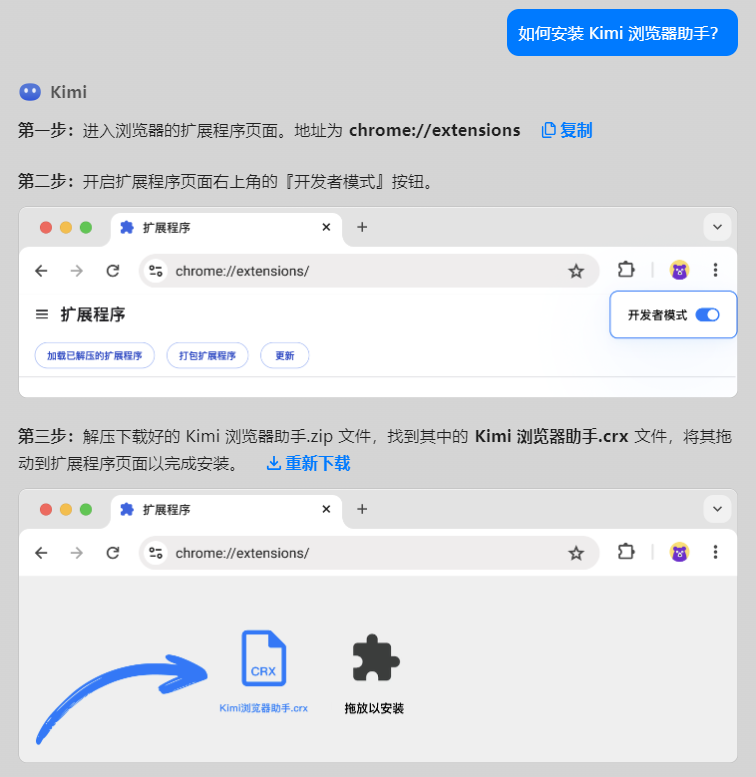

+++
title = '[AI Kimi Extension] Kimi Browser Plugin: Instantly Enhance Your Browsing Experience with AI'
date = 2024-07-09T10:22:12+08:00
draft = false
categories = ['AI']
tags = ['AI']
description = 'The Kimi browser plugin provides an easy installation and usage guide, helping users quickly install the plugin and take advantage of its powerful features, such as text highlighting for questions, article summarization, and inspiration for writing.'
keywords = ['AI', 'browser plugin', 'Kimi', 'text highlighting', 'article summarization', 'inspiration']
+++

The Kimi browser plugin is here, download it at https://kimi.moonshot.cn/extension/download

## Installation

Click "Install Now" to download the software.

After downloading, it is a compressed package `Kimi Browser Assistant.zip`.

The interface will also pop up to guide you through the installation process.

## Usage

### Have a question? Highlight and ask Kimi
Directly select the text you have questions about to get an immediate explanation.

### Reading an article? Summarize with Kimi
Quickly extract key points from long articles.

### Writing a document? Get inspiration from Kimi
Open the sidebar mode and continuously converse with Kimi.

---

<!-- - [AI Blog - Learn AI from scratch](...) -->
<!-- - [Official Account - Learn AI from scratch](...) -->
<!-- - [CSDN - Learn AI from scratch](...) -->
<!-- - [Juejin - Learn AI from scratch](...) -->
<!-- - [Zhihu - Learn AI from scratch](...) -->
<!-- - [Alibaba Cloud - Learn AI from scratch](...) -->
<!-- - [Tencent Cloud - Learn AI from scratch](...) -->
