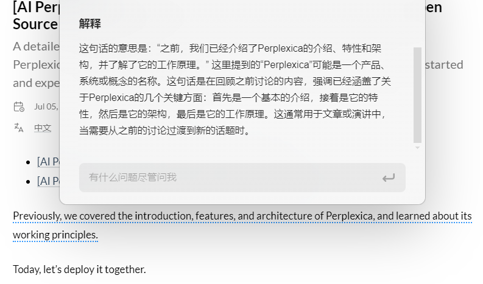

+++
title = '[AI Kimi Extension] Kimi 浏览器插件，让你的浏览体验秒升AI智能'
date = 2024-07-09T10:22:12+08:00
draft = false
categories = ['AI']
tags = ['AI']
description = 'Kimi 浏览器插件提供了方便的安装和使用指南，帮助用户快速安装插件并利用其强大的功能，如划线问答、文章摘要和灵感获取。'
keywords = ['AI', '浏览器插件', 'Kimi', '划线问答', '文章摘要', '灵感获取']
+++

Kimi 浏览器插件来了，下载地址 https://kimi.moonshot.cn/extension/download

## 安装

点击 “立即安装”，将会下载软件。

下载后，是个压缩包 `Kimi 浏览器助手.zip`

界面也会弹出，指导你如何安装。

## 使用

### 有问题，划线问 Kimi
直接选取有疑问的文字立刻获得解释

### 读文章，摘要找 Kimi
快速从长文章中提炼重点内容

### 写文档，灵感找 Kimi
开启侧边栏模式和 Kimi 持续对话

---

- [AI 博客 - 从零开始学AI](https://ai-blog.aihub2022.top/zh/post/ai-kimi-extension/)
- [公众号 - 从零开始学AI](https://mp.weixin.qq.com/s?__biz=MzA3MDIyNTgzNA==&mid=2649977561&idx=1&sn=1c11270a1ce217cbe81ec50723c8dcb3&chksm=86c7c81cb1b0410a8f9a80b664f65d72168826d9786589242266ca975bf63128341082e63482#rd)
<!-- - [CSDN - 从零开始学AI](...) -->
<!-- - [掘金 - 从零开始学AI](...) -->
<!-- - [知乎 - 从零开始学AI](...) -->
<!-- - [阿里云 - 从零开始学AI](...) -->
<!-- - [腾讯云 - 从零开始学AI](...) -->
