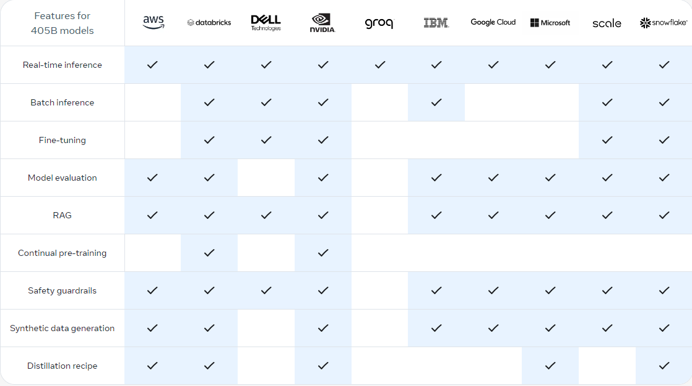
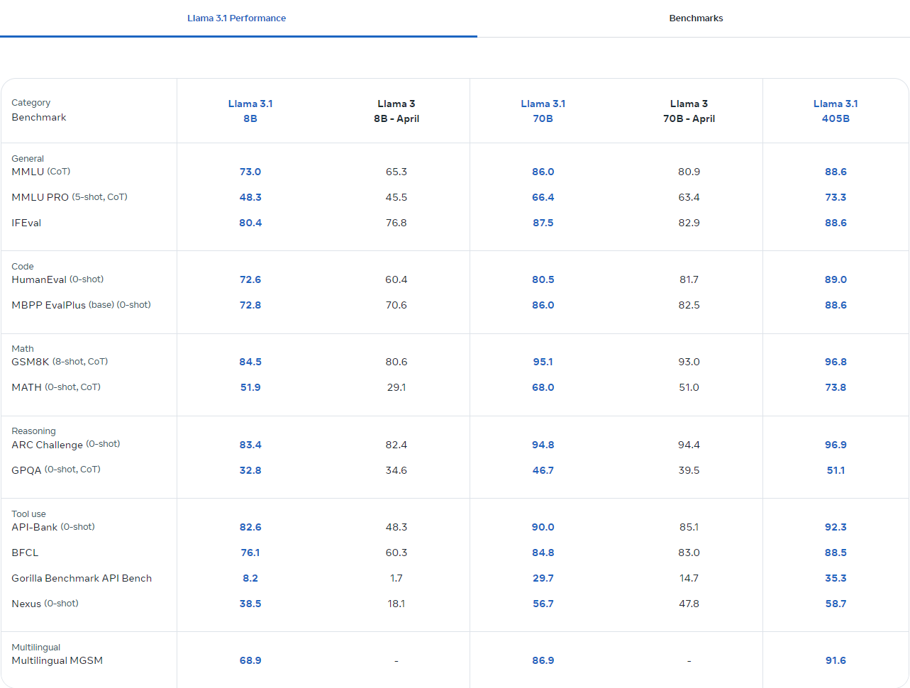
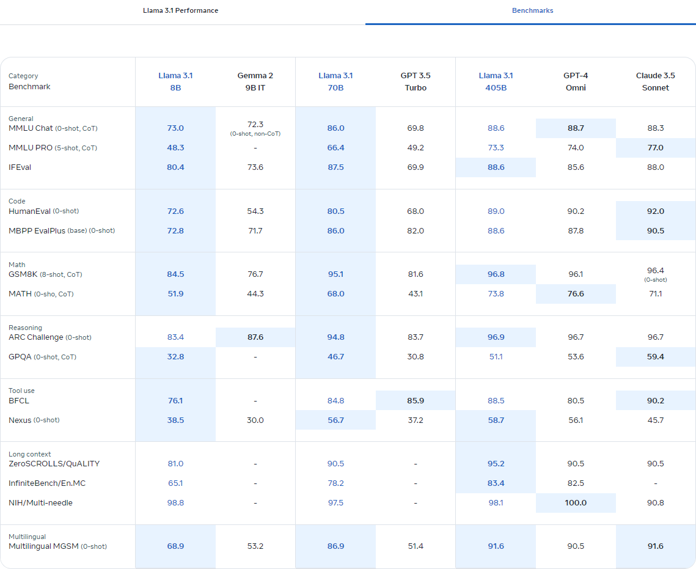
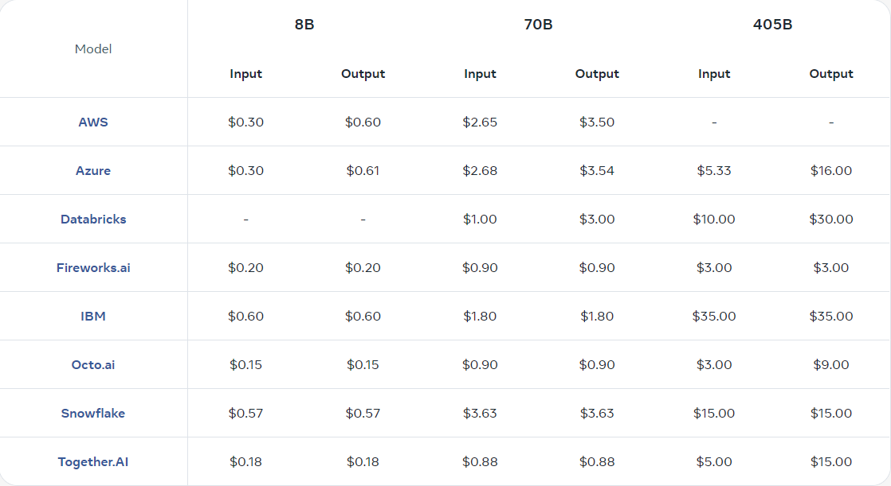

+++
title = '[AI Meta Llama-3.1] Introduction'
date = 2024-07-24T10:10:02+08:00
draft = false
categories = ['AI', 'Meta', 'Llama-3.1']
tags = ['AI', 'Meta', 'Llama-3.1']
description = 'Explore the powerful features of the Meta Llama-3.1 AI model, including multi-version options, key capabilities, custom deployment, and cost optimization strategies.'
keywords = ['AI', 'Meta', 'Llama-3.1', 'open source', 'model fine-tuning', 'deployment', 'cost optimization', 'inference service', 'synthetic data']
+++

This open-source AI model can be fine-tuned, distilled, and deployed anywhere. The latest instruction-tuned models are available in 8B, 70B, and 405B versions.

## Models

- 405B flagship foundational model, supporting the broadest range of use cases.
- 70B high-performing, cost-effective model, supporting various use cases.
- 8B lightweight, ultra-fast model that can run anywhere.

## Key Capabilities

- Tool usage
- Multilingual agent
- Complex reasoning
- Coding assistant

## Make Llama Your Own
Build faster with our open ecosystem by choosing a range of differentiated product services to support your use case.

- Inference Choose between real-time inference or batch inference services. Download model weights to further optimize cost per token.
- Fine-tuning, Distillation, and Deployment Adapt and improve your applications with synthetic data, and deploy locally or in the cloud.
- RAG and Tool Usage Use Llama system components and extend the model with zero-shot tool usage and RAG to build agent-like models.
- Synthetic Data Generation Utilize 405B high-quality data to improve specialized models for specific use cases.

## Quick Start with Partners

## Model Evaluation
Measured on over 150 benchmark datasets covering multiple languages, with extensive human evaluations.

## Model Pricing
As of 2024-07-23 12:00 PST, public pricing for hosting Llama 3.1 inference API is per million tokens. This table will be updated as more pricing information becomes available.

---

- [Llama](https://llama.meta.com/)
<!-- - [AI Blog - Learn AI from scratch](...) -->
<!-- - [Official Account - Learn AI from scratch](...) -->
<!-- - [CSDN - Learn AI from scratch](...) -->
<!-- - [Juejin - Learn AI from scratch](...) -->
<!-- - [Zhihu - Learn AI from scratch](...) -->
<!-- - [Alibaba Cloud - Learn AI from scratch](...) -->
<!-- - [Tencent Cloud - Learn AI from scratch](...) -->