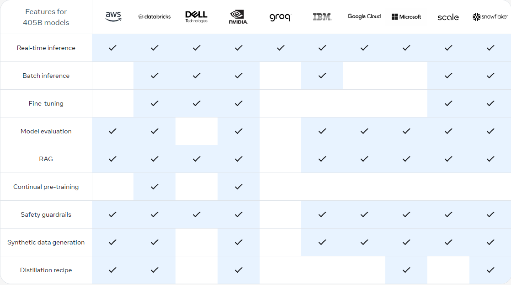
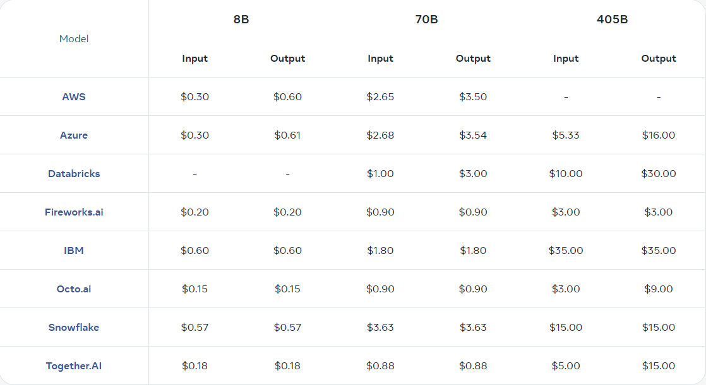

+++
title = '[AI Meta Llama-3.1] 介绍'
date = 2024-07-24T10:10:02+08:00
draft = false
categories = ['AI', 'Meta', 'Llama-3.1']
tags = ['AI', 'Meta', 'Llama-3.1']
description = '探索Meta Llama-3.1 AI模型的强大功能，包括多版本选择、关键能力、自定义部署和成本优化策略。'
keywords = ['AI', 'Meta', 'Llama-3.1', '开源', '模型微调', '部署', '成本优化', '推理服务', '合成数据']
+++

这款开源人工智能模型，你可以进行微调、蒸馏并在任何地方部署。最新的指令调优模型有8B、70B和405B版本可供选择。

## 模型

- 405B 旗舰基础模型，支持最广泛的使用案例。
- 70B 性能卓越、成本效益高的模型，支持多种使用案例。
- 8B 轻量级、超快速的模型，可在任何地方运行。

## 关键能力

- 工具使用
- 多语言代理
- 复杂推理
- 编码助手

## 让羊驼成为你自己的
使用我们的开放生态系统，通过选择一系列差异化的产品服务来更快地构建，以支持你的使用案例。

- 推理 选择实时推理或批量推理服务。下载模型权重以进一步优化每个代币的成本。
- 微调、蒸馏与部署 为你的应用程序进行适应性调整，使用合成数据进行改进，并部署在本地或云端。
- RAG与工具使用 使用羊驼系统组件，并通过零样本工具使用和RAG扩展模型，以构建具有代理行为的模型。
- 合成数据生成 利用405B高质量数据，改进针对特定使用案例的专业模型。

## 快速开始与合作伙伴

## 模型评估
在超过150个基准数据集上进行测量，这些数据集涵盖了多种语言，并经过广泛的人类评估。

## 模型定价
截至2024年7月23日12:00 PST，托管Llama 3.1推理API的公共定价为每百万个令牌。此表格将随着更多定价信息的可用而更新。

---

- [Llama](https://llama.meta.com/)
- [AI 博客 - 从零开始学AI](https://ai-blog.aihub2022.top/zh/post/ai-meta-llama-3-1-intro/)
- [公众号 - 从零开始学AI](https://mp.weixin.qq.com/s?__biz=MzA3MDIyNTgzNA==&mid=2649977663&idx=1&sn=c956c3157be9073e1378c64bcf3f3286&chksm=86c7c9fab1b040ecd43d9d527e840e1973b197af21dbe08b1459e264ad563d47601ca9d643d5#rd)
<!-- - [CSDN - 从零开始学AI](...) -->
<!-- - [掘金 - 从零开始学AI](...) -->
<!-- - [知乎 - 从零开始学AI](...) -->
<!-- - [阿里云 - 从零开始学AI](...) -->
<!-- - [腾讯云 - 从零开始学AI](...) -->
