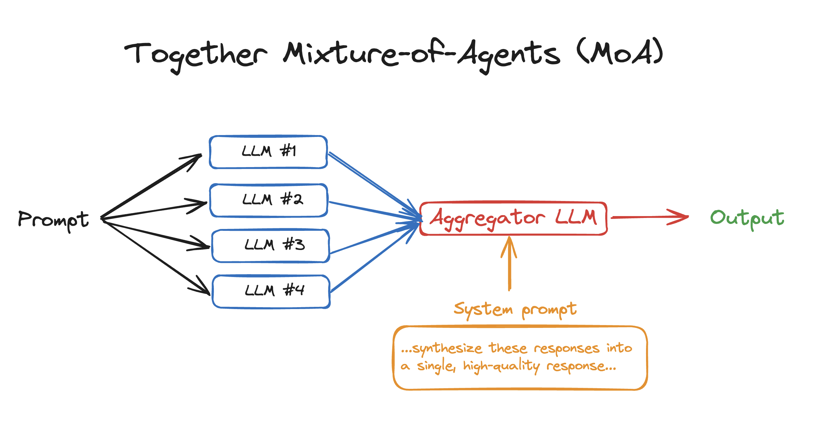
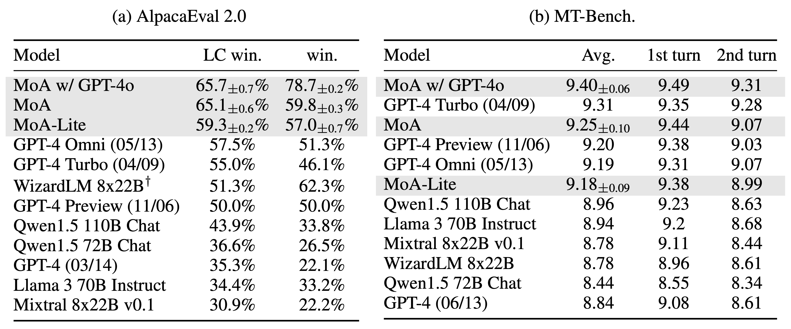

+++
title = '[AI MoA] So This is MoA (Mixture-of-Agents)'
date = 2024-07-10T11:10:13+08:00
draft = false
categories = ['AI', 'MoA']
tags = ['AI', 'MoA']
description = "Introducing a project, Mixture-of-Agents (MoA). MoA is an innovative approach that leverages the collective advantages of multiple LLMs to enhance performance, achieving state-of-the-art results. By adopting a hierarchical architecture with multiple LLM agents at each layer, MoA uses only open-source models and scores 65.1% on AlpacaEval 2.0, significantly outperforming GPT-4 Omni's 57.5%!"
keywords = ["AI", "MoA", "Mixture-of-Agents", "LLM", "AlpacaEval"]
+++

I came across a project today, Mixture-of-Agents (MoA), which opened up a new perspective.

## Introduction

Mixture-of-Agents (MoA) is an innovative approach that leverages the collective advantages of multiple LLMs to enhance performance, achieving state-of-the-art results. By adopting a hierarchical architecture with multiple LLM agents at each layer, MoA uses only open-source models and scores 65.1% on AlpacaEval 2.0, significantly outperforming GPT-4 Omni's 57.5%!

Let's look at the architecture diagram



## Quick Start

```bash
pip install together
export TOGETHER_API_KEY=...
python moa.py
```

## Evaluation
### Preparation
```bash
# install requirements
pip install -r requirements.txt
cd alpaca_eval
pip install -e .
cd FastChat
pip install -e ".[model_worker,llm_judge]"
cd ..

# setup api keys
export TOGETHER_API_KEY=<TOGETHER_API_KEY>
export OPENAI_API_KEY=<OPENAI_API_KEY>
```
### AlpacaEval 2
```bash
bash run_eval_alpaca_eval.sh
```
### MT-Bench
```bash
bash run_eval_mt_bench.sh
```
### FLASK
```bash
bash run_eval_flask.sh
```
### Results


From the results, the performance looks good.

## Summary
### MoA
The above introduction text may not be very clear. Look at the code, and everything becomes clear. What it does:

- Users ask questions, and asynchronously call various LLMs for results.
    - The models used here are `Qwen/Qwen2-72B-Instruct`, `Qwen/Qwen1.5-72B-Chat`, `mistralai/Mixtral-8x22B-Instruct-v0.1`, `databricks/dbrx-instruct`, which you can configure as needed
    - Asynchronously and concurrently request each LLM
- After receiving the results from each LLM, request the LLM to summarize the answers from each LLM and provide a good result
    - The configured model here is `mistralai/Mixtral-8x22B-Instruct-v0.1`, which can also be changed

That's it, this is MoA. Looking at the architecture diagram above again, it becomes very clear.

Here, the Together API is used. With the above introduction, the idea becomes clear, and writing your own implementation based on this idea is very simple. You can replace various LLMs as you like.


```python
# Mixture-of-Agents in 50 lines of code
import asyncio
import os
from together import AsyncTogether, Together

client = Together(api_key=os.environ.get("TOGETHER_API_KEY"))
async_client = AsyncTogether(api_key=os.environ.get("TOGETHER_API_KEY"))

user_prompt = "What are some fun things to do in SF?"
reference_models = [
    "Qwen/Qwen2-72B-Instruct",
    "Qwen/Qwen1.5-72B-Chat",
    "mistralai/Mixtral-8x22B-Instruct-v0.1",
    "databricks/dbrx-instruct",
]
aggregator_model = "mistralai/Mixtral-8x22B-Instruct-v0.1"
aggreagator_system_prompt = """You have been provided with a set of responses from various open-source models to the latest user query. Your task is to synthesize these responses into a single, high-quality response. It is crucial to critically evaluate the information provided in these responses, recognizing that some of it may be biased or incorrect. Your response should not simply replicate the given answers but should offer a refined, accurate, and comprehensive reply to the instruction. Ensure your response is well-structured, coherent, and adheres to the highest standards of accuracy and reliability.

Responses from models:"""


async def run_llm(model):
    """Run a single LLM call with a reference model."""
    response = await async_client.chat.completions.create(
        model=model,
        messages=[{"role": "user", "content": user_prompt}],
        temperature=0.7,
        max_tokens=512,
    )
    print(model)
    return response.choices[0].message.content


async def main():
    results = await asyncio.gather(*[run_llm(model) for model in reference_models])

    finalStream = client.chat.completions.create(
        model=aggregator_model,
        messages=[
            {"role": "system", "content": aggreagator_system_prompt},
            {"role": "user", "content": ",".join(str(element) for element in results)},
        ],
        stream=True,
    )

    for chunk in finalStream:
        print(chunk.choices[0].delta.content or "", end="", flush=True)


asyncio.run(main())
```

### Evaluation

Another point worth mentioning in this project is the evaluation. How good is the performance can be seen through evaluation.

How to perform the evaluation? Look at the following diagram, scoring from various indicators, and finally look at the score.

|                                 |   Human agreement |   Price [$/1000 examples] |   Time [seconds/1000 examples] |   Spearman corr. |   Pearson corr. |   Bias |   Variance |   Proba. prefer longer |
|:--------------------------------|------------------:|--------------------------:|-------------------------------:|-----------------:|----------------:|-------:|-----------:|-----------------------:|
| alpaca_eval_gpt4                |              69.2 |                      13.6 |                           1455 |             0.97 |            0.93 |   28.4 |       14.6 |                   0.68 |
| alpaca_eval_cot_gpt4_turbo_fn   |              68.6 |                       6.3 |                           1989 |             0.97 |            0.90 |   29.3 |       18.4 |                   0.67 |
| alpaca_eval_gpt4_turbo_fn       |              68.1 |                       5.5 |                            864 |             0.93 |            0.82 |   30.2 |       15.6 |                   0.65 |
| gpt4                            |              66.9 |                      12.5 |                           1037 |             0.88 |            0.87 |   31.5 |       14.6 |                   0.65 |
| alpaca_farm_greedy_gpt4         |              66.4 |                      15.3 |                            878 |             0.85 |            0.75 |   30.2 |       19.3 |                   0.60 |
| alpaca_eval_cot_gpt4_turbo_fn |              65.7 |                       4.3 |                            228 |             0.78 |            0.77 |   33.9 |       23.7 |                   0.61 |
| humans                          |              65.7 |                     300.0 |                          36800 |             1.00 |            1.00 |    0.0 |       34.3 |                   0.64 |
| claude                          |              65.3 |                       3.3 |                            173 |             0.93 |            0.90 |   32.4 |       18.5 |                   0.66 |
| lmsys_gpt4                      |              65.3 |                      13.9 |                          17982 |             0.98 |            0.97 |   31.6 |       15.9 |                   0.74 |
| text_davinci_003                |              64.1 |                       8.7 |                            121 |             0.85 |            0.83 |   33.8 |       22.7 |                   0.70 |
| longest                         |              62.2 |                       0.0 |                              0 |             0.27 |            0.56 |   37.8 |        0.0 |                   1.00 |
| chatgpt                         |              57.3 |                       0.8 |                            285 |             0.72 |            0.71 |   39.4 |       34.1 |                   0.59 |

The code for calculating various indicators is [here](https://github.com/tatsu-lab/alpaca_eval/blob/f05cbd651b79ac93906b19d01fe443b45828b0f2/src/alpaca_eval/analyze.py#L366)

The dataset is [here](https://huggingface.co/datasets/tatsu-lab/alpaca_eval/blob/main/alpaca_farm_human_crossannotations.json) with 2.5K human annotations.

---

- [github](https://github.com/togethercomputer/MoA)
- [AI Blog - Learn AI from scratch](https://ai-blog.aihub2022.top/post/ai-moa-intro/)
<!-- - [公众号 - 从零开始学AI](...) -->
<!-- - [CSDN - Learn AI from scratch](...) -->
<!-- - [掘金 - Learn AI from scratch](...) -->
<!-- - [知乎 - Learn AI from scratch](...) -->
<!-- - [阿里云 - Learn AI from scratch](...) -->
<!-- - [腾讯云 - Learn AI from scratch](...) -->