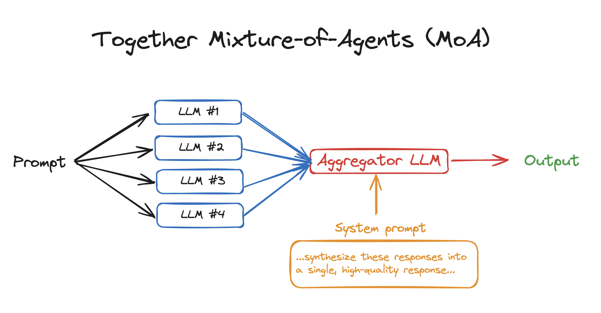

+++
title = '[AI MoA] 原来这就是 MoA(Mixture-of-Agents)'
date = 2024-07-10T11:10:13+08:00
draft = false
categories = ['AI', 'MoA']
tags = ['AI', 'MoA']
description = "介绍一个项目，Mixture-of-Agents (MoA)。MoA 是一种新颖的方法，它利用多个 LLMs 的集体优势来增强性能，实现最先进的结果。通过采用每层包含多个 LLM 代理的分层架构，MoA 仅使用开源模型，在 AlpacaEval 2.0 上的得分为 65.1%，显着优于 GPT-4 Omni 的 57.5%！"
keywords = ["AI", "MoA", "Mixture-of-Agents", "LLM", "AlpacaEval"]
+++

今天看到一个项目，Mixture-of-Agents (MoA)，打开了一个新思路。

## 介绍

Mixture-of-Agents (MoA) 是一种新颖的方法，它利用多个 LLMs 的集体优势来增强性能，实现最先进的结果。通过采用每层包含多个 LLM 代理的分层架构，MoA 仅使用开源模型，在 AlpacaEval 2.0 上的得分为 65.1%，显着优于 GPT-4 Omni 的 57.5%！

我们看下架构图



## 快速开始

```bash
pip install together
export TOGETHER_API_KEY=...
python moa.py
```

## 评估
### 准备
```bash
# install requirements
pip install -r requirements.txt
cd alpaca_eval
pip install -e .
cd FastChat
pip install -e ".[model_worker,llm_judge]"
cd ..

# setup api keys
export TOGETHER_API_KEY=<TOGETHER_API_KEY>
export OPENAI_API_KEY=<OPENAI_API_KEY>
```
### AlpacaEval 2
```bash
bash run_eval_alpaca_eval.sh
```
### MT-Bench
```bash
bash run_eval_mt_bench.sh
```
### FLASK
```bash
bash run_eval_flask.sh
```
### 结果


从结果上看，效果不错。

## 总结
### MoA
上面的介绍文字，看的不一定清楚。看下代码，就都清楚了。它做的事

- 用户提问，异步调用各种 llm 给结果。
    - 这里用到的模型是 `Qwen/Qwen2-72B-Instruct`, `Qwen/Qwen1.5-72B-Chat`, `mistralai/Mixtral-8x22B-Instruct-v0.1`, `databricks/dbrx-instruct` ，你可以根据需要自己配
    - 异步并发同时请求各 llm
- 拿到各 llm 的结果后，请求 llm 总结各 llm 的回答，给个好的结果
    - 这里配置的模型是 `mistralai/Mixtral-8x22B-Instruct-v0.1` ，同样可以自己改

就这样了，原来这就是 MoA。再去看上面的架构图，很清晰。

这里用的 together api 。通过上面的介绍，思路清晰了，那你自己根据这个思路，写一个，也是很简单了。你可以随便换各种 llm 。


```python
# Mixture-of-Agents in 50 lines of code
import asyncio
import os
from together import AsyncTogether, Together

client = Together(api_key=os.environ.get("TOGETHER_API_KEY"))
async_client = AsyncTogether(api_key=os.environ.get("TOGETHER_API_KEY"))

user_prompt = "What are some fun things to do in SF?"
reference_models = [
    "Qwen/Qwen2-72B-Instruct",
    "Qwen/Qwen1.5-72B-Chat",
    "mistralai/Mixtral-8x22B-Instruct-v0.1",
    "databricks/dbrx-instruct",
]
aggregator_model = "mistralai/Mixtral-8x22B-Instruct-v0.1"
aggreagator_system_prompt = """You have been provided with a set of responses from various open-source models to the latest user query. Your task is to synthesize these responses into a single, high-quality response. It is crucial to critically evaluate the information provided in these responses, recognizing that some of it may be biased or incorrect. Your response should not simply replicate the given answers but should offer a refined, accurate, and comprehensive reply to the instruction. Ensure your response is well-structured, coherent, and adheres to the highest standards of accuracy and reliability.

Responses from models:"""


async def run_llm(model):
    """Run a single LLM call with a reference model."""
    response = await async_client.chat.completions.create(
        model=model,
        messages=[{"role": "user", "content": user_prompt}],
        temperature=0.7,
        max_tokens=512,
    )
    print(model)
    return response.choices[0].message.content


async def main():
    results = await asyncio.gather(*[run_llm(model) for model in reference_models])

    finalStream = client.chat.completions.create(
        model=aggregator_model,
        messages=[
            {"role": "system", "content": aggreagator_system_prompt},
            {"role": "user", "content": ",".join(str(element) for element in results)},
        ],
        stream=True,
    )

    for chunk in finalStream:
        print(chunk.choices[0].delta.content or "", end="", flush=True)


asyncio.run(main())
```

### 评估

这个项目中还有一点可以说的，就是评估。效果到底好不好，可以通过评估看。

怎么做评估？看下面这个图，从各个指标上去打分，最后看得分。

|                                 |   Human agreement |   Price [$/1000 examples] |   Time [seconds/1000 examples] |   Spearman corr. |   Pearson corr. |   Bias |   Variance |   Proba. prefer longer |
|:--------------------------------|------------------:|--------------------------:|-------------------------------:|-----------------:|----------------:|-------:|-----------:|-----------------------:|
| alpaca_eval_gpt4                |              69.2 |                      13.6 |                           1455 |             0.97 |            0.93 |   28.4 |       14.6 |                   0.68 |
| alpaca_eval_cot_gpt4_turbo_fn   |              68.6 |                       6.3 |                           1989 |             0.97 |            0.90 |   29.3 |       18.4 |                   0.67 |
| alpaca_eval_gpt4_turbo_fn       |              68.1 |                       5.5 |                            864 |             0.93 |            0.82 |   30.2 |       15.6 |                   0.65 |
| gpt4                            |              66.9 |                      12.5 |                           1037 |             0.88 |            0.87 |   31.5 |       14.6 |                   0.65 |
| alpaca_farm_greedy_gpt4         |              66.4 |                      15.3 |                            878 |             0.85 |            0.75 |   30.2 |       19.3 |                   0.60 |
| alpaca_eval_cot_gpt4_turbo_fn |              65.7 |                       4.3 |                            228 |             0.78 |            0.77 |   33.9 |       23.7 |                   0.61 |
| humans                          |              65.7 |                     300.0 |                          36800 |             1.00 |            1.00 |    0.0 |       34.3 |                   0.64 |
| claude                          |              65.3 |                       3.3 |                            173 |             0.93 |            0.90 |   32.4 |       18.5 |                   0.66 |
| lmsys_gpt4                      |              65.3 |                      13.9 |                          17982 |             0.98 |            0.97 |   31.6 |       15.9 |                   0.74 |
| text_davinci_003                |              64.1 |                       8.7 |                            121 |             0.85 |            0.83 |   33.8 |       22.7 |                   0.70 |
| longest                         |              62.2 |                       0.0 |                              0 |             0.27 |            0.56 |   37.8 |        0.0 |                   1.00 |
| chatgpt                         |              57.3 |                       0.8 |                            285 |             0.72 |            0.71 |   39.4 |       34.1 |                   0.59 |

各个指标计算的 [代码在这里](https://github.com/tatsu-lab/alpaca_eval/blob/f05cbd651b79ac93906b19d01fe443b45828b0f2/src/alpaca_eval/analyze.py#L366)

数据集在这里 [2.5K 条人工注释](https://huggingface.co/datasets/tatsu-lab/alpaca_eval/blob/main/alpaca_farm_human_crossannotations.json)

---

- [github](https://github.com/togethercomputer/MoA)
- [AI 博客 - 从零开始学AI](https://ai-blog.aihub2022.top/zh/post/ai-moa-intro/)
- [公众号 - 从零开始学AI](https://mp.weixin.qq.com/s?__biz=MzA3MDIyNTgzNA==&mid=2649977578&idx=1&sn=db5b5f93c0798440cd3739291db0f4c3&chksm=86c7c82fb1b041397ee86a1e75d855f080f85fc1938db57800fa794ad5e3ad738f41738de991#rd)
<!-- - [CSDN - 从零开始学AI](...) -->
<!-- - [掘金 - 从零开始学AI](...) -->
<!-- - [知乎 - 从零开始学AI](...) -->
<!-- - [阿里云 - 从零开始学AI](...) -->
<!-- - [腾讯云 - 从零开始学AI](...) -->
