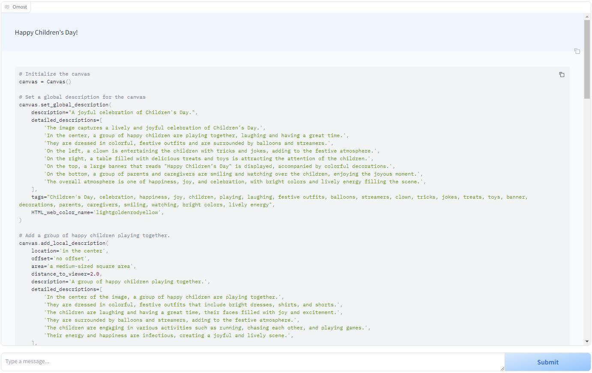
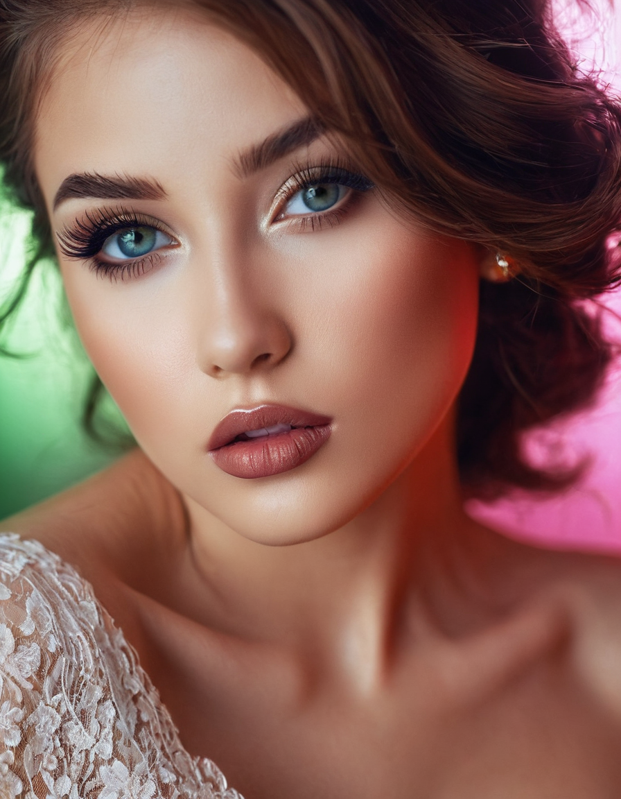

+++
title = '[AI Omost] Revolutionary AI Image Synthesis Technology: Your Creativity at Your Fingertips!'
date = 2024-06-07T14:43:17+08:00
draft = false
categories = ['AI', 'Text-to-Image']
tags = ['AI', 'Text-to-Image']
description = 'Omost is a project to convert LLM's coding capability to image generation (or more accurately, image composing) capability.'
keywords = ['AI', 'Text-to-Image', 'Omost']
+++

## Introduction
Omost is an innovative project that leverages the encoding capabilities of large language models (LLM) to generate images, particularly through image synthesis technology. The project's name, "Omost," sounds like "almost," implying that with this project, users can nearly complete their image generation tasks effortlessly. Additionally, "O" stands for "omni" (multimodal), and "most" indicates the project's aim to maximize the model's potential.

Omost provides several LLM models capable of writing code and collaborating with Omost's virtual canvas agent to synthesize visual content for images. This virtual canvas can integrate with specific image generators to produce actual images.

Currently, Omost offers three pre-trained LLM models based on variants of Llama3 and Phi3. These models are trained using mixed data, including:

1. Real annotated data from several datasets, such as Open-Images.
2. Data extracted from images through automatic annotation.
3. Reinforcement from DPO (Direct Preference Optimization), where the direct preference is whether the code can be compiled by Python 3.10.
4. A small portion of fine-tuning data from the multimodal capabilities of OpenAI GPT4o.

With this training data, Omost's models can generate high-quality images, providing users with a powerful image synthesis tool.

## Installation
Installation is straightforward, simply run the following commands:

```bash
git clone https://github.com/lllyasviel/Omost.git
cd Omost
conda create -n omost python=3.10
conda activate omost
pip install torch torchvision --index-url https://download.pytorch.org/whl/cu121
pip install -r requirements.txt
python gradio_app.py
```

## Principles
For principles, please refer to the readme on GitHub (link at the end of the document), which explains everything clearly.

In brief, you give a simple prompt, the LLM enriches it, plans the image in detail, and finally generates a high-quality, controllable image.

## Practice
Theoretical knowledge alone is insufficient; true understanding comes from practice. Let's try it out:




The interface is relatively clear.

Enter the prompt on the right and click "submit."

Then the interface will generate a large detailed design description.

Once generation is complete, click "Render the Image!" on the left. Wait a moment, and the image is generated!

### Script

Let's take a look at the generated script.

I input "Happy Children’s Day," and below is a large amount of image design description generated.

```python
# Initialize the canvas
canvas = Canvas()

# Set a global description for the canvas
canvas.set_global_description(
    description="A joyful celebration of Children's Day.",
    detailed_descriptions=[
        'The image captures a lively and joyful celebration of Children’s Day.',
        'In the center, a group of happy children are playing together, laughing and having a great time.',
        'They are dressed in colorful, festive outfits and are surrounded by balloons and streamers.',
        'On the left, a clown is entertaining the children with tricks and jokes, adding to the festive atmosphere.',
        'On the right, a table filled with delicious treats and toys is attracting the attention of the children.',
        'On the top, a large banner that reads "Happy Children’s Day" is displayed, accompanied by colorful decorations.',
        'On the bottom, a group of parents and caregivers are smiling and watching over the children, enjoying the joyous moment.',
        'The overall atmosphere is one of happiness, joy, and celebration, with bright colors and lively energy filling the scene.',
    ],
    tags="Children's Day, celebration, happiness, joy, children, playing, laughing, festive outfits, balloons, streamers, clown, tricks, jokes, treats, toys, banner, decorations, parents, caregivers, smiling, watching, bright colors, lively energy",
    HTML_web_color_name='lightgoldenrodyellow',
)

# Add a group of happy children playing together.
canvas.add_local_description(
    location='in the center',
    offset='no offset',
    area='a medium-sized square area',
    distance_to_viewer=2.0,
    description='A group of happy children playing together.',
    detailed_descriptions=[
        'In the center of the image, a group of happy children are playing together.',
        'They are dressed in colorful, festive outfits that include bright dresses, shirts, and shorts.',
        'The children are laughing and having a great time, their faces filled with joy and excitement.',
        'They are surrounded by balloons and streamers, adding to the festive atmosphere.',
        'The children are engaging in various activities such as running, chasing each other, and playing games.',
        'Their energy and happiness are infectious, creating a joyful and lively scene.',
    ],
    tags='children, playing, happy, colorful outfits, bright dresses, shirts, shorts, laughing, joy, excitement, balloons, streamers, running, chasing, playing games, energy, happiness',
    atmosphere='Joyful and lively, filled with energy and happiness.',
    style='Bright and colorful, with a focus on the happiness of the children.',
    quality_meta='High-quality, capturing the joyful moment with clarity and detail.',
    HTML_web_color_name='lightyellow',
)

# Add a clown entertaining the children.
canvas.add_local_description(
    location='on the left',
    offset='no offset',
    area='a medium-sized vertical area',
    distance_to_viewer=3.0,
    description='A clown entertaining the children.',
    detailed_descriptions=[
        'On the left side of the image, a clown is entertaining the children with tricks and jokes.',
        'The clown is wearing a bright red nose, oversized shoes, and a colorful costume with large buttons and stripes.',
        'He is performing tricks such as pulling out colorful objects from a hat and making silly jokes to make the children laugh.',
        'The children are clearly enjoying the clown’s performance, their faces lit up with joy and amusement.',
        'The clown’s antics add to the festive and joyful atmosphere of the celebration.',
    ],
    tags='clown, entertaining, tricks, jokes, bright red nose, oversized shoes, colorful costume, large buttons, stripes, performing tricks, pulling out objects, making jokes, children laughing, joy, amusement, festive, joyful atmosphere',
    atmosphere='Festive and joyful, filled with laughter and amusement.',
    style='Colorful and lively, with a focus on the entertainment provided by the clown.',
    quality_meta='High-quality, capturing the clown’s performance with clarity and detail.',
    HTML_web_color_name='tomato',
)

# Add a table filled with treats and toys.
canvas.add_local_description(
    location='on the right',
    offset='no offset',
    area='a medium-sized vertical area',
    distance_to_viewer=3.0,
    description='A table filled with treats and toys.',
    detailed_descriptions=[
        'On the right side of the image, a table is filled with a variety of delicious treats and colorful toys.',
        'The table is decorated with a red and white checkered cloth and is laden with goodies such as cupcakes, candies, and fruit.',
        'Next to the table, there are piles of toys including stuffed animals, building blocks, and small cars.',
        'The treats and toys are attracting the attention of the children, who are excitedly gathering around the table to explore and enjoy the offerings.',
        'The table adds to the festive and enjoyable atmosphere of the celebration.',
    ],
    tags='table, treats, toys, red and white checkered cloth, cupcakes, candies, fruit, stuffed animals, building blocks, small cars, attention of children, excited, exploring, enjoying, festive, enjoyable atmosphere',
    atmosphere='Festive and enjoyable, filled with excitement and joy.',
    style='Bright and colorful, with a focus on the variety of treats and toys.',
    quality_meta='High-quality, capturing the treats and toys with clarity and detail.',
    HTML_web_color_name='lightcoral',
)

# Add a large banner that reads "happy children's day".
canvas.add_local_description(
    location='on the top',
    offset='no offset',
    area='a large horizontal area',
    distance_to_viewer=5.0,
    description="A large banner that reads 'Happy Children's Day'.",
    detailed_descriptions=[
        "On the top of the image, a large banner that reads 'Happy Children's Day' is displayed.",
        'The banner is decorated with colorful ribbons and is placed against a backdrop of festive decorations.',
        'The text on the banner is large and bold, making it easily readable.',
        'The banner adds to the celebratory and joyful atmosphere of the scene, serving as a focal point that draws attention.',
        'The decorations surrounding the banner include streamers, balloons, and other festive elements that enhance the overall celebratory feel of the image.',
    ],
    tags="banner, Happy Children's Day, large, colorful ribbons, backdrop, festive decorations, text, bold, readable, celebratory, joyful atmosphere, focal point, streamers, balloons, festive elements, overall celebratory feel",
    atmosphere='Celebratory and joyful, with a focus on the festive decorations.',
    style='Colorful and festive, with a focus on the banner and decorations.',
    quality_meta='High-quality, capturing the banner and decorations with clarity and detail.',
    HTML_web_color_name='gold',
)

# Add parents and caregivers smiling and watching over the children.
canvas.add_local_description(
    location='on the bottom',
    offset='no offset',
    area='a large horizontal area',
    distance_to_viewer=4.0,
    description='Parents and caregivers smiling and watching over the children.',
    detailed_descriptions=[
        'On the bottom of the image, a group of parents and caregivers are smiling and watching over the children.',
        'They are dressed in casual and comfortable clothing, and their expressions are filled with joy and pride as they watch their children having fun.',
        'The parents and caregivers are standing and sitting, some holding cameras to capture the special moment.',
        'They are actively involved in the celebration, cheering and clapping along with the children.',
        'Their presence adds to the overall joyful and celebratory atmosphere, making the scene feel complete and heartwarming.',
    ],
    tags='parents, caregivers, smiling, watching, children, casual clothing, comfortable clothing, joy, pride, having fun, standing, sitting, holding cameras, capturing moment, actively involved, cheering, clapping, overall joyful atmosphere, celebratory, heartwarming',
    atmosphere='Joyful and celebratory, filled with pride and joy.',
    style='Heartwarming and joyful, with a focus on the parents and caregivers.',
    quality_meta='High-quality, capturing the expressions and actions of the parents and caregivers with clarity and detail.',
    HTML_web_color_name='lightpink',
)
```

Finally, the image was generated. The result is quite good.


## Samples

Lastly, here are some images I generated, all with pretty good results.

The only issue is that it’s a bit slow, taking a few minutes per image.





---

- [GitHub](https://github.com/lllyasviel/Omost)
<!-- - [Blog - Learn AI from scratch](...) -->
<!-- - [公众号 - Learn AI from scratch](...) -->
<!-- - [CSDN - Learn AI from scratch](...) -->
<!-- - [Juejin - Learn AI from scratch](...) -->
<!-- - [Zhihu - Learn AI from scratch](...) -->
<!-- - [Alibaba Cloud - Learn AI from scratch](...) -->
<!-- - [Tencent Cloud - Learn AI from scratch](...) -->
