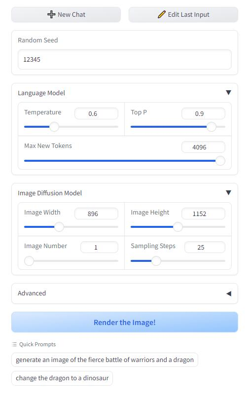
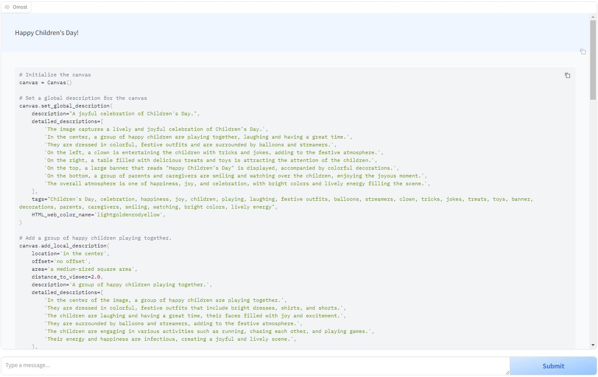
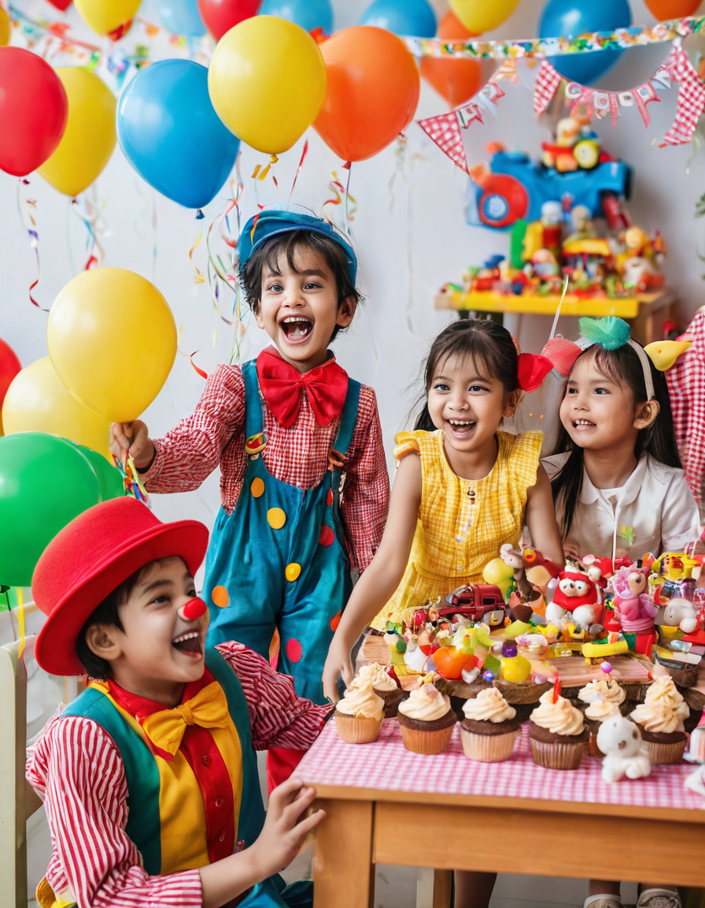

+++
title = '[AI Omost] 革命性AI图像合成技术，让你的创意几乎一触即发！'
date = 2024-06-07T14:43:17+08:00
draft = false
categories = ['AI', '文生图']
tags = ['AI', '文生图']
description = 'Omost 是一个旨在将大型语言模型的编码能力转化为图像生成（或更准确地说，图像合成）能力的项目。'
keywords = ['AI', '文生图', 'Omost']
+++

## 介绍
Omost 是一个创新的项目，它利用大型语言模型（LLM）的编码能力来生成图像，特别是通过图像合成技术。项目的名称“Omost”发音类似于“almost”，寓意着使用该项目后，用户的图像生成工作几乎可以完成。同时，“O”代表“omni”（多模态），而“most”则表示项目旨在最大化模型的潜力。

Omost 提供了一些LLM模型，这些模型能够编写代码，并与Omost的虚拟画布代理协作，合成图像的视觉内容。这个虚拟画布能够与特定的图像生成器结合，以实际生成图像。

目前，Omost 提供了3个基于Llama3和Phi3变种的预训练LLM模型。这些模型使用混合数据进行训练，包括：

1. 几个数据集的真实标注数据，如Open-Images。
2. 通过自动标注图像提取的数据。
3. 来自DPO（直接偏好优化）的强化，其中代码是否能被Python 3.10编译作为直接偏好。
4. 来自OpenAI GPT4o的多模态能力的一小部分调整数据。

通过这些训练数据，Omost 的模型能够生成高质量的图像，为用户提供一个强大的图像合成工具。

## 安装
安装很简单，只需运行以下命令：

```bash
git clone https://github.com/lllyasviel/Omost.git
cd Omost
conda create -n omost python=3.10
conda activate omost
pip install torch torchvision --index-url https://download.pytorch.org/whl/cu121
pip install -r requirements.txt
python gradio_app.py
```

## 原理
原理请看github上的readme(文末有链接)，已经说的很清楚了。

简单说就是：说一句简单的 prompt，LLM帮你丰富，详细规划图像，最后生成高质量可控图像。

## 实践
纸上得来终觉浅，绝知此事要躬行。实际操作一把：





界面还是比较清楚。

右边输入 prompt，点击“submit”。

然后界面就会生成一大片详细设计描述。

生成完成，点击左边的“Render the Image！”。稍等片刻，图片生成！

### script

我们来看下生成的脚本。

我输入的是“Happy Children’s Day”，下面生成了一大堆图像设计描述。

```python
# Initialize the canvas
canvas = Canvas()

# Set a global description for the canvas
canvas.set_global_description(
    description="A joyful celebration of Children's Day.",
    detailed_descriptions=[
        'The image captures a lively and joyful celebration of Children’s Day.',
        'In the center, a group of happy children are playing together, laughing and having a great time.',
        'They are dressed in colorful, festive outfits and are surrounded by balloons and streamers.',
        'On the left, a clown is entertaining the children with tricks and jokes, adding to the festive atmosphere.',
        'On the right, a table filled with delicious treats and toys is attracting the attention of the children.',
        'On the top, a large banner that reads "Happy Children’s Day" is displayed, accompanied by colorful decorations.',
        'On the bottom, a group of parents and caregivers are smiling and watching over the children, enjoying the joyous moment.',
        'The overall atmosphere is one of happiness, joy, and celebration, with bright colors and lively energy filling the scene.',
    ],
    tags="Children's Day, celebration, happiness, joy, children, playing, laughing, festive outfits, balloons, streamers, clown, tricks, jokes, treats, toys, banner, decorations, parents, caregivers, smiling, watching, bright colors, lively energy",
    HTML_web_color_name='lightgoldenrodyellow',
)

# Add a group of happy children playing together.
canvas.add_local_description(
    location='in the center',
    offset='no offset',
    area='a medium-sized square area',
    distance_to_viewer=2.0,
    description='A group of happy children playing together.',
    detailed_descriptions=[
        'In the center of the image, a group of happy children are playing together.',
        'They are dressed in colorful, festive outfits that include bright dresses, shirts, and shorts.',
        'The children are laughing and having a great time, their faces filled with joy and excitement.',
        'They are surrounded by balloons and streamers, adding to the festive atmosphere.',
        'The children are engaging in various activities such as running, chasing each other, and playing games.',
        'Their energy and happiness are infectious, creating a joyful and lively scene.',
    ],
    tags='children, playing, happy, colorful outfits, bright dresses, shirts, shorts, laughing, joy, excitement, balloons, streamers, running, chasing, playing games, energy, happiness',
    atmosphere='Joyful and lively, filled with energy and happiness.',
    style='Bright and colorful, with a focus on the happiness of the children.',
    quality_meta='High-quality, capturing the joyful moment with clarity and detail.',
    HTML_web_color_name='lightyellow',
)

# Add a clown entertaining the children.
canvas.add_local_description(
    location='on the left',
    offset='no offset',
    area='a medium-sized vertical area',
    distance_to_viewer=3.0,
    description='A clown entertaining the children.',
    detailed_descriptions=[
        'On the left side of the image, a clown is entertaining the children with tricks and jokes.',
        'The clown is wearing a bright red nose, oversized shoes, and a colorful costume with large buttons and stripes.',
        'He is performing tricks such as pulling out colorful objects from a hat and making silly jokes to make the children laugh.',
        'The children are clearly enjoying the clown’s performance, their faces lit up with joy and amusement.',
        'The clown’s antics add to the festive and joyful atmosphere of the celebration.',
    ],
    tags='clown, entertaining, tricks, jokes, bright red nose, oversized shoes, colorful costume, large buttons, stripes, performing tricks, pulling out objects, making jokes, children laughing, joy, amusement, festive, joyful atmosphere',
    atmosphere='Festive and joyful, filled with laughter and amusement.',
    style='Colorful and lively, with a focus on the entertainment provided by the clown.',
    quality_meta='High-quality, capturing the clown’s performance with clarity and detail.',
    HTML_web_color_name='tomato',
)

# Add a table filled with treats and toys.
canvas.add_local_description(
    location='on the right',
    offset='no offset',
    area='a medium-sized vertical area',
    distance_to_viewer=3.0,
    description='A table filled with treats and toys.',
    detailed_descriptions=[
        'On the right side of the image, a table is filled with a variety of delicious treats and colorful toys.',
        'The table is decorated with a red and white checkered cloth and is laden with goodies such as cupcakes, candies, and fruit.',
        'Next to the table, there are piles of toys including stuffed animals, building blocks, and small cars.',
        'The treats and toys are attracting the attention of the children, who are excitedly gathering around the table to explore and enjoy the offerings.',
        'The table adds to the festive and enjoyable atmosphere of the celebration.',
    ],
    tags='table, treats, toys, red and white checkered cloth, cupcakes, candies, fruit, stuffed animals, building blocks, small cars, attention of children, excited, exploring, enjoying, festive, enjoyable atmosphere',
    atmosphere='Festive and enjoyable, filled with excitement and joy.',
    style='Bright and colorful, with a focus on the variety of treats and toys.',
    quality_meta='High-quality, capturing the treats and toys with clarity and detail.',
    HTML_web_color_name='lightcoral',
)

# Add a large banner that reads "happy children's day".
canvas.add_local_description(
    location='on the top',
    offset='no offset',
    area='a large horizontal area',
    distance_to_viewer=5.0,
    description="A large banner that reads 'Happy Children's Day'.",
    detailed_descriptions=[
        "On the top of the image, a large banner that reads 'Happy Children's Day' is displayed.",
        'The banner is decorated with colorful ribbons and is placed against a backdrop of festive decorations.',
        'The text on the banner is large and bold, making it easily readable.',
        'The banner adds to the celebratory and joyful atmosphere of the scene, serving as a focal point that draws attention.',
        'The decorations surrounding the banner include streamers, balloons, and other festive elements that enhance the overall celebratory feel of the image.',
    ],
    tags="banner, Happy Children's Day, large, colorful ribbons, backdrop, festive decorations, text, bold, readable, celebratory, joyful atmosphere, focal point, streamers, balloons, festive elements, overall celebratory feel",
    atmosphere='Celebratory and joyful, with a focus on the festive decorations.',
    style='Colorful and festive, with a focus on the banner and decorations.',
    quality_meta='High-quality, capturing the banner and decorations with clarity and detail.',
    HTML_web_color_name='gold',
)

# Add parents and caregivers smiling and watching over the children.
canvas.add_local_description(
    location='on the bottom',
    offset='no offset',
    area='a large horizontal area',
    distance_to_viewer=4.0,
    description='Parents and caregivers smiling and watching over the children.',
    detailed_descriptions=[
        'On the bottom of the image, a group of parents and caregivers are smiling and watching over the children.',
        'They are dressed in casual and comfortable clothing, and their expressions are filled with joy and pride as they watch their children having fun.',
        'The parents and caregivers are standing and sitting, some holding cameras to capture the special moment.',
        'They are actively involved in the celebration, cheering and clapping along with the children.',
        'Their presence adds to the overall joyful and celebratory atmosphere, making the scene feel complete and heartwarming.',
    ],
    tags='parents, caregivers, smiling, watching, children, casual clothing, comfortable clothing, joy, pride, having fun, standing, sitting, holding cameras, capturing moment, actively involved, cheering, clapping, overall joyful atmosphere, celebratory, heartwarming',
    atmosphere='Joyful and celebratory, filled with pride and joy.',
    style='Heartwarming and joyful, with a focus on the parents and caregivers.',
    quality_meta='High-quality, capturing the expressions and actions of the parents and caregivers with clarity and detail.',
    HTML_web_color_name='lightpink',
)
```

最后生成了图像。效果还不错。



## 样例

最后给大家看几张我生成的图，效果都还不错。

问题就是有点慢，几分钟一张图。


---

- [github](https://github.com/lllyasviel/Omost)
<!-- - [博客 - 从零开始学AI](...) -->
<!-- - [Blog - Learn AI from scratch](...) -->
<!-- - [公众号 - 从零开始学AI](...) -->
<!-- - [CSDN - 从零开始学AI](...) -->
<!-- - [掘金 - 从零开始学AI](...) -->
<!-- - [知乎 - 从零开始学AI](...) -->
<!-- - [阿里云 - 从零开始学AI](...) -->
<!-- - [腾讯云 - 从零开始学AI](...) -->
