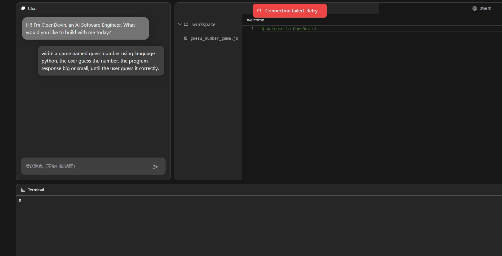

+++
title = '[AI OpenDevin] 开源AI程序员，帮您写代码，开发程序'
date = 2024-04-12T17:13:37+08:00
draft = false
categories = ['AI', 'AI程序员']
tags = ['AI', 'AI程序员', 'OpenDevin']
description = "OpenDevin 是一个开源项目，旨在复制 Devin，一款自主的 AI 软件工程师，能够执行复杂的工程任务，并与用户积极合作，共同进行软件开发项目。该项目立志通过开源社区的力量复制、增强和创新 Devin。"
keywords = ["OpenDevin", "Devin", "AI程序员", "自主AI", "软件工程", "开源项目", "人工智能"]
+++

之前写了文章，介绍了Devin，第一个AI程序员。放出来的视频，看起来很不错，效率很高。但是要使用的话，需要加入waiting list排队，也不知道什么时候能轮到。

[【AI cognition】Devin，第一个AI程序员](https://mp.weixin.qq.com/s?__biz=MzA3MDIyNTgzNA==&mid=2649976540&idx=1&sn=f3fa3b04dd7cb0c8ab27ae51179770f0&chksm=86c7d419b1b05d0fdae9a494b487d025d072d23f8e913dadf350c93c9849073543dd3b537364#rd)。

今天，我们直接来看开源版本的 OpenDevin。

[官方视频在这里](https://github.com/OpenDevin/OpenDevin/assets/38853559/71a472cc-df34-430c-8b1d-4d7286c807c9)

这么好，界面跟Devin也长的很像，我们来试下。

按照文档，安装，并不复杂。具体如何安装看下面。

安装完成后，打开浏览器访问。哇哦，看起来好像能用。


输入我的需求



然后，就没有然后了。一直卡住，不知道原因。不太清楚是网络原因还是配置有点问题。翻了github issue也没太找到答案。不花费太多时间研究了。

最后看日志，是有报错。应该是超过请求速率了。不清楚为什么要用模型 text-embedding-ada-002 。

```log
Error code: 429 - {'error': {'message': 'Rate limit reached for text-embedding-ada-002 in organization [...] on requests per min (RPM): Limit 3, Used 3, Requested 1. Please try again in 20s. Visit https://platform.openai.com/account/rate-limits to learn more. You can increase your rate limit by adding a payment method to your account at https://platform.openai.com/account/billing.', 'type': 'requests', 'param': None, 'code': 'rate_limit_exceeded'}}
```

本次实验，算是失败了。下面我们来看下官方的 readme

---

欢迎来到 OpenDevin，一个开源项目，旨在复制 Devin，一款自主的 AI 软件工程师，能够执行复杂的工程任务，并与用户积极合作，共同进行软件开发项目。该项目立志通过开源社区的力量复制、增强和创新 Devin。

## 🤔 Devin 是什么？
Devin 代表着一种尖端的自主代理程序，旨在应对软件工程的复杂性。它利用诸如 shell、代码编辑器和 Web 浏览器等工具的组合，展示了在软件开发中利用 LLMs（大型语言模型）的未开发潜力。我们的目标是探索和拓展 Devin 的能力，找出其优势和改进空间，以指导开源代码模型的进展。

## 🐚 为什么选择 OpenDevin？
OpenDevin 项目源于对复制、增强和超越原始 Devin 模型的愿望。通过与开源社区的互动，我们旨在解决 Code LLMs 在实际场景中面临的挑战，创作出对社区有重大贡献并为未来进步铺平道路的作品。

## 🚧 项目状态

OpenDevin 目前仍在进行中，但您已经可以运行 alpha 版本来查看端到端系统的运行情况。项目团队正在积极努力实现以下关键里程碑：

- **用户界面（UI）**：开发用户友好的界面，包括聊天界面、演示命令的 shell 和 Web 浏览器。
- **架构**：构建一个稳定的代理框架，具有强大的后端，可以读取、写入和运行简单的命令。
- **代理能力**：增强代理的能力，以生成 bash 脚本、运行测试和执行其他软件工程任务。
- **评估**：建立一个与 Devin 评估标准一致的最小评估流水线。

在完成 MVP 后，团队将专注于各个领域的研究，包括基础模型、专家能力、评估和代理研究。

## ⚠️ 注意事项和警告
* OpenDevin 仍然是一个 alpha 项目。它变化很快且不稳定。我们正在努力在未来几周发布稳定版本。
* OpenDevin 会向您配置的 LLM 发出许多提示。大多数 LLM 都需要花费金钱，请务必设置花费限制并监控使用情况。
* OpenDevin 在 Docker 沙箱中运行 `bash` 命令，因此不应影响您的计算机。但您的工作区目录将附加到该沙箱，并且目录中的文件可能会被修改或删除。
* 我们默认的代理目前是 MonologueAgent，具有有限的功能，但相当稳定。我们正在开发其他代理实现，包括 [SWE 代理](https://swe-agent.com/)。您可以[在这里阅读我们当前的代理集合](./docs/documentation/Agents.md)。

## 🚀 开始

开始使用 OpenDevin 项目非常简单。按照以下简单步骤在您的系统上设置和运行 OpenDevin：

### 1. 系统要求
* Linux、Mac OS 或 [Windows 上的 WSL](https://learn.microsoft.com/en-us/windows/wsl/install)
* [Docker](https://docs.docker.com/engine/install/)（对于 MacOS 用户，请确保允许默认的 Docker 套接字在高级设置中使用！）
* [Python](https://www.python.org/downloads/) >= 3.11
* [NodeJS](https://nodejs.org/en/download/package-manager) >= 18.17.1
* [Poetry](https://python-poetry.org/docs/#installing-with-the-official-installer) >= 1.8

在继续执行 `make build` 命令之前，请确保您已安装所有这些依赖项。

### 2. 构建和设置环境

- **构建项目：** 首先构建项目，这包括设置环境和安装依赖项。此步骤确保 OpenDevin 已准备就绪，可以在您的系统上顺利运行。
    ```bash
    make build
    ```

### 3. 配置语言模型

OpenDevin 通过强大的 [litellm](https://docs.litellm.ai) 库支持多种语言模型（LMs）。默认情况下，我们选择了 OpenAI 的强大 GPT-4 作为我们的首选模型，但世界是你的！您可以释放 Anthropic 的光滑 Claude、神秘的 Llama 或任何其他引起您兴趣的 LM 的潜力。

要配置您选择的 LM，请按照以下步骤操作：

1. **使用 Makefile：轻松的方法**
   只需一条命令，您就可以为 OpenDevin 体验设置一个顺畅的 LM。只需运行：
   ```bash
   make setup-config
   ```
   此命令将提示您输入 LLM API 密钥和模型名称，确保 OpenDevin 能够满足您的特定需求。

**关于替代模型的注意事项：**
某些替代模型可能比其他模型更难驾驭。勇敢的冒险家，不要害怕！我们很快将公布专门的 LLM 文档，指导您的探索之旅。如果您已经掌握了除 OpenAI 的 GPT 之外的模型的使用技巧，我们鼓励您与我们[分享您的设置说明](https://github.com/OpenDevin/OpenDevin/issues/417)。

要查看可用的 LM 提供者和模型的完整列表，请参阅 [litellm 文档](https://docs.litellm.ai/docs/providers)。

还有关于使用 ollama 运行本地模型的[文档](./docs/documentation/LOCAL_LLM_GUIDE.md)。

我们正在制作一个 [使用 Azure 运行 OpenDevin 的指南](./docs/documentation/AZURE_LLM_GUIDE.md)。

### 4. 运行应用程序

- **运行应用程序：** 完成设置后，启动 OpenDevin 就像运行一个简单的命令一样简单。此命令无缝启动后端和前端服务器，使您可以轻松地与 OpenDevin 交互。
    ```bash
    make run
    ```

### 5. 启动各个服务器

- **启动后端服务器：** 如果您愿意，您可以独立启动后端服务器，以便专注于后端相关的任务或配置。
    ```bash
    make start-backend
    ```

- **启动前端服务器：** 同样地，您可以单独启动前端服务器，以便处理前端相关的组件或界面增强。
    ```bash
    make start-frontend
    ```

### 6. 帮助

- **获取帮助：** 需要帮助或了解可用目标和命令吗？帮助命令提供了所有必要的指导，确保您与 OpenDevin 有一个顺畅的体验。
    ```bash
    make help
    ```
## ⭐️ 研究策略

利用 LLMs 实现生产级应用程序的完全复制是一个复杂的任务。我们的策略包括：

1. **核心技术研究：** 专注于基础研究，以了解和改进代码生成和处理的技术方面。
2. **专业能力：** 通过数据整理、训练方法等手段增强核心组件的效能。
3. **任务规划：** 开发能力，用于错误检测、代码库管理和优化。
4. **评估：** 建立全面的评估指标，以更好地了解和改进我们的模型。

## 🤝 如何贡献

OpenDevin 是一个社区驱动的项目，我们欢迎所有人的贡献。无论您是开发人员、研究人员，还是对利用人工智能推动软件工程领域发展充满热情的人，都有许多参与方式：

- **代码贡献：** 帮助我们开发核心功能、前端界面或沙盒解决方案。
- **研究和评估：** 为我们对软件工程中的 LLMs 的理解做出贡献，参与评估模型，或提出改进意见。
- **反馈和测试：** 使用 OpenDevin 工具集，报告错误，提出功能建议，或就可用性提供反馈。

详情请查看[此文档](./CONTRIBUTING.md)。

## 🛠️ 技术栈

OpenDevin 使用了一系列强大的框架和库的组合，为其开发提供了坚实的基础。以下是项目中使用的关键技术：

- FastAPI
- uvicorn
- LiteLLM
- Docker
- Ruff
- MyPy
- LlamaIndex
- React

请注意，这些技术的选择正在进行中，随着项目的发展，可能会添加其他技术或移除现有技术。我们致力于采用最合适和最有效的工具，以增强 OpenDevin 的功能。

---

- [官网](https://github.com/OpenDevin/OpenDevin)
- 本文
    - [AI 博客 - 从零开始学AI](https://ai-blog.aihub2022.top/post/ai-opendevin-intro/)
    - [微信 - 从零开始学AI](https://mp.weixin.qq.com/s?__biz=MzA3MDIyNTgzNA==&mid=2649976812&idx=1&sn=d0a139130753fc4c1e1b749e62a6b35c&chksm=86c7d529b1b05c3f11ab4ee807867e3674ce42788ba1d49f2a5f4ba6b113e55d95839650eef7#rd)
    - [CSDN - 从零开始学AI](https://blog.csdn.net/mahone3297/article/details/137714109)
    - [知乎 - 从零开始学AI](https://zhuanlan.zhihu.com/p/692280610)
