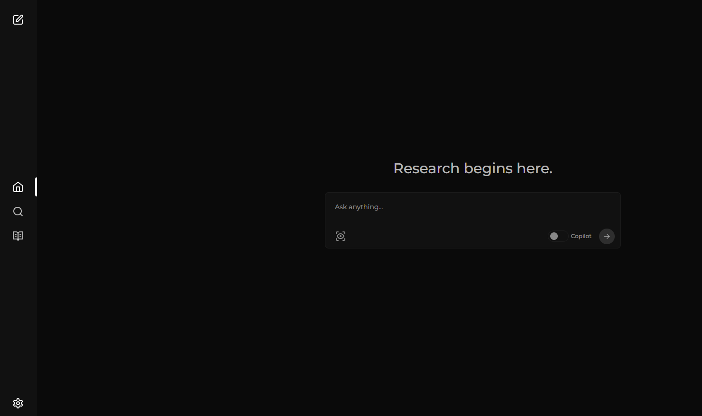
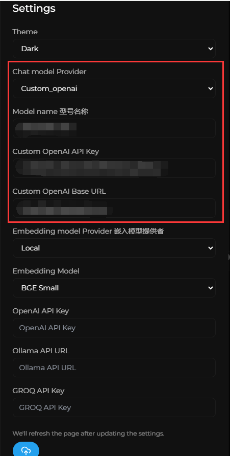
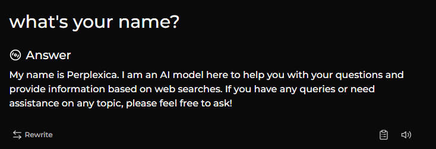
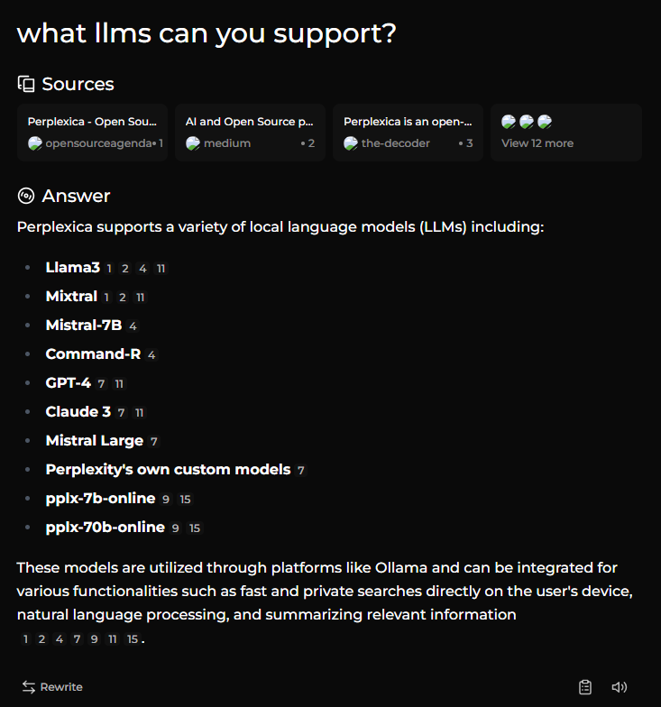
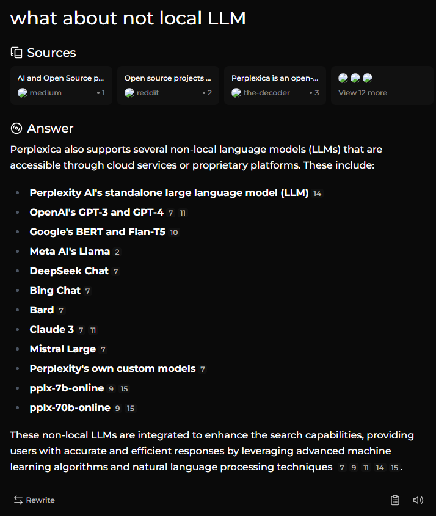

+++
title = '[AI Perplexica] 安装指南：轻松部署AI驱动的开源搜索引擎'
date = 2024-07-05T23:56:45+08:00
draft = false
categories = ['AI', 'Perplexica']
tags = ['AI', 'Perplexica']
description = '详细讲解如何在本地环境中使用Docker部署AI驱动的开源搜索引擎Perplexica，让您快速上手体验其强大功能。'
keywords = ['AI', 'Perplexica', '安装', 'Docker', '教程']
+++

- [[AI Perplexica] AI驱动的开源搜索引擎](https://ai-blog.aihub2022.top/zh/post/ai-perplexica-intro/)
- [[AI Perplexica] 深入解析，AI 架构揭秘](https://ai-blog.aihub2022.top/zh/post/ai-perplexica-architecture/)

之前，我们看过了 Perplexica 的介绍，特点和架构，了解了其工作原理。

今天，我们一起来部署下

## 安装

### docker

- 安装 docker
    - https://docs.docker.com/engine/install/ubuntu/
- 安装 docker compose
    - https://docs.docker.com/compose/install/
- clone 代码
    ```bash
    git clone https://github.com/ItzCrazyKns/Perplexica.git
    ```
- 配置 config.toml
    ```bash
    cp sample.config.toml config.toml
    ```
- 启动 docker
    ```bash
    docker compose up -d
    ```

## 使用

安装完成后，就能顺利访问 http://127.0.0.1:3000/



默认是黑色主题。

点击左下角 设置 按钮，做一些配置，填上这几项(model name, url, api key)，点保存。



现在，就可以聊天啦。我们试试。



这个就是之前文章中提到的，遇到他会的，就不搜索了，直接回答






后面的一些问题，都有调用搜索。

速度有些慢，可能搜索慢，也可能 LLM 慢，暂时不确定。

---

- [github](https://github.com/ItzCrazyKns/Perplexica)
<!-- - [AI 博客 - 从零开始学AI](...) -->
<!-- - [AI Blog - Learn AI from scratch](...) -->
<!-- - [公众号 - 从零开始学AI](...) -->
<!-- - [CSDN - 从零开始学AI](...) -->
<!-- - [掘金 - 从零开始学AI](...) -->
<!-- - [知乎 - 从零开始学AI](...) -->
<!-- - [阿里云 - 从零开始学AI](...) -->
<!-- - [腾讯云 - 从零开始学AI](...) -->
