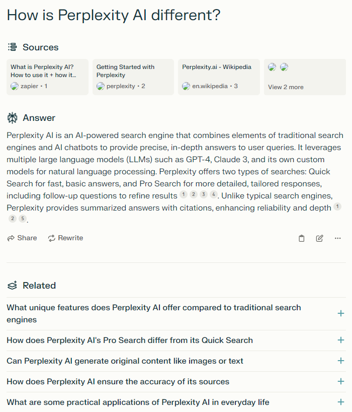
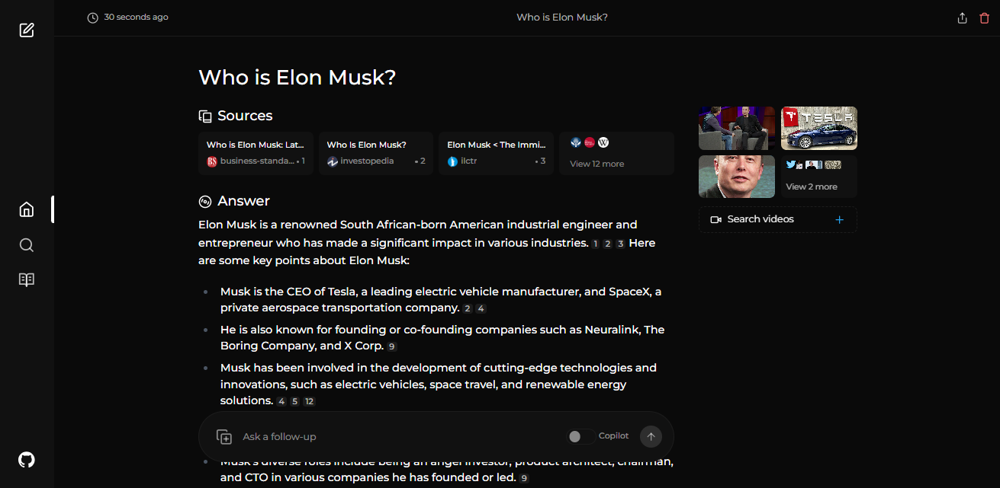

+++
title = '[AI Perplexica] AI-Driven Open Source Search Engine'
date = 2024-07-02T10:33:39+08:00
draft = false
categories = ['AI', 'Perplexica']
tags = ['AI', 'Perplexica', 'Open Source', 'Search Engine']
description = 'Explore Perplexica, an AI-driven open source search engine. Learn about its features, usage, and installation.'
keywords = ['AI', 'Perplexica', 'Open Source', 'Search Engine', 'Machine Learning', 'SearxNG', 'LLMs']
+++

In the AI search engine market, there is a product called https://www.perplexity.ai/. Let's take a look at how it introduces itself:



In the open-source market, there is a comparable product called Perplexica. Let's check it out:



The interface looks very similar.

## Introduction

Perplexica is an open-source, AI-driven search tool or search engine that scours the internet for answers. Inspired by Perplexity AI, it is an open-source option that not only searches the web but also understands your questions. It uses advanced machine learning algorithms, such as similarity search and embeddings, to refine results and provide clear answers with cited sources.

Using SearxNG to stay up-to-date and completely open source, Perplexica ensures you always get the latest information without compromising your privacy.

## Features

- **Local LLMs**: You can use Ollama to leverage local LLMs, such as Llama3 and Mixtral.
- **Two Main Modes**:
  - **Copilot Mode**: (In development) Enhances searches by generating different queries to find more relevant internet resources. Unlike regular searches using only SearxNG context, it visits the most matched pages and attempts to directly find content related to the user's query.
  - **Regular Mode**: Processes your queries and performs web searches.
- **Focus Modes**: Specific modes to better answer particular types of questions. Perplexica currently has six focus modes:
  - **All Mode**: Searches the entire web to find the best results.
  - **Writing Assistant Mode**: Helps with writing tasks that do not require web searches.
  - **Academic Search Mode**: Finds articles and papers suitable for academic research.
  - **YouTube Search Mode**: Finds YouTube videos based on search queries.
  - **Wolfram Alpha Search Mode**: Uses Wolfram Alpha to answer queries requiring calculations or data analysis.
  - **Reddit Search Mode**: Searches discussions and opinions related to queries on Reddit.
- **Current Information**: Some search tools may provide outdated information as they use crawled data converted into embeddings and stored in indexes. Unlike them, Perplexica uses SearxNG, a meta-search engine, to fetch results, re-rank them, and find the most relevant sources, ensuring you always get the latest information without the overhead of daily data updates.

## Installation

### Docker (Recommended)

1. Ensure Docker is installed and running on your system.
2. Clone the Perplexica repository:
   ```bash
   git clone https://github.com/ItzCrazyKns/Perplexica.git
   ```
3. After cloning, navigate to the directory containing the project files.
4. Rename the `sample.config.toml` file to `config.toml`. For Docker setups, you need only fill in the following fields:
   - `OPENAI`: Your OpenAI API key. **You only need to fill this if you wish to use OpenAI's models**.
   - `OLLAMA`: Your Ollama API URL. You should enter it as `http://host.docker.internal:PORT_NUMBER`. If you installed Ollama on port 11434, use `http://host.docker.internal:11434`. For other ports, adjust accordingly. **You need to fill this if you wish to use Ollama's models instead of OpenAI's**.
   - `GROQ`: Your Groq API key. **You only need to fill this if you wish to use Groq's hosted models**
   
     **Note**: You can change these after starting Perplexica from the settings dialog.
   - `SIMILARITY_MEASURE`: The similarity measure to use (This is filled by default; you can leave it as is if you are unsure about it.)
5. Ensure you are in the directory containing the `docker-compose.yaml` file and execute:
   ```bash
   docker compose up -d
   ```
6. Wait a few minutes for the setup to complete. You can access Perplexica at http://localhost:3000 in your web browser.

**Note**: After the containers are built, you can start Perplexica directly from Docker without having to open a terminal.

### Non-Docker

1. Install SearXNG and allow the `JSON` format in SearXNG settings.
2. Clone the repository and rename the `sample.config.toml` file in the root directory to `config.toml`. Ensure you fill in all the required fields in this file.
3. Rename the `.env.example` file in the `ui` folder to `.env` and fill in all the necessary fields.
4. After completing the configuration and environment files, run `npm i` in the `ui` folder and the root directory.
5. Install dependencies, then run `npm run build` in the `ui` folder and the root directory.
6. Finally, start the frontend and backend by running `npm run start` in the `ui` folder and the root directory.

**Note**: Using Docker is recommended as it simplifies the setup process, especially for managing environment variables and dependencies.

---

- [github](https://github.com/ItzCrazyKns/Perplexica)
<!-- - [AI Blog - Learn AI from scratch](...) -->
<!-- - [WeChat Official Account - Learn AI from scratch](...) -->
<!-- - [CSDN - Learn AI from scratch](...) -->
<!-- - [Juejin - Learn AI from scratch](...) -->
<!-- - [Zhihu - Learn AI from scratch](...) -->
<!-- - [Alibaba Cloud - Learn AI from scratch](...) -->
<!-- - [Tencent Cloud - Learn AI from scratch](...) -->
