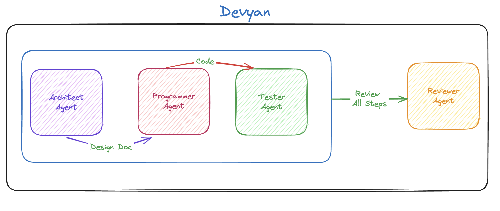

+++
title = '[AI 程序员 Devyan] 终于找到人帮我写代码了'
date = 2024-07-12T13:02:30+08:00
draft = false
categories = ['AI', 'AI程序员']
tags = ['AI', 'AI程序员', 'Devyan', 'crewai']
description = '了解 Devyan，这款由人工智能驱动的编程助手，如何通过协调多种角色来简化和优化软件开发过程。'
keywords = ['AI', '人工智能', '编程助手', '软件开发', 'Devyan', 'crewai']
+++

今天来看一个项目，Devyan。

## 概述

Devyan 是一个由人工智能驱动的软件开发助手，它协调一组代理来解决编程任务。它使用 OpenAI 的基于 GPT 的代理来执行各种角色，如架构设计、实施、测试和审查。

## 特点
- 架构师代理：根据用户输入设计解决方案的架构。
- 程序员代理：根据架构设计实施解决方案。
- 测试员代理：测试实施的解决方案，以确保它满足要求且无错误。
- 审查员代理：审查架构、实施和测试结果，提供全面的分析。



## 安装

```bash
git clone https://github.com/your-username/devain.git
cd devain

python -m venv venv
source venv/bin/activate  # On Windows use `venv\Scripts\activate`

pip install -r requirements.txt
```

`.env` 文件
```conf
OPENAI_API_KEY=your_openai_api_key_here
SERPER_API_KEY=your_serper_api_key_here
```

## 使用

```python
python main.py
```

## 亮点

- 使用了 `crewai` 框架
- 根据业务需求，创建了4个角色(架构师，程序员，测试，审查)

---

- [github](https://github.com/theyashwanthsai/Devyan)
<!-- - [AI 博客 - 从零开始学AI](...) -->
<!-- - [AI Blog - Learn AI from scratch](...) -->
<!-- - [公众号 - 从零开始学AI](...) -->
<!-- - [CSDN - 从零开始学AI](...) -->
<!-- - [掘金 - 从零开始学AI](...) -->
<!-- - [知乎 - 从零开始学AI](...) -->
<!-- - [阿里云 - 从零开始学AI](...) -->
<!-- - [腾讯云 - 从零开始学AI](...) -->
