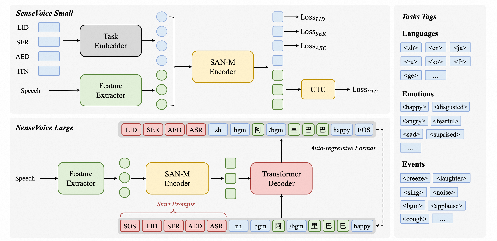

+++
title = '[AI SenseVoice] Alibaba Open-Sources Speech Foundation Model with Automatic Speech Recognition, Language Identification, Speech Emotion Recognition, and Audio Event Detection'
date = 2024-07-18T06:51:33+08:00
draft = false
categories = ['AI', 'SenseVoice']
tags = ['AI', 'SenseVoice']
description = 'Alibaba open-sources the SenseVoice speech foundation model, featuring high-accuracy multilingual speech recognition, emotion recognition, and audio event detection capabilities. Supports over 50 languages, outperforming the Whisper model.'
keywords = ['AI', 'SenseVoice', 'Speech Recognition', 'Emotion Recognition', 'Audio Event Detection', 'Alibaba Open-Source']
+++

## Introduction
SenseVoice is a speech foundation model with multiple speech understanding capabilities, including Automatic Speech Recognition (ASR), Language Identification (LID), Speech Emotion Recognition (SER), and Audio Event Detection (AED).



## Highlights

SenseVoice focuses on high-accuracy multilingual speech recognition, speech emotion recognition, and audio event detection.

- Multilingual Speech Recognition: Trained on over 400,000 hours of data, supports over 50 languages, and outperforms the Whisper model in recognition performance.
- Rich Transcription Features:
    - Outstanding emotion recognition capability, achieving and surpassing the performance of the current best emotion recognition models on test data.
    - Provides audio event detection functionality, supporting the detection of various common human-machine interaction events, such as background music, applause, laughter, crying, coughing, and sneezing.
- Efficient Inference: The SenseVoice-Small model adopts a non-autoregressive end-to-end framework, achieving extremely low inference latency. Processing 10 seconds of audio takes only 70 milliseconds, 15 times faster than Whisper-Large.
- Convenient Fine-Tuning: Offers convenient fine-tuning scripts and strategies, allowing users to easily address long-tail sample issues based on business scenarios.
- Service Deployment: Provides service deployment pipelines, supporting multiple concurrent requests. Client languages include Python, C++, HTML, Java, and C#.

## Latest Updates
- 2024/7: The SenseVoice-Small speech understanding model is open-sourced, offering high-accuracy multilingual speech recognition, emotion recognition, and audio event detection capabilities, supporting Mandarin, Cantonese, English, Japanese, and Korean, with extremely low inference latency.
- 2024/7: CosyVoice for natural speech generation, with multilingual, timbre, and emotion control features. CosyVoice excels in multilingual speech generation, zero-shot speech generation, cross-language voice cloning, and instruction-following capabilities. Provides CosyVoice repository and CosyVoice space.
- 2024/7: FunASR is a fundamental speech recognition toolkit offering multiple functions, including ASR, Voice Activity Detection (VAD), punctuation restoration, language modeling, speaker verification, speaker separation, and multi-speaker ASR.

## Installation
```bash
pip install -r requirements.txt
```

## Usage
### Inference
Supports audio input in any format and length.

```python
from funasr import AutoModel
from funasr.utils.postprocess_utils import rich_transcription_postprocess

model_dir = "iic/SenseVoiceSmall"

model = AutoModel(
    model=model_dir,
    trust_remote_code=True,
    remote_code="./model.py",    
    vad_model="fsmn-vad",
    vad_kwargs={"max_single_segment_time": 30000},
    device="cuda:0",
)

# en
res = model.generate(
    input=f"{model.model_path}/example/en.mp3",
    cache={},
    language="auto",  # "zn", "en", "yue", "ja", "ko", "nospeech"
    use_itn=True,
    batch_size_s=60,
    merge_vad=True,
    merge_length_s=15,
)
text = rich_transcription_postprocess(res[0]["text"])
print(text)
```

Parameter Description:

- model_dir: Name of the model or the path to the model on the local disk.
- trust_remote_code:
  - True: Indicates that the model implementation is loaded from remote_code, which specifies the exact location of the model code (e.g., model.py in the current directory). Supports absolute paths, relative paths, and network URLs.
  - False: Indicates that the model implementation is the built-in version of FunASR. In this case, modifications to model.py in the current directory will not take effect, and the built-in version of FunASR will be loaded. Click here for model code details.
- vad_model: Indicates activation of VAD (Voice Activity Detection). VAD aims to split long audio into shorter segments. In this case, the inference time includes the total consumption of VAD and SenseVoice, representing end-to-end latency. To test the inference time of the SenseVoice model alone, VAD can be disabled.
- vad_kwargs: Specifies the configuration of the VAD model. max_single_segment_time: Maximum time for vad_model to split audio, in milliseconds (ms).
- use_itn: Whether the output result includes punctuation and inverse text normalization.
- batch_size_s: Indicates the use of dynamic batching, where the total length of audio in the batch is measured in seconds (s).
- merge_vad: Whether to merge short audio segments split by the VAD model, with the merged length in seconds (s).

If all inputs are short audio (<30s) and batch processing inference is required to improve inference efficiency, the VAD model can be removed, and batch_size set accordingly.

```python
model = AutoModel(model=model_dir, trust_remote_code=True, device="cuda:0")

res = model.generate(
    input=f"{model.model_path}/example/en.mp3",
    cache={},
    language="zh",  # "zn", "en", "yue", "ja", "ko", "nospeech"
    use_itn=False,
    batch_size=64,
)
```

For more usage, please refer to the documentation.

### Direct Inference
Supports audio input in any format, with an input duration limit of 30 seconds or less.

```python
from model import SenseVoiceSmall
from funasr.utils.postprocess_utils import rich_transcription_postprocess

model_dir = "iic/SenseVoiceSmall"
m, kwargs = SenseVoiceSmall.from_pretrained(model=model_dir, device="cuda:0")

res = m.inference(
    data_in=f"{kwargs['model_path']}/example/en.mp3",
    language="auto",  # "zn", "en", "yue", "ja", "ko", "nospeech"
    use_itn=False,
    **kwargs,
)

text = rich_transcription_postprocess(res[0][0]["text"])
print(text)
```

### Export and Testing (In Progress)

```python
# pip3 install -U funasr-onnx
from funasr_onnx import SenseVoiceSmall

model_dir = "iic/SenseVoiceCTC"
model = SenseVoiceSmall(model_dir, batch_size=1, quantize=True)

wav_path = [f'~/.cache/modelscope/hub/{model_dir}/example/asr_example.wav']

result = model(wav_path)
print(result)
```

## Fine-Tuning
### Installation
```bash
git clone https://github.com/alibaba/FunASR.git && cd FunASR
pip3 install -e ./
```

### Data Preparation
Data Example

```json
{"key": "YOU0000008470_S0000238_punc_itn", "text_language": "", "emo_target": "", "event_target": "", "with_or_wo_itn": "", "target": "Including legal due diligence, subscription agreement, negotiation.", "source": "/cpfs01/shared/Group-speech/beinian.lzr/data/industrial_data/english_all/audio/YOU0000008470_S0000238.wav", "target_len": 7, "source_len": 140}
{"key": "AUD0000001556_S0007580", "text_language": "", "emo_target": "", "event_target": "", "with_or_wo_itn": "", "target": "there is a tendency to identify the self or take interest in what one has got used to", "source": "/cpfs01/shared/Group-speech/beinian.lzr/data/industrial_data/english_all/audio/AUD0000001556_S0007580.wav", "target_len": 18, "source_len": 360}
```

For the complete reference, see data/train_example.jsonl.

### Fine-Tuning
Ensure to modify the train_tool in finetune.sh to the absolute path of funasr/bin/train_ds.py in the FunASR installation directory set earlier.

```bash
bash finetune.sh
```

## WebUI

```bash
python webui.py
```

---

- [homepage](https://fun-audio-llm.github.io/)
- [online demo](https://www.modelscope.cn/studios/iic/SenseVoice)
<!-- - [AI Blog - Learn AI from scratch](...) -->
<!-- - [WeChat Official Account - Learn AI from scratch](...) -->
<!-- - [CSDN - Learn AI from scratch](...) -->
<!-- - [Juejin - Learn AI from scratch](...) -->
<!-- - [Zhihu - Learn AI from scratch](...) -->
<!-- - [Alibaba Cloud - Learn AI from scratch](...) -->
<!-- - [Tencent Cloud - Learn AI from scratch](...) -->
