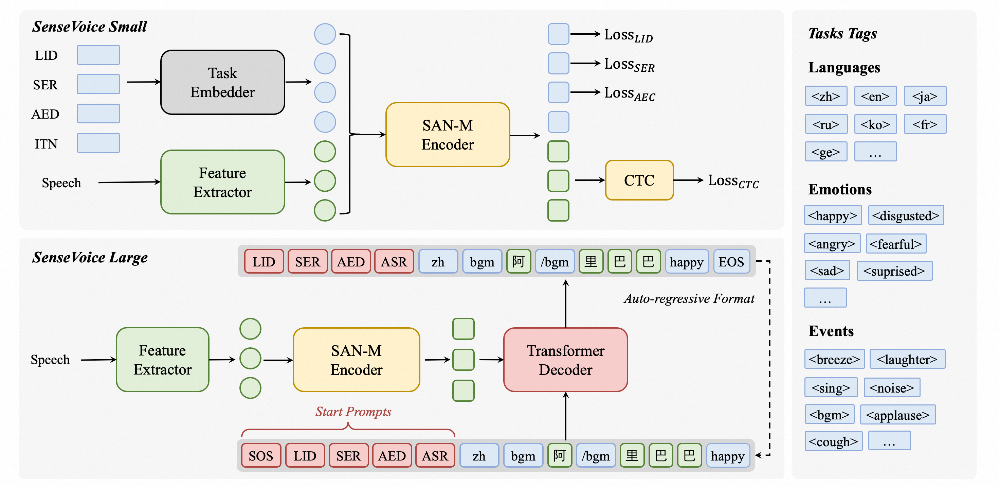

+++
title = '[AI Sensevoice] 阿里开源语音基础模型，包括自动语音识别、语言识别、语音情感识别 和音频事件检测'
date = 2024-07-18T06:51:33+08:00
draft = false
categories = ['AI', 'Sensevoice']
tags = ['AI', 'Sensevoice']
description = '阿里开源 SenseVoice 语音基础模型，具备高精度的多语言语音识别、情感识别和音频事件检测功能，支持超过 50 种语言，性能超越 Whisper 模型。'
keywords = ['AI', 'SenseVoice', '语音识别', '情感识别', '音频事件检测', '阿里开源']
+++

## 介绍
SenseVoice 是一个具有多种语音理解能力的语音基础模型，包括自动语音识别 (ASR)、语言识别 (LID)、语音情感识别 (SER) 和音频事件检测 (AED)。



## 亮点

SenseVoice 专注于高精度的多语言语音识别、语音情感识别和音频事件检测。

- 多语言语音识别：经过超过 40 万小时的数据训练，支持超过 50 种语言，识别性能超越 Whisper 模型。
- 丰富的转录功能：
    - 具备出色的情感识别能力，在测试数据上的效果达到并超越目前最好的情感识别模型。
    - 提供声音事件检测功能，支持检测多种常见的人机交互事件，如背景音乐、掌声、笑声、哭声、咳嗽和打喷嚏等。
- 高效推理：SenseVoice-Small 模型采用非自回归的端到端框架，推理延迟极低。处理 10 秒音频仅需 70 毫秒，比 Whisper-Large 快 15 倍。
- 便捷的微调：提供便捷的微调脚本和策略，使用户能够根据业务场景轻松解决长尾样本问题。
- 服务部署：提供服务部署管道，支持多并发请求，客户端语言包括 Python、C++、HTML、Java 和 C# 等。

## 最新动态
- 2024/7: SenseVoice-Small 语音理解模型开源，提供高精度的多语言语音识别、情感识别和音频事件检测能力，支持普通话、粤语、英语、日语和韩语，并具有极低的推理延迟。
- 2024/7: CosyVoice 用于自然语音生成，具有多语言、音色和情感控制功能。CosyVoice 在多语言语音生成、零样本语音生成、跨语言语音克隆和指令跟随能力方面表现出色。提供 CosyVoice 仓库和 CosyVoice 空间。
- 2024/7: FunASR 是一个基础语音识别工具包，提供多种功能，包括语音识别 (ASR)、语音活动检测 (VAD)、标点恢复、语言模型、说话人验证、说话人分离和多说话人 ASR。

## 安装
```bash
pip install -r requirements.txt
```

## 用法
### 推理
支持任何格式和任意时长的音频输入。

```python
from funasr import AutoModel
from funasr.utils.postprocess_utils import rich_transcription_postprocess

model_dir = "iic/SenseVoiceSmall"

model = AutoModel(
    model=model_dir,
    trust_remote_code=True,
    remote_code="./model.py",    
    vad_model="fsmn-vad",
    vad_kwargs={"max_single_segment_time": 30000},
    device="cuda:0",
)

# en
res = model.generate(
    input=f"{model.model_path}/example/en.mp3",
    cache={},
    language="auto",  # "zn", "en", "yue", "ja", "ko", "nospeech"
    use_itn=True,
    batch_size_s=60,
    merge_vad=True,  #
    merge_length_s=15,
)
text = rich_transcription_postprocess(res[0]["text"])
print(text)
```

参数说明：

- model_dir：模型的名称或本地磁盘上的模型路径。
- trust_remote_code：
  - 为 True 时，表示模型的代码实现从 remote_code 加载，remote_code 指定了模型代码的确切位置（例如当前目录下的 model.py）。支持绝对路径、相对路径和网络 URL。
  - 为 False 时，表示模型的代码实现为 FunASR 内置版本，此时对当前目录下 model.py 的修改将不起作用，加载的是 FunASR 内部版本。有关模型代码，请点击此处查看。
- vad_model：表示激活 VAD（语音活动检测）。VAD 的目的是将长音频拆分为更短的片段。在这种情况下，推理时间包括 VAD 和 SenseVoice 的总消耗，表示端到端延迟。如果希望单独测试 SenseVoice 模型的推理时间，可以禁用 VAD 模型。
- vad_kwargs：指定 VAD 模型的配置。max_single_segment_time：表示 vad_model 进行音频分割的最长时间，单位为毫秒（ms）。
- use_itn：输出结果是否包含标点符号和反向文本标准化。
- batch_size_s：表示使用动态批处理，批次中音频的总时长以秒（s）为单位。
- merge_vad：是否合并 VAD 模型分割出的短音频片段，合并后的长度为 merge_length_s，以秒（s）为单位。

如果所有输入都是短音频（<30s），并且需要批处理推理以提高推理效率，可以移除 VAD 模型，并相应设置 batch_size。

```python
model = AutoModel(model=model_dir, trust_remote_code=True, device="cuda:0")

res = model.generate(
    input=f"{model.model_path}/example/en.mp3",
    cache={},
    language="zh", # "zn", "en", "yue", "ja", "ko", "nospeech"
    use_itn=False,
    batch_size=64, 
)
```

有关更多用法，请参考文档

### 直接推理
支持任何格式的音频输入，输入时长限制为 30 秒或更短。

```python
from model import SenseVoiceSmall
from funasr.utils.postprocess_utils import rich_transcription_postprocess

model_dir = "iic/SenseVoiceSmall"
m, kwargs = SenseVoiceSmall.from_pretrained(model=model_dir, device="cuda:0")

res = m.inference(
    data_in=f"{kwargs['model_path']}/example/en.mp3",
    language="auto", # "zn", "en", "yue", "ja", "ko", "nospeech"
    use_itn=False,
    **kwargs,
)

text = rich_transcription_postprocess(res[0][0]["text"])
print(text)
```

### 导出和测试（进行中）

```python
# pip3 install -U funasr-onnx
from funasr_onnx import SenseVoiceSmall

model_dir = "iic/SenseVoiceCTC"
model = SenseVoiceSmall(model_dir, batch_size=1, quantize=True)

wav_path = [f'~/.cache/modelscope/hub/{model_dir}/example/asr_example.wav']

result = model(wav_path)
print(result)
```

## 微调
### 安装
```bash
git clone https://github.com/alibaba/FunASR.git && cd FunASR
pip3 install -e ./
```

### 数据准备
数据示例

```json
{"key": "YOU0000008470_S0000238_punc_itn", "text_language": "", "emo_target": "", "event_target": "", "with_or_wo_itn": "", "target": "Including legal due diligence, subscription agreement, negotiation.", "source": "/cpfs01/shared/Group-speech/beinian.lzr/data/industrial_data/english_all/audio/YOU0000008470_S0000238.wav", "target_len": 7, "source_len": 140}
{"key": "AUD0000001556_S0007580", "text_language": "", "emo_target": "", "event_target": "", "with_or_wo_itn": "", "target": "there is a tendency to identify the self or take interest in what one has got used to", "source": "/cpfs01/shared/Group-speech/beinian.lzr/data/industrial_data/english_all/audio/AUD0000001556_S0007580.wav", "target_len": 18, "source_len": 360}
```

完整参考 data/train_example.jsonl

### 微调
确保修改 finetune.sh 中的 train_tool 为之前设置的 FunASR 安装目录中的 funasr/bin/train_ds.py 的绝对路径。

```bash
bash finetune.sh
```

## WebUI

```bash
python webui.py
```

---

- [homepage](https://fun-audio-llm.github.io/)
- [online demo](https://www.modelscope.cn/studios/iic/SenseVoice)
- [AI 博客 - 从零开始学AI](https://ai-blog.aihub2022.top/zh/post/ai-sensevoice-intro/)
- [公众号 - 从零开始学AI](https://mp.weixin.qq.com/s?__biz=MzA3MDIyNTgzNA==&mid=2649977621&idx=1&sn=c52c7b1bfd9e31272a8be0dff34b4740&chksm=86c7c9d0b1b040c6e02214d67ede3df9cd56065602cb32033a193cf3b83f7bbe747d1f58bf34#rd)
<!-- - [CSDN - 从零开始学AI](...) -->
<!-- - [掘金 - 从零开始学AI](...) -->
<!-- - [知乎 - 从零开始学AI](...) -->
<!-- - [阿里云 - 从零开始学AI](...) -->
<!-- - [腾讯云 - 从零开始学AI](...) -->
