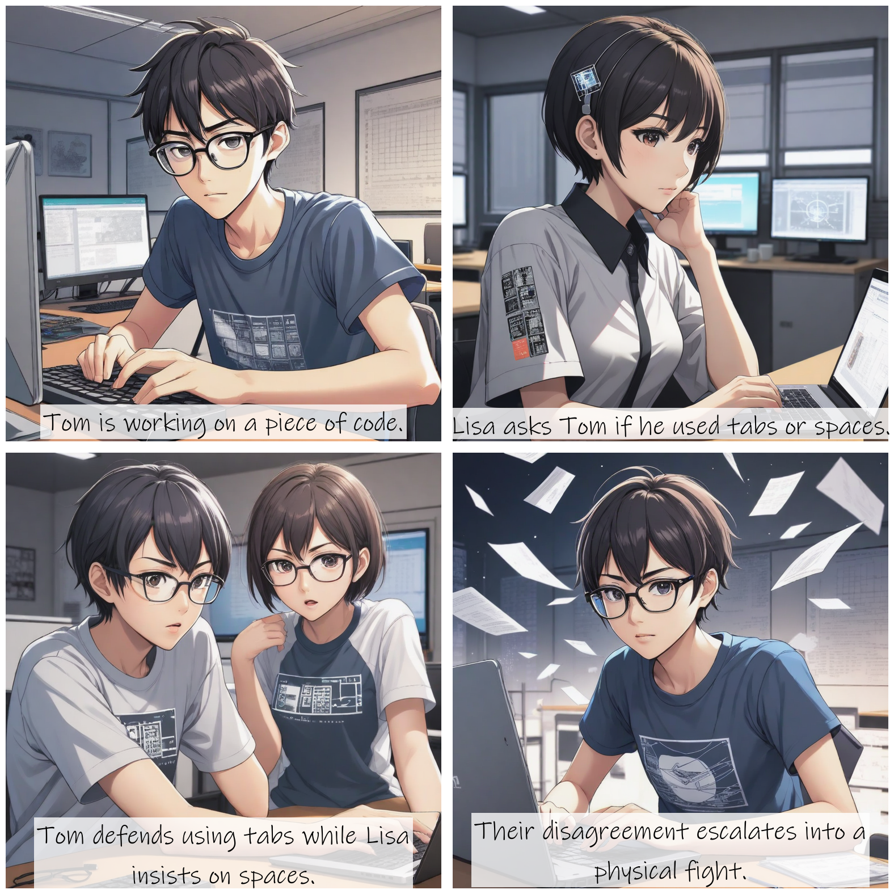
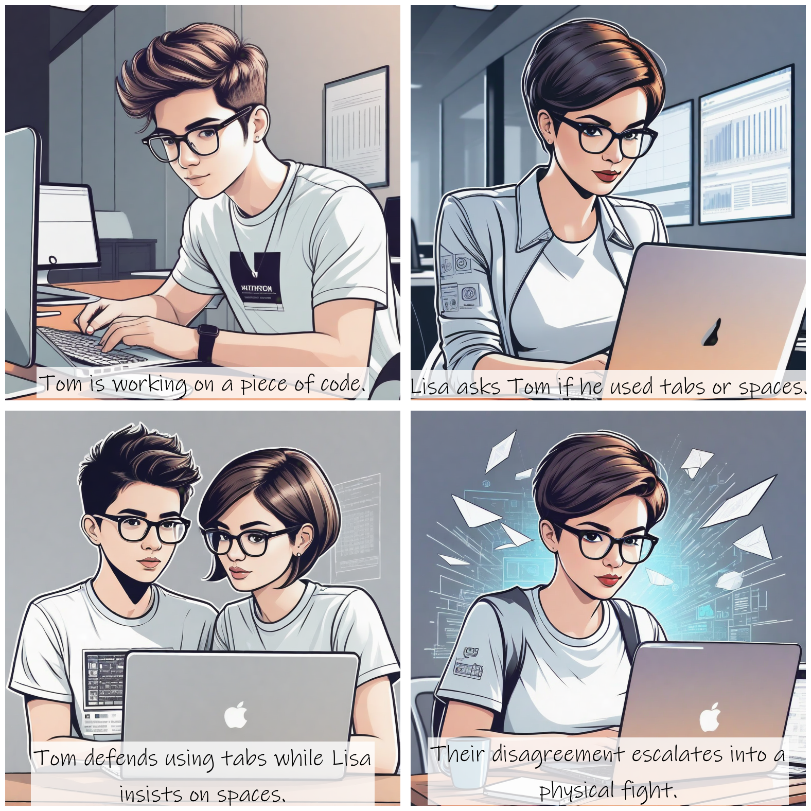
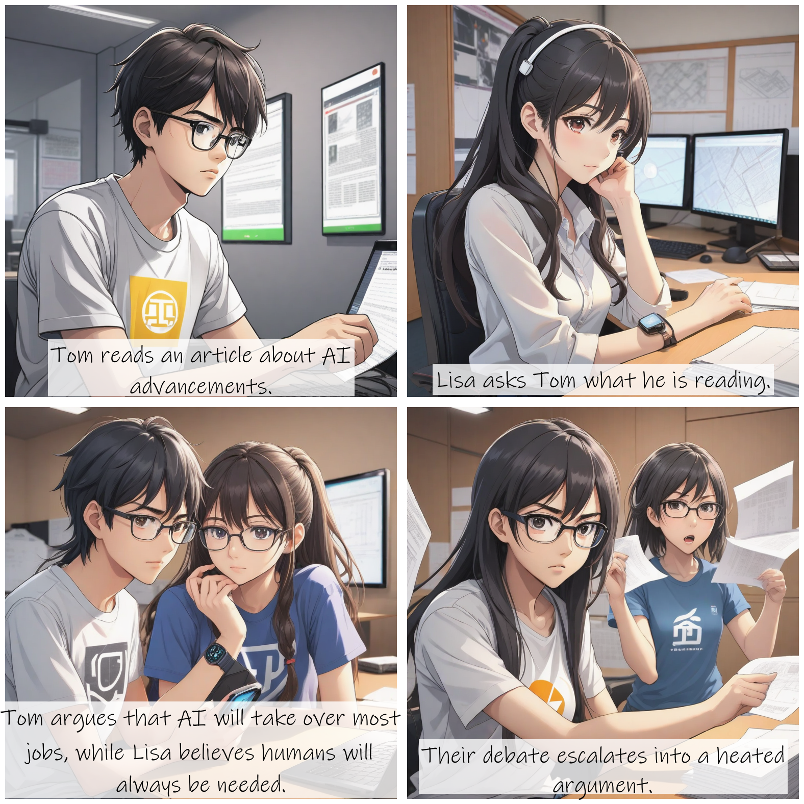
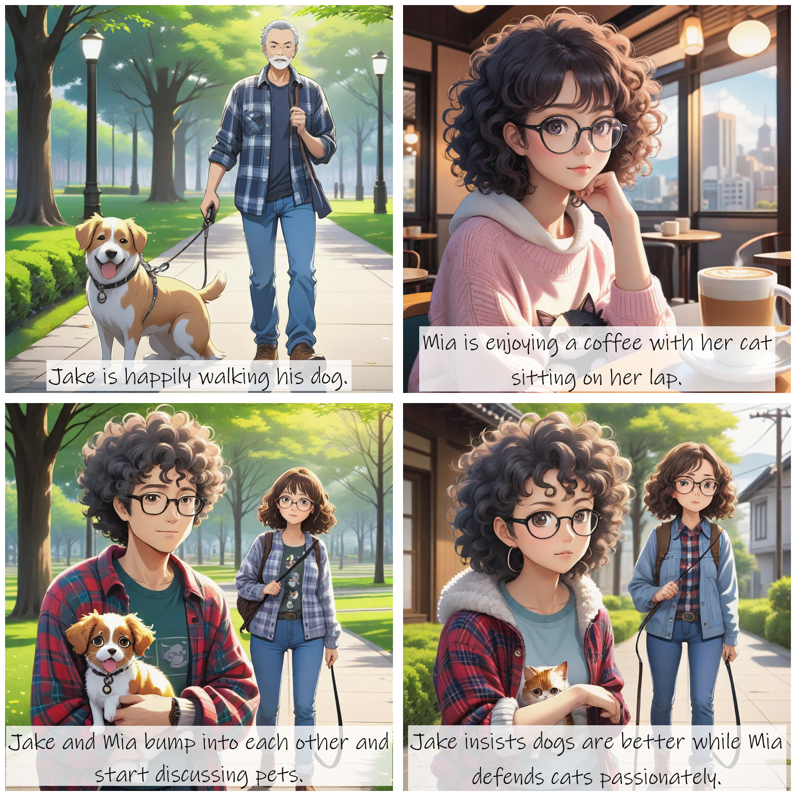
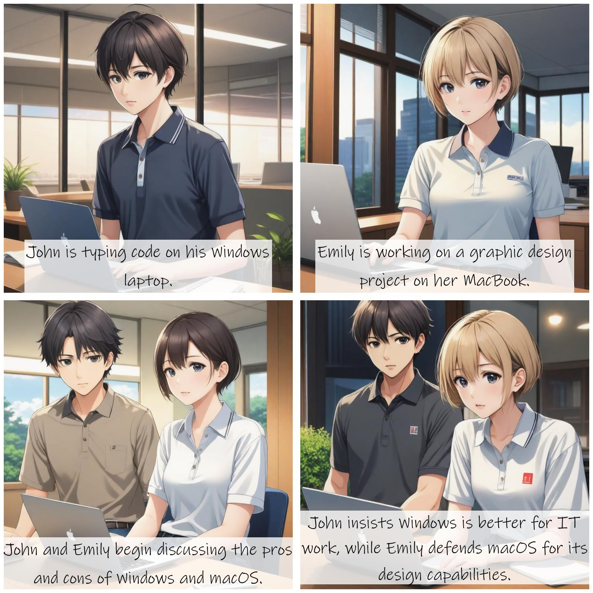

+++
title = '[AI StoryDiffusion] Create Magical Stories, AI Comic Showdown!'
date = 2024-06-12T11:44:17+08:00
draft = false
categories = ['AI', 'StoryDiffusion']
tags = ['AI', 'StoryDiffusion']
description = "Explore the magical AI project StoryDiffusion, bringing you a consistent and coherent experience in image and video creation."
keywords = ["AI", "StoryDiffusion", "Coherent Image Generation", "Video Creation", "Comic", "Long Video", "Artificial Intelligence"]
+++

Today, let's introduce a new AI project, StoryDiffusion, used to generate coherent images and videos.

Due to its coherence, it can be used to create comics or long videos.

Official examples can be viewed at the end of the article via the link provided, so we won't go into detail here.

## Key Features:
StoryDiffusion creates a magical story by generating coherent images and videos. Our work mainly consists of two parts:

1. Coherent self-attention mechanism for generating character-consistent images in long-range sequences. It is plug-and-play and compatible with all image diffusion models based on SD1.5 and SDXL. In the current implementation, users need to provide at least three textual prompts for the coherent self-attention module. We recommend providing at least 5-6 textual prompts for better layout arrangements.
2. Motion predictor for generating long-distance videos, which predicts the motion between conditional images in a compressed image semantic space, achieving larger-scale motion prediction.

## Installation

Installation is straightforward, just execute a few commands sequentially.

```bash
conda create --name storydiffusion python=3.10
conda activate storydiffusion
pip install -U pip
pip install -r requirements.txt

python gradio_app_sdxl_specific_id_low_vram.py
```

## Usage

Let's take a look at the interface.


So, you need to input "Character Description" and "Comic Description," and that's basically it.

Programmers often debate whether to use tabs or spaces for code alignment, so we'll consider using this topic for a comic.

### Character Description

```
[Tom] A young programmer wearing glasses, with a T-shirt featuring programming slogans.
[Lisa] A female developer with short hair, her laptop covered in stickers with tech logos.
```

### Comic Description

```
[Tom] In the office, typing on his keyboard #Tom is writing a piece of code.
[Lisa] In the same office, checking Tom's code on her laptop #Lisa asks Tom if he uses tabs or spaces.
[Tom] and [Lisa] argue, both looking frustrated #Tom argues for tabs, Lisa insists on spaces.
[Tom] and [Lisa] start fighting, papers and notebooks flying everywhere #Their argument escalates into a physical conflict.
```

Then click "Generate" to get the image!



## Examples

Let's look at a few examples. Still on the tab or space theme, let's try different comic styles.





Let's try a few different themes.

Will AI replace human jobs?



Which is a better pet: cat or dog?



Which operating system is better: Windows or macOS?



---

- [GitHub](https://github.com/HVision-NKU/StoryDiffusion)
- [Official Website](https://storydiffusion.github.io/)
- [AI Blog - Learn AI from scratch](https://ai-blog.aihub2022.top/post/ai-storydiffusion-intro/)
