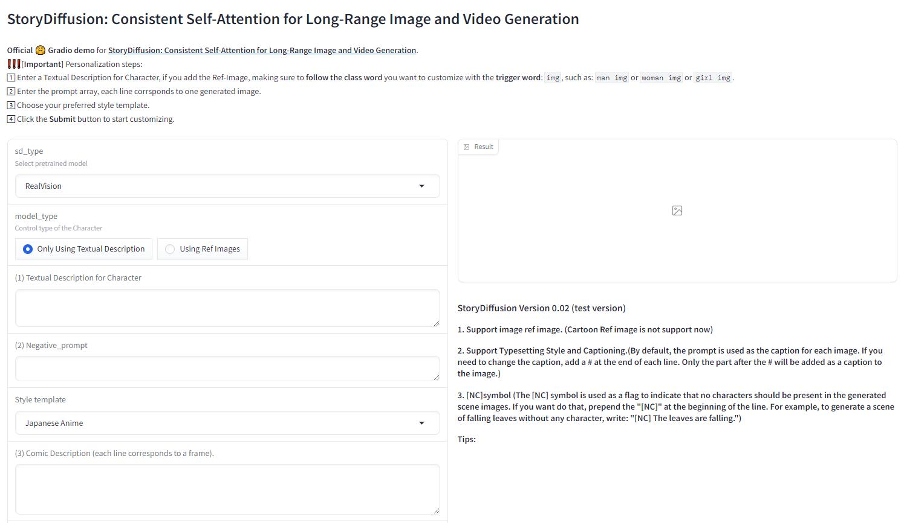
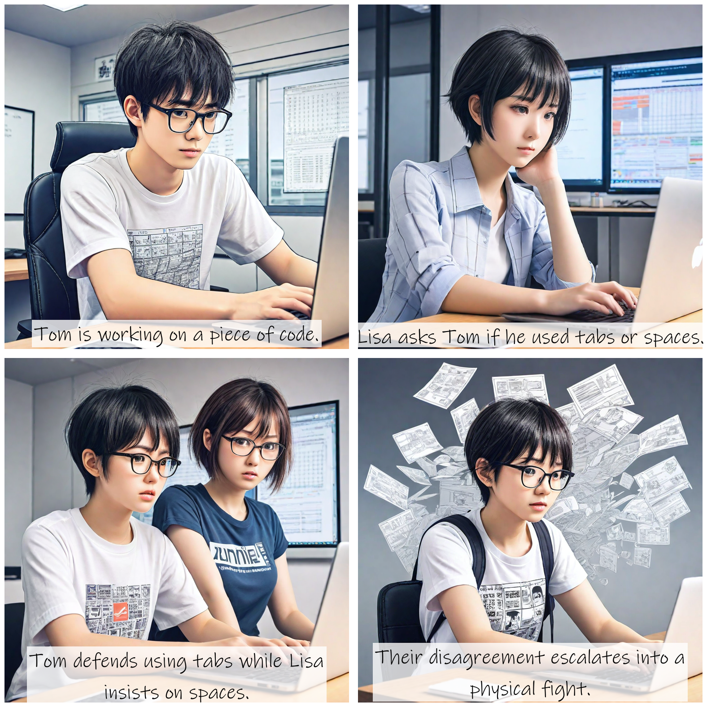

+++
title = '[AI StoryDiffusion] 创造神奇故事，AI漫画大乱斗！'
date = 2024-06-12T11:44:17+08:00
draft = false
categories = ['AI', 'StoryDiffusion']
tags = ['AI', 'StoryDiffusion']
description = "探索神奇AI项目StoryDiffusion，为您带来一致性连贯的图像和视频创作体验。"
keywords = ["AI", "StoryDiffusion", "连贯图像生成", "视频创作", "漫画", "长视频", "人工智能"]
+++

今天介绍一个新的AI项目，StoryDiffusion，用于生成一致性连贯的图像和视频。

因为它的一致性，因此可以用于创建漫画，或者长视频。

官方示例可看文末链接，这里不再赘述。

## 关键特性：
StoryDiffusion 可以通过生成连贯的图像和视频来创造一个神奇的故事。我们的工作主要包括两个部分：

1. 长距离序列中角色一致的图像生成的连贯自注意力机制。它是即插即用的，与所有基于SD1.5和SDXL的图像扩散模型兼容。在当前的实现中，用户需要为连贯自注意力模块提供至少3个文本提示。我们建议至少提供5-6个文本提示以获得更好的布局安排。
2. 长距离视频生成的运动预测器，它在压缩的图像语义空间中预测条件图像之间的运动，实现更大范围的运动预测。

## 安装

安装很简单，依次执行几个命令

```bash
conda create --name storydiffusion python=3.10
conda activate storydiffusion
pip install -U pip
pip install -r requirements.txt

python gradio_app_sdxl_specific_id_low_vram.py
```

## 使用

我们看下界面




所以，需要输入“角色描述” 和 “漫画描述”，基本上就可以了。

程序员经常争论代码对齐用 tab 还是 space，我们考虑用这个话题做个漫画。

### 角色描述

```plaintext
[汤姆] 一个戴眼镜的年轻程序员，穿着带有编程口号的T恤。
[丽莎] 一个女开发者，短发，笔记本电脑上贴满了科技标志的贴纸。
```

### 漫画描述

```plaintext
[汤姆] 在办公室，正在键盘上打字 #汤姆正在编写一段代码。
[丽莎] 在同一个办公室，正在她的笔记本电脑上查看汤姆的代码 #丽莎问汤姆他是用的tab还是空格。
[汤姆] 和 [丽莎] 争论，双方都显得很沮丧 #汤姆辩解用tab，丽莎坚持用空格。
[汤姆] 和 [丽莎] 打起来了，纸张和笔记本飞得到处都是 #他们的争论升级成了肢体冲突。
```

然后点“Generate”，出图！


## 样例

我们再来看几个例子。还是 tab or space 主题，换漫画风格试试




再换几个主题试试

人工智能是否会取代人类工作？


猫和狗哪个是更好的宠物？


哪个操作系统更好：Windows还是macOS？


---

- [github](https://github.com/HVision-NKU/StoryDiffusion)
- [官网](https://storydiffusion.github.io/)
- [AI 博客 - 从零开始学AI](https://ai-blog.aihub2022.top/zh/post/ai-storydiffusion-intro/)
- [公众号 - 从零开始学AI](https://mp.weixin.qq.com/s?__biz=MzA3MDIyNTgzNA==&mid=2649977457&idx=1&sn=d756952c4a9b1a3a67a1db2bb3286d05&chksm=86c7c8b4b1b041a2a37002e7fa7510e6593b941087c02e13d9b9339167a5ebc743b025627146#rd)
<!-- - [CSDN - 从零开始学AI](...) -->
<!-- - [掘金 - 从零开始学AI](...) -->
<!-- - [知乎 - 从零开始学AI](...) -->
<!-- - [阿里云 - 从零开始学AI](...) -->
<!-- - [腾讯云 - 从零开始学AI](...) -->
