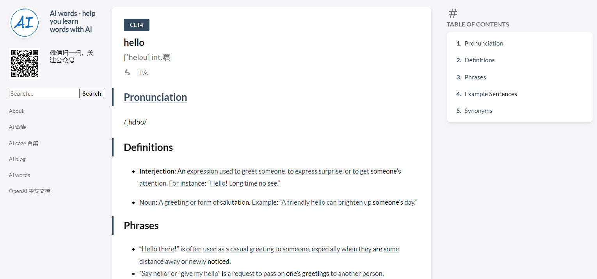
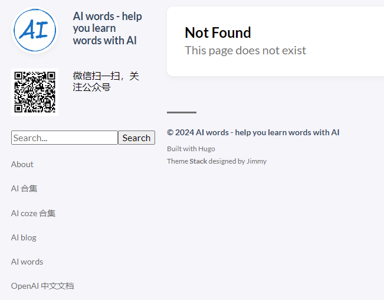

+++
title = '[AI Words] Launches New Search Feature for Faster and Easier Word Lookup'
date = 2024-06-14T13:52:12+08:00
draft = false
categories = ['AI', 'AI words']
tags = ['AI', 'AI words']
description = 'AI Words site adds a new search feature, allowing users to quickly find the words they need.'
keywords = ['AI', 'AI words', 'search bar', 'new feature', 'word lookup']
+++

The [AI words](https://ai-words.aihub2022.top/) website has just launched an exciting new feature: a search bar located in the left sidebar. This feature is designed to simplify your word search experience, making it faster and more intuitive than ever before.

Now, users can simply type a word into the search bar and click the button or press enter to be taken directly to the word's page. This new feature greatly facilitates quick word lookup and learning.

For example, when you enter "hello" and perform a search, you will be taken directly to the page about "hello":

If the word you enter does not exist or is not included in the database, the system will display a “Not Found” message, indicating that the page does not exist.

The launch of this new feature is part of our ongoing efforts to enhance user experience. We are committed to providing more convenient and efficient learning tools to help users better master AI-related knowledge.

We invite everyone to visit [AI words](https://ai-words.aihub2022.top/) and try out the new feature. If you have any feedback or suggestions, please feel free to contact us. We will continue to strive to bring you better services.

---

- [AI words](https://ai-words.aihub2022.top/)
