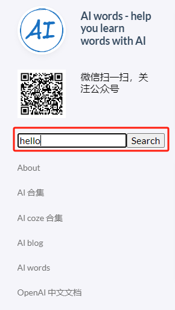
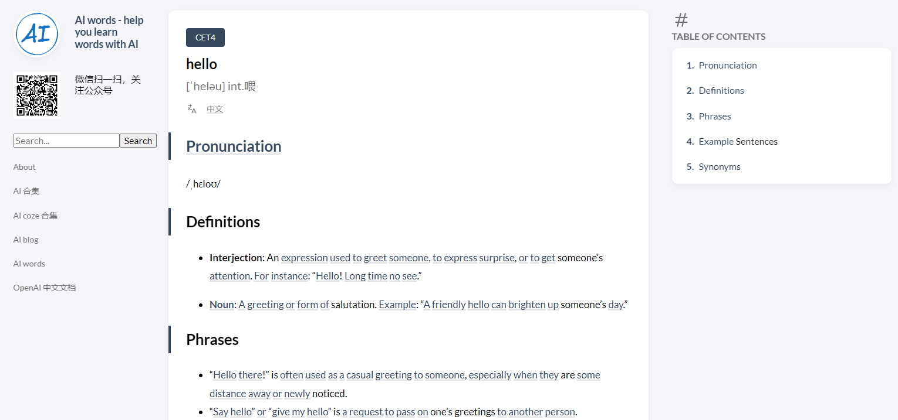

+++
title = '[AI Words] 全新上线搜索功能，让查单词更快捷高效'
date = 2024-06-14T13:52:12+08:00
draft = false
categories = ['AI', 'AI words']
tags = ['AI', 'AI words']
description = 'AI Words站点新增搜索功能，用户可通过搜索框快速查找所需单词。'
keywords = ['AI', 'AI words', 'search bar', '新功能', '单词查找']
+++

[AI words](https://ai-words.aihub2022.top/) 网站刚刚推出了一个激动人心的新功能：搜索框，它位于左侧边栏，旨在简化你的单词搜索体验，使其比以往任何时候都更快、更直观。

现在，用户只需在搜索框中输入单词并点击按钮或按下回车键，即可直接跳转到该单词的页面。这一新功能极大地方便了用户快速查找和学习单词。

例如，当你输入 "hello" 并进行搜索时，将会直接跳转到关于 "hello" 的页面：

如果输入的单词不存在或未被收录，系统会提示“Not Found”，表示页面不存在。

这个新功能的上线，是我们不断优化用户体验的一部分。我们致力于提供更便捷、更高效的学习工具，帮助用户更好地掌握AI相关知识。

欢迎大家访问 AI words 并试用新功能。如果你有任何反馈或建议，请随时联系我们。我们将继续努力，为大家带来更优质的服务。

---

- [AI words](https://ai-words.aihub2022.top/)
- [公众号 - 从零开始学AI](https://mp.weixin.qq.com/s?__biz=MzA3MDIyNTgzNA==&mid=2649977475&idx=1&sn=f8b81c6022f69523af4ff83047e53112&chksm=86c7c846b1b041501e5f5164c83c694da7f4666c847f16ecf05cefa85c650f21a255920c2837#rd)
