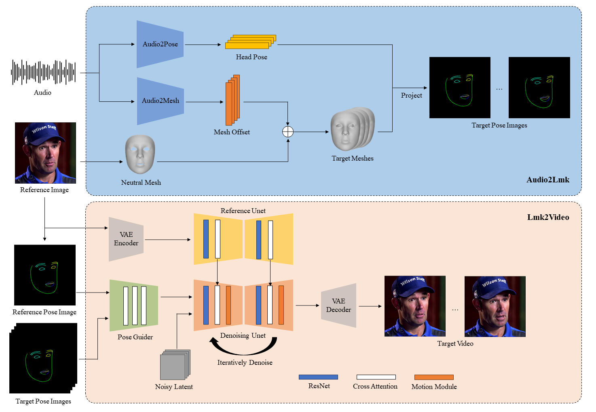

+++
title = '【AI AniPortrait】腾讯游戏知几团队推出的音频驱动的逼真肖像动画合成框架，对标阿里EMO | blog.aihub2022.top'
date = 2024-04-01T17:43:11+08:00
draft = false
categories = ['AI', 'AniPortrait']
tags = ['AI', 'AniPortrait']
description = 'AniPortrait 是腾讯开源的音频驱动的逼真肖像动画合成工具。本文介绍了 AniPortrait 的特性、使用方法以及相关训练和推理过程。'
keywords = ['AniPortrait', '腾讯', '动画合成', '音频驱动', '肖像动画']
+++

之前阿里推出了EMO，效果很棒，但是并未给出源码。

最近，腾讯游戏知几团队放出了类似产品 AniPortrait，并开源。我们一起来看下。

---

# AniPortrait

**AniPortrait：音频驱动的逼真肖像动画合成**

作者：Huawei Wei, Zejun Yang, Zhisheng Wang

组织：Tencent Games Zhiji, Tencent


在这里，我们提出了AniPortrait，一个新颖的框架，用于生成由音频和参考肖像图像驱动的高质量动画。您还可以提供视频来实现面部重现。

[](https://arxiv.org/abs/2403.17694)

## 流程



## 待办事项

- [x] 现在我们的论文已经在arXiv上发布了。
- [x] 更新代码以生成pose_temp.npy，用于头部姿态控制。
- [ ] 我们将在进一步优化后发布audio2pose预训练权重，用于音频到视频的转换。您可以在 `./configs/inference/head_pose_temp` 中选择头部姿态模板进行替换。

## 各种生成的视频

### 自主驱动




[链接点这里](https://github.com/Zejun-Yang/AniPortrait?tab=readme-ov-file#self-driven)

### 面部重现




[链接点这里](https://github.com/Zejun-Yang/AniPortrait?tab=readme-ov-file#face-reenacment)

视频来源：[鹿火CAVY来自bilibili](https://www.bilibili.com/video/BV1H4421F7dE/?spm_id_from=333.337.search-card.all.click)

### 音频驱动







[链接点这里](https://github.com/Zejun-Yang/AniPortrait?tab=readme-ov-file#audio-driven)

## 安装

### 构建环境

我们建议使用 Python 版本 >=3.10 和 CUDA 版本 =11.7。然后按照以下方式构建环境：

```shell
pip install -r requirements.txt
```

### 下载权重

所有权重应放置在 `./pretrained_weights` 目录下。您可以手动下载权重，如下所示：

1. 下载我们训练的 [权重](https://huggingface.co/ZJYang/AniPortrait/tree/main)，其中包括四个部分：`denoising_unet.pth`、`reference_unet.pth`、`pose_guider.pth`、`motion_module.pth` 和 `audio2mesh.pt`。

2. 下载基于模型和其他组件的预训练权重：
    - [StableDiffusion V1.5](https://huggingface.co/runwayml/stable-diffusion-v1-5)
    - [sd-vae-ft-mse](https://huggingface.co/stabilityai/sd-vae-ft-mse)
    - [image_encoder](https://huggingface.co/lambdalabs/sd-image-variations-diffusers/tree/main/image_encoder)
    - [wav2vec2-base-960h](https://huggingface.co/facebook/wav2vec2-base-960h)

最后，这些权重应按以下方式组织：

```text
./pretrained_weights/
|-- image_encoder
|   |-- config.json
|   `-- pytorch_model.bin
|-- sd-vae-ft-mse
|   |-- config.json
|   |-- diffusion_pytorch_model.bin
|   `-- diffusion_pytorch_model.safetensors
|-- stable-diffusion-v1-5
|   |-- feature_extractor
|   |   `-- preprocessor_config.json
|   |-- model_index.json
|   |-- unet
|   |   |-- config.json
|   |   `-- diffusion_pytorch_model.bin
|   `-- v1-inference.yaml
|-- wav2vec2-base-960h
|   |-- config.json
|   |-- feature_extractor_config.json
|   |-- preprocessor_config.json
|   |-- pytorch_model.bin
|   |-- README.md
|   |-- special_tokens_map.json
|   |-- tokenizer_config.json
|   `-- vocab.json
|-- audio2mesh.pt
|-- denoising_unet.pth
|-- motion_module.pth
|-- pose_guider.pth
`-- reference_unet.pth
```

注意：如果您已经安装了一些预训练模型，例如 `StableDiffusion V1.5`，您可以在配置文件中指定它们的路径（例如 `./config/prompts/animation.yaml`）。

## 推理

以下是运行推理脚本的CLI命令：

**请注意，您可以在命令中设置 -L 为所需的生成帧数，例如，-L 300。**

### 自主驱动

```shell
python -m scripts.pose2vid --config ./configs/prompts/animation.yaml -W 512 -H 512
```

您可以参考animation.yaml的格式，添加自己的参考图像或姿态视频。要将原始视频转换为姿态视频（关键点序列），可以使用以下命令运行：

```shell
python -m scripts.vid2pose --video_path pose_video_path.mp4
```

### 面部重现

```shell
python -m scripts.vid2vid --config ./configs/prompts/animation_facereenac.yaml -W 512 -H 512
```

在animation_facereenac.yaml中添加源脸部视频和参考图像。

### 音频驱动

```shell
python -m scripts.audio2vid --config ./configs/prompts/animation_audio.yaml -W 512 -H 512
```

在animation_audio.yaml中添加音频和参考图像。

您可以使用以下命令为头部姿态控制生成pose_temp.npy：

```shell
python -m scripts.generate_ref_pose --ref_video ./configs/inference/head_pose_temp/pose_ref_video.mp4 --save_path ./configs/inference/head_pose_temp/pose.npy
```

## 训练

### 数据准备
下载 [VFHQ](https://liangbinxie.github.io/projects/vfhq/) 和 [CelebV-HQ](https://github.com/CelebV-HQ/CelebV-HQ) 

从原始视频中提取关键点并编写训练json文件（以下是处理VFHQ的示例）：

```shell
python -m scripts.preprocess_dataset --input_dir VFHQ_PATH --output_dir SAVE_PATH --training_json JSON_PATH
```

更新训练配置文件中的行：

```yaml
data:
  json_path: JSON_PATH
```

### 第一阶段

运行命令：

```shell
accelerate launch train_stage_1.py --config ./configs/train/stage1.yaml
```

### 第二阶段

将预训练的运动模块权重 `mm_sd_v15_v2.ckpt`（[下载链接](https://huggingface.co/guoyww/animatediff/blob/main/mm_sd_v15_v2.ckpt)）放置在 `./pretrained_weights` 下。

在配置文件 `stage2.yaml` 中指定第一阶段训练权重，例如：

```yaml
stage1_ckpt_dir: './exp_output/stage1'
stage1_ckpt_step: 30000 
```

运行命令：

```shell
accelerate launch train_stage_2.py --config ./configs/train/stage2.yaml
```

## 致谢

我们首先感谢[EMO](https://github.com/HumanAIGC/EMO)的作者，我们演示中的部分图像和音频来自EMO。此外，我们还要感谢 [Moore-AnimateAnyone](https://github.com/MooreThreads/Moore-AnimateAnyone)、[majic-animate](https://github.com/magic-research/magic-animate)、[animatediff](https://github.com/guoyww/AnimateDiff) 和 [Open-AnimateAnyone](https://github.com/guoqincode/Open-AnimateAnyone) 仓库的贡献者，感谢他们的开放研究和探索。

## 引用

```
@misc{wei2024aniportrait,
      title={AniPortrait: Audio-Driven Synthesis of Photorealistic Portrait Animations}, 
      author={Huawei Wei and Zejun Yang and Zhisheng Wang},
      year={2024},
      eprint={2403.17694},
      archivePrefix={arXiv},
      primaryClass={cs.CV}
}
```

---

- [官网](https://github.com/Zejun-Yang/AniPortrait)
- 本文
    - [博客 - 从零开始学AI](https://blog.aihub2022.top/post/aniportrait-readme/)
    - [微信 - 从零开始学AI](https://mp.weixin.qq.com/s?__biz=MzA3MDIyNTgzNA==&mid=2649976763&idx=1&sn=e7b9ee2c8bdc90cf73725d03df6a5581&chksm=86c7d57eb1b05c68f3bebb63418b79d374220def4e7ff69072dcdcb35b62514f7773f61a7705#rd)
    - [CSDN - 从零开始学AI](https://blog.csdn.net/mahone3297/article/details/137366473)
    - [知乎 - 从零开始学AI](https://zhuanlan.zhihu.com/p/690687456)
