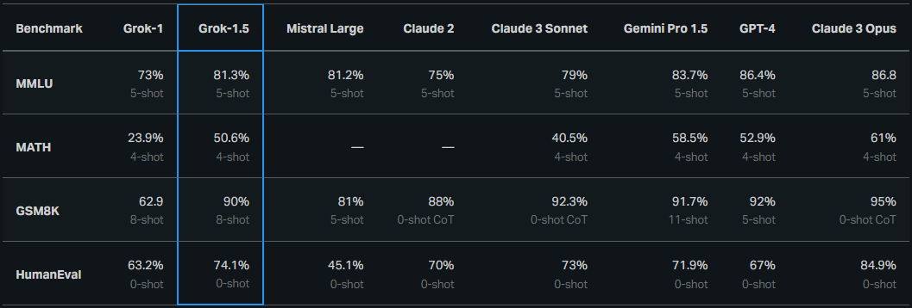

+++
title = 'Announcing Grok 1.5 | aihub2022.top'
date = 2024-03-30T23:52:03+08:00
draft = false
categories = ['AI', 'Grok']
tags = ['AI', 'Grok']
keywords = ["Grok-1.5", "推理能力", "上下文长度", "模型", "高级推理", "早期测试者", "Grok用户", "𝕏平台"]
description = "Grok-1.5具备改进的推理能力，上下文长度为128,000个标记。即将在𝕏上推出。介绍Grok-1.5，我们最新的模型，能够理解长篇上下文并进行高级推理。Grok-1.5将在未来几天内提供给我们的早期测试者和现有的Grok用户，供在𝕏平台上使用。"
+++

两周前，xAI发布了Grok-1。

今日，xAI推出了Grok-1.5。我们一起来看下。

---

# 宣布Grok-1.5

Grok-1.5具备改进的推理能力，上下文长度为128,000个标记。即将在𝕏上推出。

介绍Grok-1.5，我们最新的模型，能够理解长篇上下文并进行高级推理。Grok-1.5将在未来几天内提供给我们的早期测试者和现有的Grok用户，供在𝕏平台上使用。

两周前发布了Grok-1的模型权重和网络架构，我们展示了截至去年11月份为止xAI所取得的进展的一瞥。自那时以来，我们在我们最新的模型Grok-1.5中改进了推理和解决问题的能力。

## 能力与推理

在Grok-1.5中最显著的改进之一是其在编码和与数学相关的任务中的表现。在我们的测试中，Grok-1.5在MATH基准测试中取得了50.6%的分数，在GSM8K基准测试中取得了90%的分数。这两个数学基准测试涵盖了从小学到高中竞赛题目的广泛范围。此外，它在HumanEval基准测试中得分74.1%，该测试评估了代码生成和问题解决能力。

## 长篇上下文理解

Grok-1.5的一个新功能是能够在其上下文窗口内处理长达128K标记的长篇上下文。这使得Grok的内存容量增加了前一个上下文长度的16倍，使其能够利用来自 substantially longer documents 的信息。

此外，该模型可以处理更长、更复杂的提示，同时在其上下文窗口扩展的情况下仍保持其遵循指令的能力。在“大海捞针”（NIAH）评估中，Grok-1.5展示了强大的检索能力，能够在长达128K标记的上下文中检索嵌入文本，并取得了完美的检索结果。

## Grok-1.5基础设施

运行在大规模GPU集群上的尖端大型语言模型（LLMs）研究需要健壮且灵活的基础设施。Grok-1.5建立在基于JAX、Rust和Kubernetes的定制分布式训练框架之上。这个训练堆栈使我们的团队能够在大规模上快速地原型化想法并训练新的架构，而几乎不需要付出太多的努力。在大型计算集群上训练LLMs的一个主要挑战是最大限度地提高训练作业的可靠性和运行时间。我们的定制训练协调器确保自动检测到问题节点并将其从训练作业中排除。我们还优化了检查点、数据加载和训练作业重启，以在发生故障时尽量减少停机时间。如果你对我们的训练堆栈感兴趣，请申请加入我们的团队。

## 展望未来
Grok-1.5即将提供给早期测试者，我们期待收到您的反馈，以帮助我们改进Grok。随着我们逐渐将Grok-1.5推广到更广泛的用户群中，我们将在未来几天内介绍几个新功能。

请注意，GPT-4的分数来自于2023年3月发布。对于MATH和GSM8K，我们呈现maj@1结果。对于HumanEval，我们报告的是pass@1基准分数。

---

- [官网](https://x.ai/blog/grok-1.5)
