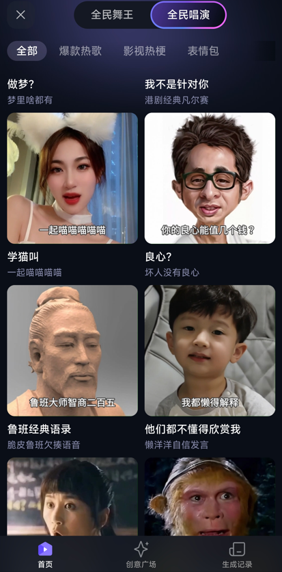
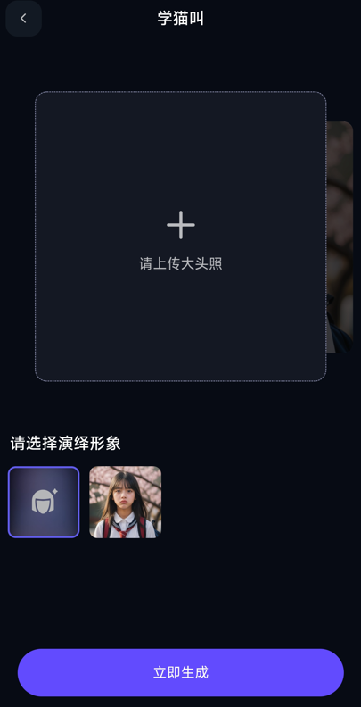
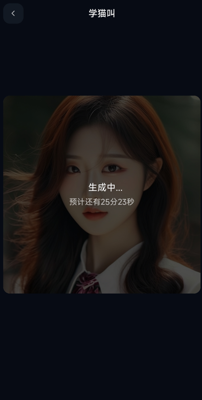

+++
title = '[AI 阿里 EMO] 集成进通义千问app，全民演唱，人人可用！'
date = 2024-04-26T10:59:52+08:00
draft = false
categories = ['AI', '阿里', 'EMO', '通义千问']
tags = ['AI', '阿里', 'EMO', '通义千问', '视频生成', '全民演唱']
description = '阿里EMO技术的最新进展，现在集成进通义千问app，允许用户通过图+音频生成任意时长的视频，实现全民演唱的互动体验。'
keywords = ['阿里EMO', 'EMO技术', '通义千问app', '视频生成', '音频视频同步', '全民演唱', '互动体验']
+++

前段时间，阿里的EMO放出了demo，效果那是相当炸裂。

- [【AI Alibaba/EMO】1. 图+音频，生成任意时长视频，效果炸裂！](https://mp.weixin.qq.com/s?__biz=MzA3MDIyNTgzNA==&mid=2649976387&idx=1&sn=8533dac9e4bbce02d8817fe56647ab43&chksm=86c7d486b1b05d90d567be4d80d1bf72689bb7ac64b1203b2320450bf898d215d584ceaab234#rd)
- [【AI Alibaba/EMO】2. 图+音频，生成任意时长视频，效果炸裂！](https://mp.weixin.qq.com/s?__biz=MzA3MDIyNTgzNA==&mid=2649976398&idx=1&sn=f1446d5a063f55fe4c6f51b5caf18c83&chksm=86c7d48bb1b05d9d0962daec851246a84e03f9a2d43cb4fce7e01888d972358f1d35a4b2c289#rd)

今天，EMO直接放出来了，人人可用！集成进通义千问app，我们一起来看下。

打开app，输入emo，即可进到全民演唱。

点击“立即体验”

选择“全民演唱”

这里有许多模板可选。用户不可自己提交音乐，只能使用现有模板。

我们选择“一起学猫叫”

点击“演同款”

上传大头照，点击“立即生成”

app很火爆，排队等25分钟

video 视频请上微信公众号查看。

感觉合成的视频，图像比声音稍微慢一点。可能0.5s左右。

---

- 本文
    - [博客 - 从零开始学AI](https://blog.aihub2022.top/post/emo-integrate-into-tongyi-qianwen/)
    - [微信 - 从零开始学AI](https://mp.weixin.qq.com/s?__biz=MzA3MDIyNTgzNA==&mid=2649976939&idx=1&sn=1618cd4ab92898f73cdba88cdb5bc163&chksm=86c7caaeb1b043b8c6e448130fa5cabd0a19f2c1dad4a67b3e79a8182f269b1c80f601bb8499#rd)
    - [CSDN - 从零开始学AI](https://blog.csdn.net/mahone3297/article/details/138217555)
    - [掘金 - 从零开始学AI](https://juejin.cn/post/7361715712992788519)
    - [知乎 - 从零开始学AI](https://zhuanlan.zhihu.com/p/694691752)
    - [阿里云 - 从零开始学AI](https://developer.aliyun.com/article/1493372)
    - [腾讯云 - 从零开始学AI](https://cloud.tencent.com/developer/article/2412028)
