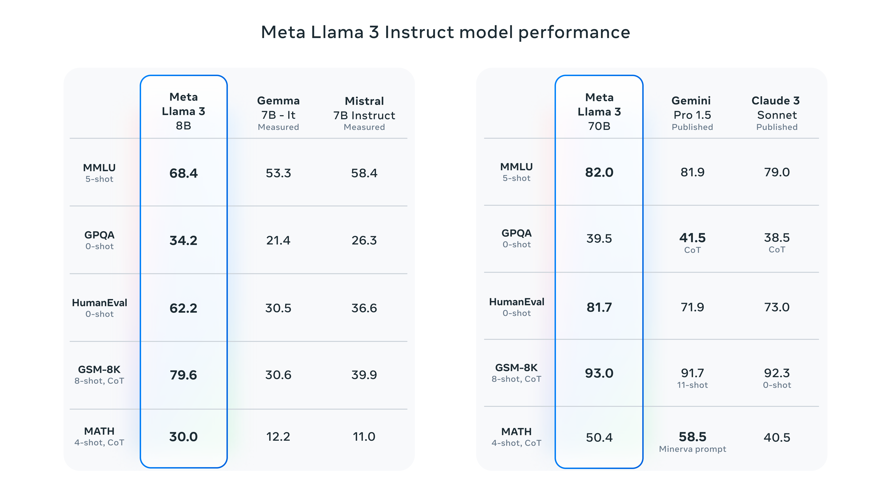
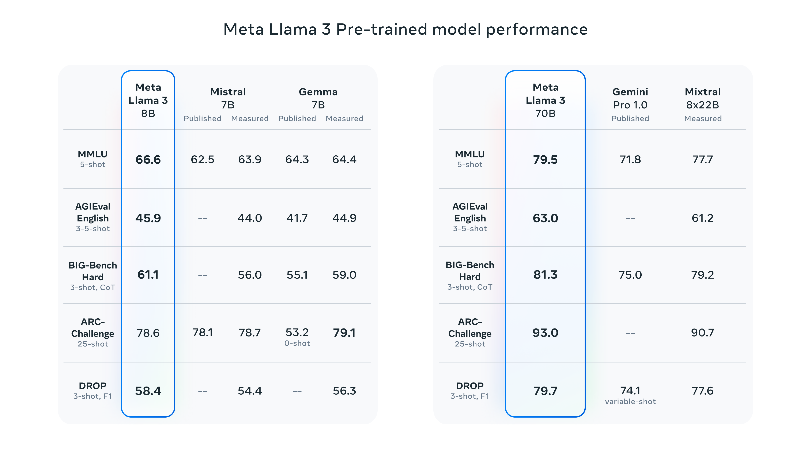
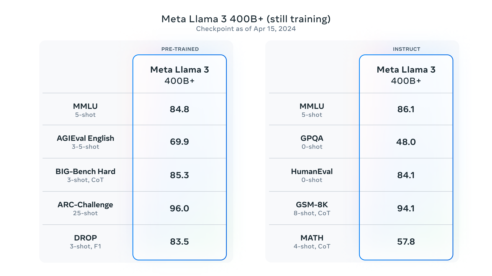

+++
title = '[AI Meta Llama-3] 最强开源大模型Llama 3发布！'
date = 2024-04-19T11:37:01+08:00
draft = false
categories = ['AI', 'Meta', 'Llama-3']
tags = ['AI', 'Meta', 'Llama-3']
description = 'Meta Llama 3是迄今最具能力的开源大型语言模型的下一代。'
keywords = ['AI', 'Meta', 'Llama-3', '开源', '语言模型', 'Meta AI', '多语言', '多模态', '指导微调', '模型架构']
+++

最强开源大模型Llama 3发布！我们看下重点：

- 今天，我们介绍Meta Llama 3，这是我们最先进的开源大型语言模型的下一代。
- Llama 3模型很快将在AWS、Databricks、Google Cloud、Hugging Face、Kaggle、IBM WatsonX、Microsoft Azure、NVIDIA NIM和Snowflake上提供，并得到AMD、AWS、戴尔、英特尔、NVIDIA和高通等硬件平台的支持。
- 我们致力于以负责任的方式开发Llama 3，并提供各种资源来帮助其他人负责任地使用它。这包括推出新的信任和安全工具，如Llama Guard 2、Code Shield和CyberSec Eval 2。
- 在未来几个月里，我们预计将推出新的功能、更长的上下文窗口、额外的模型大小以及增强的性能，并将分享Llama 3的研究论文。
- 使用Llama 3技术构建的Meta AI现在是世界上领先的人工智能助手之一，可以提升您的智能并减轻您的负担——帮助您学习、完成任务、创建内容和连接，以充分利用每一刻。您可以在这里尝试Meta AI。

详细请看下文：

---

介绍 Meta Llama 3：迄今为止最具能力的开放LLM

推荐阅读：

1. 使用Llama 2入门的5个步骤
2. Llama生态系统：过去、现在和未来
3. 推出Code Llama，这是一款用于编码的最先进的大型语言模型
4. Meta和微软推出下一代Llama

今天，我们很高兴地宣布Meta Llama 3的第一批模型已经推出，可供广泛使用。此次发布的模型具有8B和70B参数的预训练和指导微调语言模型，可以支持广泛的用例。这一代Llama展示了在广泛的行业基准测试中的最先进性能，并提供了改进的推理等新功能。我们相信这些是同类中最优秀的开源模型。为了支持我们长期以来的开放式方法，我们将Llama 3交到了社区的手中。我们希望推动AI在整个技术栈上的下一波创新——从应用程序到开发者工具再到评估和推理优化等方面。我们迫不及待地想看到您的构建，并期待您的反馈。

## 我们对Llama 3的目标

通过Llama 3，我们致力于构建与当今最优秀的专有模型相媲美的最佳开源模型。我们希望解决开发者的反馈，提高Llama 3的整体实用性，同时继续在负责任使用和部署LLM方面发挥领导作用。我们秉持着开源精神，提前释放模型，让社区在其开发过程中获得访问权。今天发布的基于文本的模型是Llama 3模型系列的首批模型。我们未来的目标是使Llama 3具备多语言和多模态能力，具有更长的上下文，并持续提升核心LLM功能，如推理和编码的整体性能。

## 最先进的性能

我们的新型8B和70B参数的Llama 3模型是对Llama 2的重大飞跃，为这些规模的LLM模型建立了一个新的最先进水平。由于预训练和后训练的改进，我们的预训练和指导微调模型是目前8B和70B参数规模下最优秀的模型。我们后训练程序的改进大幅降低了虚假拒绝率，改善了模型对齐，并增加了模型响应的多样性。我们还看到了推理、代码生成和指导遵循等能力的极大改进，使得Llama 3更加可控。

在Llama 3的开发过程中，我们查看了模型在标准基准上的性能，并试图优化其在实际场景中的表现。为此，我们开发了一个新的高质量人工评估集。该评估集包含1800个提示，涵盖了12个关键用例：寻求建议、头脑风暴、分类、封闭式问题回答、编码、创意写作、提取、扮演角色/人物、开放式问题回答、推理、改写和总结。为了防止我们的模型在此评估集上出现意外过拟合，甚至我们自己的建模团队也无法访问它。下面的图表显示了我们在这些类别和提示上对Claude Sonnet、Mistral Medium和GPT-3.5的人工评估结果的汇总。

根据这一评估集，由人类标注者进行的偏好排名突显了我们的70B指导遵循模型在实际场景中相比规模相近的竞争模型表现强劲。

我们的预训练模型还为这些规模的LLM模型确立了一个新的最先进水平。

为了开发出一个优秀的语言模型，我们认为创新、扩展和优化简洁至关重要。我们在整个Llama 3项目中采用了这一设计理念，重点关注四个关键要素：模型架构、预训练数据、扩大预训练规模和指导微调。

## 模型架构

根据我们的设计理念，在Llama 3中我们选择了相对标准的仅解码器transformer架构。与Llama 2相比，我们进行了几个关键改进。Llama 3使用了一个词汇表为128K标记的分词器，更高效地编码语言，大大提高了模型性能。为了提高Llama 3模型的推理效率，我们采用了组合查询注意力（GQA）技术，覆盖了8B和70B规模。我们以8,192个标记的序列为训练样本，使用掩码确保自注意力不会跨越文档边界。

## 训练数据

为了训练出最佳的语言模型，构建一个大规模、高质量的训练数据集至关重要。按照我们的设计原则，我们大量投入预训练数据。Llama 3使用了来自公开可用来源的超过15T个标记进行预训练。我们的训练数据集比Llama 2使用的大七倍，其中包含四倍的代码。为了准备即将到来的多语言用例，超过5%的Llama 3预训练数据集包含覆盖30多种语言的高质量非英语数据。然而，我们不指望这些语言的性能水平与英语相同。

为确保Llama 3在最高质量的数据上进行训练，我们开发了一系列数据过滤管道。这些管道包括使用启发式过滤器、不安全内容过滤器、语义去重方法和文本分类器来预测数据质量。我们发现，以前版本的Llama在识别高质量数据方面表现出惊人的能力，因此我们使用Llama 2生成了用于驱动Llama 3的文本质量分类器的训练数据。

我们还进行了大量实验，评估了在最终的预训练数据集中混合不同来源数据的最佳方法。这些实验使我们能够选择一种数据混合方式，确保Llama 3在各种用例中表现良好，包括琐事问题、STEM、编码、历史知识等。

## 扩大预训练规模

为了有效地利用Llama 3模型的预训练数据，我们付出了大量努力来扩大预训练规模。具体来说，我们制定了一系列详细的下游基准评估的规模定律。这些规模定律使我们能够选择最佳的数据混合方式，并做出明智的决策，以最佳方式利用我们的训练计算资源。重要的是，规模定律使我们能够在实际训练模型之前预测最大型号模型在关键任务上的性能（例如，在上面提到的HumanEval基准评估上评估的代码生成），这有助于确保我们最终模型在各种用例和功能中表现出色。

在开发Llama 3过程中，我们对规模行为进行了几项新的观察。例如，虽然对于8B参数模型来说，Chinchilla-optimal的训练计算量对应约200B标记，但我们发现，即使在模型训练了两个数量级的数据后，模型性能仍然会持续提高。我们的8B和70B参数模型在训练了高达15T标记后仍然呈对数线性改善。较大的模型可以通过更少的训练计算量达到这些较小模型的性能水平，但一般更喜欢较小模型，因为它们在推理过程中更加高效。

为了训练我们最大的Llama 3模型，我们结合了三种并行化方式：数据并行化、模型并行化和流水线并行化。我们最有效的实现在同时使用16K个GPU进行训练时，每个GPU的计算利用率超过400 TFLOPS。我们在两个定制的24K GPU集群上进行了训练。为了最大程度地提高GPU的正常运行时间，我们开发了一个先进的新训练堆栈，自动化错误检测、处理和维护。我们还大大提高了硬件的可靠性，并针对无声数据损坏开发了新的可扩展存储系统，减少了检查点和回滚的开销。这些改进使得我们的训练时间的整体有效率超过95%。综合来看，这些改进使得Llama 3的训练效率相比Llama 2提高了大约三倍。

## 指导微调

为了充分释放我们预训练模型在聊天用例中的潜力，我们也对指导微调的方法进行了创新。我们的后训练方法是监督微调（SFT）、拒绝抽样、近端策略优化（PPO）和直接策略优化（DPO）的组合。在SFT中使用的提示质量以及在PPO和DPO中使用的偏好排名对齐模型的表现有着极大的影响。我们在模型质量方面的一些最大改进来自于精心策划这些数据，并对人类标注者提供的注释进行多轮质量保证。

通过PPO和DPO学习偏好排名也极大地提高了Llama 3在推理和编码任务上的表现。我们发现，如果向模型提出它难以回答的推理问题，模型有时会产生正确的推理追踪：模型知道如何产生正确的答案，但不知道如何选择它。通过偏好排名的训练，模型可以学会如何选择正确的答案。

## 利用Llama 3构建

我们的愿景是让开发者能够定制Llama 3以支持相关的用例，并使采用最佳实践和改进开放生态系统变得更加容易。通过这一发布，我们提供了新的信任和安全工具，包括更新的组件，其中包括Llama Guard 2和Cybersec Eval 2，以及Code Shield的引入——这是一个推理时的护栏，用于过滤LLM生成的不安全代码。

我们还与torchtune共同开发了Llama 3，这是一个新的PyTorch原生库，用于轻松编写、微调和实验LLM。torchtune提供了内存高效和可修改的训练配方，完全由PyTorch编写。该库与Hugging Face、Weights & Biases和EleutherAI等流行平台集成，甚至支持Executorch，以在各种移动和边缘设备上运行高效推理。无论是从提示工程到使用LangChain与Llama 3，我们都有全面的入门指南，引导您从下载Llama 3一直到在您的生成式AI应用程序中实现规模化部署。

## 责任的系统级方法

我们设计Llama 3模型旨在最大程度地提供帮助，同时确保在负责任地部署它们方面处于行业领先地位。为实现这一目标，我们采用了一种新的、系统级的方法来负责任地开发和部署Llama。我们将Llama模型视为更广泛系统的一部分，这个系统让开发者掌控主导权。Llama模型将作为开发者根据其独特的终极目标设计的系统的基础部分。

指导微调在确保我们模型安全性方面也起着重要作用。我们通过内部和外部努力对我们的指导微调模型进行了红队测试以确保安全。我们的红队测试方法利用人类专家和自动化方法生成试图引发问题响应的对抗提示。例如，我们应用全面的测试来评估与化学、生物、网络安全和其他风险领域相关的滥用风险。所有这些努力都是迭代的，并用于指导发布模型的安全微调。您可以在模型卡中了解更多关于我们努力的信息。

Llama Guard模型旨在成为提示和响应安全的基础，并可以根据应用需求轻松进行微调以创建新的分类法。作为起点，新的Llama Guard 2使用了最近宣布的MLCommons分类法，以支持这一重要领域的行业标准的出现。此外，CyberSecEval 2通过增加对LLM允许滥用其代码解释器的倾向、攻击性网络安全能力以及易受提示注入攻击的度量，扩展了其前身。最后，我们引入了Code Shield，它增加了对由LLM生成的不安全代码的推理时间过滤支持。这提供了对不安全代码建议、代码解释器滥用预防以及安全命令执行的风险的缓解。

随着生成式AI领域的发展速度，我们认为开放式方法是将生态系统汇聚在一起并减轻这些潜在危害的重要方式。作为其中的一部分，我们正在更新我们的负责任使用指南（RUG），该指南提供了使用LLM进行负责任开发的综合指南。正如我们在RUG中概述的那样，我们建议根据应用程序的内容指南检查和过滤所有输入和输出。此外，许多云服务提供商提供内容审查API和其他工具，用于负责任的部署，我们鼓励开发人员也考虑使用这些选项。

## 规模化部署Llama 3

Llama 3将很快在包括云服务提供商、模型API提供商等在内的所有主要平台上提供。Llama 3将无处不在。

我们的基准测试显示，与Llama 2相比，分词器提供了改进的标记效率，产生的标记数量减少了多达15%。此外，现在已将Group Query Attention（GQA）添加到Llama 3的8B模型中。因此，尽管与Llama 2 7B相比，该模型参数多出了10亿个，但改进的分词器效率和GQA有助于保持与Llama 2 7B相当的推理效率。

要了解如何利用所有这些功能的示例，请查看Llama Recipes，其中包含了我们所有的开源代码，可以用于从微调到部署再到模型评估的各个方面。

## Llama 3的下一步是什么？

Llama 3的8B和70B模型标志着我们计划为Llama 3发布的开始。而且还有更多的内容即将推出。

我们最大的模型超过了400B参数，虽然这些模型仍在训练中，但我们的团队对它们的发展趋势感到兴奋。在未来几个月，我们将发布多个具有新功能的模型，包括多模态、能够使用多种语言进行对话、更长的上下文窗口以及更强大的整体功能。一旦Llama 3的训练完成，我们还将发布一份详细的研究论文。

为了让您提前了解这些模型在继续训练时的情况，我们想与您分享我们最大的LLM模型的一些趋势快照。请注意，这些数据基于Llama 3的早期检查点，该模型仍在训练中，并且这些功能不是今天发布的模型的一部分。

我们致力于持续发展和建设开放的人工智能生态系统，以负责任地发布我们的模型。我们长期以来坚信，开放性能够带来更好、更安全的产品，促进更快的创新，也有利于整个市场的健康发展。这对Meta来说是一件好事，也是对社会的福祉有益的。我们采取了以社区为先的方法来处理Llama 3，从今天开始，这些模型将在领先的云、托管和硬件平台上提供，并将有更多的平台加入。

## 立即体验Meta Llama 3

我们已将最新的模型集成到Meta AI中，我们相信它是世界领先的人工智能助手。现在它采用了Llama 3技术，并在我们的应用程序中更多国家可用。

您可以在Facebook、Instagram、WhatsApp、Messenger和Web上使用Meta AI来完成任务、学习、创造，并与对您重要的事物进行连接。您可以在此了解更多关于Meta AI的体验。

访问Llama 3网站下载模型，并参考入门指南，获取所有可用平台的最新列表。

您也将很快能够在我们的Ray-Ban Meta智能眼镜上测试多模式Meta AI。

像往常一样，我们期待着看到您用Meta Llama 3构建的所有精彩产品和体验。

---

- https://huggingface.co/blog/llama3)
- https://ai.meta.com/blog/meta-llama-3/
- https://llama.meta.com/llama3/
- https://github.com/meta-llama/llama3
- 本文
    - [博客 - 从零开始学AI](https://blog.aihub2022.top/post/meta-llama-3-intro/)
    - [微信 - 从零开始学AI](https://mp.weixin.qq.com/s?__biz=MzA3MDIyNTgzNA==&mid=2649976862&idx=1&sn=dbefe1a6f772e5db2b3a481ffa2a7ab4&chksm=86c7cadbb1b043cdca8419dd2f58a66bed8ad1c052973c6a389fd41a452e68f6195dd2ef389a#rd)
    - [CSDN - 从零开始学AI](https://blog.csdn.net/mahone3297/article/details/137965989)
    - [知乎 - 从零开始学AI](https://zhuanlan.zhihu.com/p/693409795)
    - [阿里云 - 从零开始学AI](https://developer.aliyun.com/article/1486793)
    - [腾讯云 - 从零开始学AI](https://cloud.tencent.com/developer/article/2410624)
