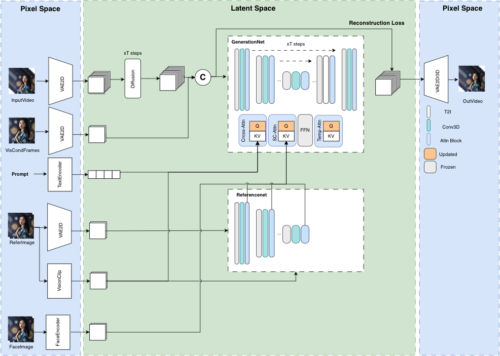
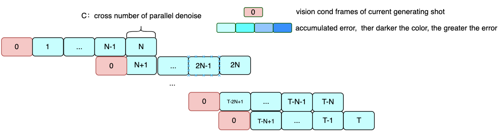

+++
title = '[AI MuseV] 基于扩散的虚拟人视频生成框架'
date = 2024-03-28T12:52:04+08:00
draft = false
categories = ['AI', 'MuseV']
tags = ['AI', 'MuseV']
description = "MuseV是基于视觉条件并行去噪的无限长度和高保真虚拟人视频生成。本项目提供了用于文本到视频和视频到视频生成的检查点，并支持多种参考图像技术。此外，MuseV还支持与Stable Diffusion生态系统兼容。"
keywords = ["MuseV", "虚拟人视频生成", "并行去噪", "扩散模型", "T2I", "IPAdapter", "文本到视频", "视频到视频", "图像处理"]
+++

近日，腾讯推出了无限长度和高保真虚拟人视频生成框架 MuseV。

官网链接在文末，文档已翻译成中文，大家可以自己搭建环境试下。

---

# MuseV

MuseV：基于视觉条件并行去噪的无限长度和高保真虚拟人视频生成。Zhiqiang Xia *, Zhaokang Chen*, Bin Wu†, Chao Li, Kwok-Wai Hung, Chao Zhan, Yingjie He, Wenjiang Zhou (*co-first author, †Corresponding Author, benbinwu@tencent.com)

[github](https://github.com/TMElyralab/MuseV) [huggingface](https://huggingface.co/TMElyralab/MuseV) [项目]（即将推出）技术报告（即将推出）

自从 2023 年 3 月以来，我们已经建立了世界模拟器视觉，相信扩散模型可以模拟世界。MuseV 是在 2023 年 7 月左右实现的一个里程碑。受到 Sora 进展的启发，我们决定开源 MuseV，希望它能造福社区。接下来，我们将转向有前景的扩散+变换器方案。

我们即将发布 MuseTalk，一个实时高质量的唇同步模型，可与 MuseV 一起作为完整的虚拟人生成解决方案。请保持关注！

# 概述

MuseV 是基于扩散的虚拟人视频生成框架，具有以下特点：

- 支持使用新颖的视觉条件并行去噪方案进行无限长度生成。
- 提供了用于虚拟人视频生成的检查点，这些检查点是在人类数据集上训练的。
- 支持图像到视频、文本到图像到视频、视频到视频的生成。
- 兼容 Stable Diffusion 生态系统，包括 base_model、lora、controlnet 等。
- 支持多参考图像技术，包括 IPAdapter、ReferenceOnly、ReferenceNet、IPAdapterFaceID。
- 训练代码（即将推出）。

# 新闻
- [2024年3月27日] 发布 `MuseV` 项目和训练好的模型 `musev`、`muse_referencenet`。

## 模型

### 模型结构概述



### 并行去噪



## 案例
所有帧都是直接从 text2video 模型生成的，没有经过任何后处理。
以下示例可以在 `configs/tasks/example.yaml` 中访问。 
### 文本/图像到视频
#### 人类

[预览点这里](https://github.com/TMElyralab/MuseV?tab=readme-ov-file#human)

#### 场景

[预览点这里](https://github.com/TMElyralab/MuseV?tab=readme-ov-file#scene)

### 视频中间到视频

**pose2video**在 `duffy` 模式下，视觉条件帧的姿势与控制视频的第一帧不对齐。`posealign` 将解决这个问题。

[预览点这里](https://github.com/TMElyralab/MuseV?tab=readme-ov-file#videomiddle2video)

### MuseTalk
对话角色 `孙昕荧` 是腾讯音乐娱乐的合作伙伴，可以在 [抖音](https://www.douyin.com/user/MS4wLjABAAAAWDThbMPN_6Xmm_JgXexbOii1K-httbu2APdG8DvDyM8) 上关注。

[预览点这里](https://github.com/TMElyralab/MuseV?tab=readme-ov-file#musetalk)

# 待办事项：
- [ ] 技术报告（即将推出）。
- [ ] 训练代码。
- [ ] 发布预训练的 UNet 模型，该模型使用 controlnet、referencenet、IPAdapter 进行训练，在 pose2video 方面效果更好。
- [ ] 支持扩散变换生成框架。
- [ ] 发布 `posealign` 模块。

# 快速入门
准备 Python 环境并安装额外的包，如 `diffusers`、`controlnet_aux`、`mmcm`。

## 准备环境
建议您主要使用 `docker` 来准备 Python 环境。
### 准备 Python 环境
**注意**：我们只测试了 Docker，使用 conda 或其他环境可能会遇到问题。我们将尽力解决。请使用 `docker`。

#### 方法 1：使用 Docker
1. 拉取 Docker 镜像
```bash
docker pull anchorxia/musev:latest
```
2. 运行 Docker 容器
```bash
docker run --gpus all -it --entrypoint /bin/bash anchorxia/musev:latest
```
默认的 conda 环境是 `musev`。
#### 方法 2：使用 conda
从 environment.yaml 创建 conda 环境
```
conda env create --name musev --file ./environment.yml
```
#### 方法 3：使用 pip requirements
```
pip install -r requirements.txt
```
#### 准备 mmlab 包
如果不使用 Docker，还需要额外安装 mmlab 包。
```bash
pip install --no-cache-dir -U openmim 
mim install mmengine 
mim install "mmcv>=2.0.1" 
mim install "mmdet>=3.1.0" 
mim install "mmpose>=1.1.0" 
```

### 准备自定义包 / 修改后的包
#### 克隆
```bash
git clone --recursive https://github.com/TMElyralab/MuseV.git
```
#### 准备 PYTHONPATH
```bash
current_dir=$(pwd)
export PYTHONPATH=${PYTHONPATH}:${current_dir}/MuseV
export PYTHONPATH=${PYTHONPATH}:${current_dir}/MuseV/MMCM
export PYTHONPATH=${PYTHONPATH}:${current_dir}/MuseV/diffusers/src
export PYTHONPATH=${PYTHONPATH}:${current_dir}/MuseV/controlnet_aux/src
cd MuseV
```

1. `MMCM`：多媒体、跨模态处理包。
2. `diffusers`：基于 [diffusers](https://github.com/huggingface/diffusers) 修改的 diffusers 包。
3. `controlnet_aux`：基于 [controlnet_aux](https://github.com/TMElyralab/controlnet_aux) 修改的包。

## 下载模型
```bash
git clone https://huggingface.co/TMElyralab/MuseV ./checkpoints
```
- `motion`：text2video 模型，使用微小的 `ucf101` 和微小的 `webvid` 数据集进行训练，约 60K 个视频文本对。GPU 内存消耗测试在 `resolution`$=512*512$，`time_size=12`。
    - `musev/unet`：仅包含并训练 `unet` 运动模块。`GPU 内存消耗` $\approx 8G$。
    - `musev_referencenet`：训练 `unet` 模块、`referencenet`、`IPAdapter`。`GPU 内存消耗` $\approx 12G$。
        - `unet`：`motion` 模块，具有 `Attention` 层中的 `to_k`、`to_v`，参考 `IPAdapter`。
        - `referencenet`：类似于 `AnimateAnyone`。
        - `ip_adapter_image_proj.bin`：图像剪辑 emb 项目层，参考 `IPAdapter`。
    - `musev_referencenet_pose`：基于 `musev_referencenet`，固定 `referencenet` 和 `controlnet_pose`，训练 `unet motion` 和 `IPAdapter`。`GPU 内存消耗` $\approx 12G$。
- `t2i/sd1.5`：text2image 模型，在训练运动模块时参数被冻结。
    - majicmixRealv6Fp16：示例，可以替换为其他 t2i 基础。从 [majicmixRealv6Fp16](https://civitai.com/models/43331/majicmix-realistic) 下载。
- `IP-Adapter/models`：从 [IPAdapter](https://huggingface.co/h94/IP-Adapter/tree/main) 下载。
    - `image_encoder`：视觉剪辑模型。
    - `ip-adapter_sd15.bin`：原始 IPAdapter 模型检查点。
    - `ip-adapter-faceid_sd15.bin`：原始 IPAdapter 模型检查点。

## 推理

### 准备模型路径
当使用示例推断命令运行示例任务时，可以跳过此步骤。在配置文件中设置模型路径和缩写，以在推断脚本中使用缩写。
- T2I SD：参考 `musev/configs/model/T2I_all_model.py`
- 运动 Unet：参考 `musev/configs/model/motion_model.py`
- 任务：参考 `musev/configs/tasks/example.yaml`

### musev_referencenet
#### 文本到视频
```bash
python scripts/inference/text2video.py   --sd_model_name majicmixRealv6Fp16   --unet_model_name musev_referencenet --referencenet_model_name musev_referencenet --ip_adapter_model_name musev_referencenet   -test_data_path ./configs/tasks/example.yaml  --output_dir ./output  --n_batch 1  --target_datas yongen  --vision_clip_extractor_class_name ImageClipVisionFeatureExtractor --vision_clip_model_path ./checkpoints/IP-Adapter/models/image_encoder  --time_size 12 --fps 12  
```
**通用参数**：
- `test_data_path`：yaml 扩展中的任务路径
- `target_datas`：sep 是 `,`，如果 `test_data_path` 中的 `name` 在 `target_datas` 中，则对子任务进行抽样。
- `sd_model_cfg_path`：T2I sd 模型路径，模型配置路径或模型路径。
- `sd_model_name`：sd 模型名称，用于在 `sd_model_cfg_path` 中选择完整模型路径。使用 `,` 分隔的多个模型名称，或 `all`。
- `unet_model_cfg_path`：运动 unet 模型配置路径或模型路径。
- `unet_model_name`：unet 模型名称，用于获取 `unet_model_cfg_path` 中的模型路径，并在 `musev/models/unet_loader.py` 中初始化 unet 类实例。使用 `,` 分隔的多个模型名称，或 `all`。如果 `unet_model_cfg_path` 是模型路径，则 `unet_name` 必须在 `musev/models/unet_loader.py` 中支持。
- `time_size`：每个扩散去噪生成的帧数。默认为 `12`。
- `n_batch`：拍摄的生成数量，$total\_frames=n\_batch * time\_size + n\_viscond$，默认为 `1`。
- `context_frames`：上下文帧数。如果 `time_size` > `context_frame`，则 `time_size` 窗口会分成多个子窗口进行并行去噪。默认为 `12`。

要生成长视频，有两种方法：
1. `视觉条件并行去噪`：设置 `n_batch=1`，`time_size` = 想要的所有帧。
2. `传统的端到端`：设置 `time_size` = `context_frames` = 一拍的帧数 (`12`)，`context_overlap` = 0；

**模型参数**：
支持 `referencenet`、`IPAdapter`、`IPAdapterFaceID`、`Facein`。
- `referencenet_model_name`：`referencenet` 模型名称。
- `ImageClipVisionFeatureExtractor`：`ImageEmbExtractor` 名称，在 `IPAdapter` 中使用的提取视觉剪辑 emb。
- `vision_clip_model_path`：`ImageClipVisionFeatureExtractor` 模型路径。
- `ip_adapter_model_name`：来自 `IPAdapter` 的，它是 `ImagePromptEmbProj`，与 `ImageEmbExtractor` 一起使用。
- `ip_adapter_face_model_name`：`IPAdapterFaceID`，来自 `IPAdapter`，用于保留 faceid，应该设置 `face_image_path`。

**一些影响运动范围和生成结果的参数**：
- `video_guidance_scale`：类似于 text2image，控制 cond 和 uncond 之间的影响，默认为 `3.5`。
- `guidance_scale`：在第一帧图像中 cond 和 uncond 之间的参数比例，默认为 `3.5`。
- `use_condition_image`：是否使用给定的第一帧进行视频生成。
- `redraw_condition_image`：是否重新绘制给定的第一帧图像。
- `video_negative_prompt`：配置文件中全 `negative_prompt` 的缩写。默认为 `V2`。

#### 视频到视频
```bash
python scripts/inference/video2video.py --sd_model_name majicmixRealv6Fp16  --unet_model_name musev_referencenet --referencenet_model_name   musev_referencenet --ip_adapter_model_name musev_referencenet    -test_data_path ./configs/tasks/example.yaml    --vision_clip_extractor_class_name ImageClipVisionFeatureExtractor --vision_clip_model_path ./checkpoints/IP-Adapter/models/image_encoder      --output_dir ./output  --n_batch 1 --controlnet_name dwpose_body_hand  --which2video "video_middle"  --target_datas dacne1 --fps 12 --time_size 12
```
**导入参数**

大多数参数与 `musev_text2video` 相同。`video2video` 的特殊参数有：
1. 需要在 `test_data` 中设置 `video_path`。现在支持 `rgb video` 和 `controlnet_middle_video`。
- `which2video`：`rgb` 视频是否影响初始噪声，比控制网络条件更强烈。如果为 `True`，则重新绘制视频。
- `controlnet_name`：是否使用 `controlnet condition`，例如 `dwpose,depth`。
- `video_is_middle`：`video_path` 是 `rgb video` 还是 `controlnet_middle_video`。可以为 `test_data_path` 中的每个 `test_data` 设置。
- `video_has_condition`：condtion_images 是否与 video_path 的第一帧对齐。如果不是，则首先生成 `condition_images`，然后与拼接对齐。设置在 `test_data` 中。

所有 `controlnet_names` 参考 [mmcm](https://github.com/TMElyralab/MMCM/blob/main/mmcm/vision/feature_extractor/controlnet.py#L513)
```python
['pose', 'pose_body', 'pose_hand', 'pose_face', 'pose_hand_body', 'pose_hand_face', 'dwpose', 'dwpose_face', 'dwpose_hand', 'dwpose_body', 'dwpose_body_hand', 'canny', 'tile', 'hed', 'hed_scribble', 'depth', 'pidi', 'normal_bae', 'lineart', 'lineart_anime', 'zoe', 'sam', 'mobile_sam', 'leres', 'content', 'face_detector']
```

### musev_referencenet_pose
仅用于 `pose2video`
基于 `musev_referencenet`，修复 `referencenet`、`pose-controlnet` 和 `T2I`，训练 `motion` 模块和 `IPAdapter`。
```bash
python scripts/inference/video2video.py --sd_model_name majicmixRealv6Fp16  --unet_model_name musev_referencenet --referencenet_model_name   musev_referencenet --ip_adapter_model_name musev_referencenet    -test_data_path ./configs/tasks/example.yaml    --vision_clip_extractor_class_name ImageClipVisionFeatureExtractor --vision_clip_model_path ./checkpoints/IP-Adapter/models/image_encoder      --output_dir ./output  --n_batch 1 --controlnet_name dwpose_body_hand  --which2video "video_middle"  --target_datas  dacne1   --fps 12 --time_size 12
```

### musev
仅有动作模块，没有 referencenet，需要更少的 GPU 内存。
#### 文本到视频
```bash
python scripts/inference/text2video.py   --sd_model_name majicmixRealv6Fp16   --unet_model_name musev   -test_data_path ./configs/tasks/example.yaml  --output_dir ./output  --n_batch 1  --target_datas yongen  --time_size 12 --fps 12
```
#### 视频到视频
```bash
python scripts/inference/video2video.py --sd_model_name majicmixRealv6Fp16  --unet_model_name musev    -test_data_path ./configs/tasks/example.yaml --output_dir ./output  --n_batch 1 --controlnet_name dwpose_body_hand  --which2video "video_middle"  --target_datas  dacne1   --fps 12 --time_size 12
```

### Gradio 演示
MuseV 提供 gradio 脚本，可在本地机器上生成 GUI，方便生成视频。

```bash
cd scripts/gradio
python app.py
```

# 致谢

1. MuseV 在很大程度上参考了 [TuneAVideo](https://github.com/showlab/Tune-A-Video)、[diffusers](https://github.com/huggingface/diffusers)、[Moore-AnimateAnyone](https://github.com/MooreThreads/Moore-AnimateAnyone/tree/master/src/pipelines)、[animatediff](https://github.com/guoyww/AnimateDiff)、[IP-Adapter](https://github.com/tencent-ailab/IP-Adapter)、[AnimateAnyone](https://arxiv.org/abs/2311.17117)、[VideoFusion](https://arxiv.org/abs/2303.08320) 和 [insightface](https://github.com/deepinsight/insightface)。
2. MuseV 基于 `ucf101` 和 `webvid` 数据集构建。

感谢开源！

# 限制

仍然存在许多限制，包括：

1. 缺乏泛化能力。一些视觉条件图像表现良好，而一些表现不佳。一些预训练的 t2i 模型表现良好，而一些表现不佳。
2. 有限的视频生成类型和有限的动作范围，部分原因是训练数据类型有限。发布的 `MuseV` 已经在大约 6 万对分辨率为 `512*320` 的人类文本视频对上进行了训练。`MuseV` 在较低分辨率下具有更大的动作范围，但视频质量较低。`MuseV` 倾向于生成较高质量的视频，但动作范围较小。在更大、更高分辨率、更高质量的文本视频数据集上进行训练可能会使 `MuseV` 更好。
3. 可能因为 `webvid` 而出现水印。一个没有水印的更干净的数据集可能会解决这个问题。
4. 有限类型的长视频生成。视觉条件并行去噪可以解决视频生成的累积误差，但当前的方法只适用于相对固定的摄像机场景。
5. referencenet 和 IP-Adapter 训练不足，因为时间有限和资源有限。
6. 代码结构不够完善。`MuseV` 支持丰富而动态的功能，但代码复杂且未经过重构。熟悉需要时间。

# 引用

```bib
@article{musev,
  title={MuseV: 基于视觉条件的并行去噪的无限长度和高保真虚拟人视频生成},
  author={Xia, Zhiqiang and Chen, Zhaokang and Wu, Bin and Li, Chao and Hung, Kwok-Wai and Zhan, Chao and He, Yingjie and Zhou, Wenjiang},
  journal={arxiv},
  year={2024}
}
```

# 免责声明/许可

1. `代码`：MuseV 的代码采用 MIT 许可证发布。无论是学术用途还是商业用途都没有限制。
2. `模型`：训练好的模型仅供非商业研究目的使用。
3. `其他开源模型`：使用的其他开源模型必须遵守其许可证，如 `insightface`、`IP-Adapter`、`ft-mse-vae` 等。
4. 测试数据收集自互联网，仅供非商业研究目的使用。
5. `AIGC`：本项目旨在积极影响基于人工智能的视频生成领域。用户被授予使用此工具创建视频的自由，但他们应该遵守当地法律，并负责任地使用。开发人员不对用户可能的不当使用承担任何责任。

---

- [github](https://github.com/TMElyralab/MuseV)
- [huggingface](https://huggingface.co/TMElyralab/MuseV)
- 本文
    - [博客 - 从零开始学AI](https://blog.aihub2022.top/post/musev-diffusion-based-virtual-human-video-generation-framework/)
    - [微信 - 从零开始学AI](https://mp.weixin.qq.com/s?__biz=MzA3MDIyNTgzNA==&mid=2649976722&idx=1&sn=82100b88eaf4a134e9d4ab1198ea5f01&chksm=86c7d557b1b05c41a59b862e59888df2607faf735e64a037e72239ba555ae4c93d338766e98e&token=449037386&lang=zh_CN#rd)
    - [CSDN - 从零开始学AI](https://blog.csdn.net/mahone3297/article/details/137186672)
