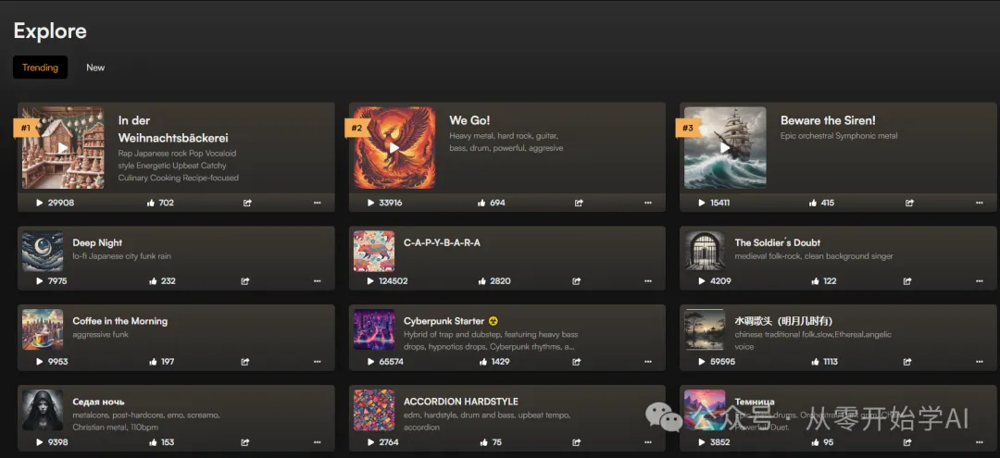
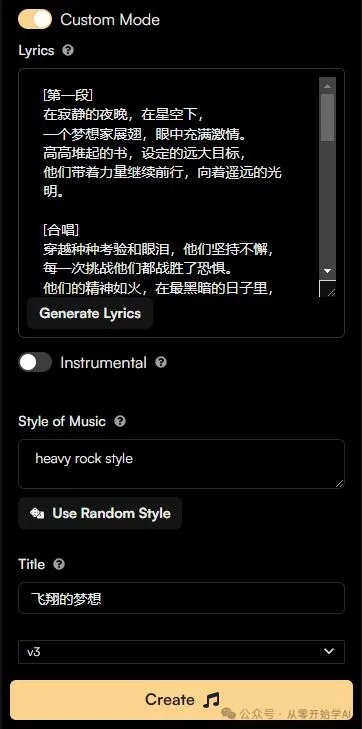
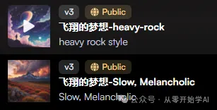

+++
title = 'Suno v3正式上线，AI音乐已来！ | 从零开始学AI learn AI from Scratch'
date = 2024-04-02T10:46:37+08:00
draft = false
categories = ['AI', 'Suno']
tags =  ['AI', 'Suno']
description = "Suno v3正式上线，AI音乐已来！在Suno，我们正在构建一个未来，在那里任何人都可以创作音乐。使用v3在几秒钟内创作完整的、长达两分钟的歌曲。更好的音频质量、更多的风格和流派、改进的提示遵从性，这是Suno v3的特性与改进。立即使用v3创作您自己的歌曲！"
keywords = ["Suno v3", "AI音乐", "Suno Explore", "Suno Create", "Suno List", "Suno v3特性", "Suno v3改进", "Suno v3使用", "音乐创作工具"]

+++

AI音乐来了，Suno v3上线！

我们到Explore页面看下

挑一些听下，还是很不错的

我们也来创作一首试试。点击Create

打开Custom Mode，输入歌词（Lyrics），歌曲风格（Style of Music），标题（Title），点击Create。

上面这些内容，歌词，歌曲风格，标题，都可以找AI帮你生成。

稍等几分钟，歌曲已生成完成

我分别生成了2种风格，一种重摇滚，一种抒情

## 不足

- 只能生成2分钟
- 音质还可再提高

---

## 介绍v3

使用v3在几秒钟内创作完整的、长达两分钟的歌曲

在Suno，我们正在构建一个未来，在那里任何人都可以创作音乐。您只需用几个简短的词就可以为任何时刻创作任何主要语言的歌曲。屡获殊荣的艺术家使用Suno，但我们的核心用户群体是那些经常是第一次尝试创作音乐的普通人。

今天，我们很高兴地介绍v3，我们的第一个能够生成广播音质音乐的模型。v3可以在几秒钟内创作完整的、长达两分钟的歌曲，现在已经向所有用户开放，网址为https://app.suno.ai。立即使用v3创作您自己的歌曲！

## 特性与改进

感谢所有的Pro和Premier会员，他们帮助我们测试和改进v3 Alpha。v3吸纳了您的反馈意见，并且具有许多改进，其中最显著的包括：

- 更好的音频质量
- 更多的风格和流派
- 改进的提示遵从性，包括更少的幻觉和更优雅的结尾

您可以使用v3制作更好的音乐，但我们还有很多工作要做。我们仍处于Suno的早期阶段，我们将继续在质量、控制和速度方面不断改进。

v4已经在开发中，我们正在全天候工作，开发一些新的、令人兴奋的功能，我们期待着很快与您分享。

## 信任与安全

Suno旨在创作原创音乐，我们的模型不识别对其他艺术家的引用。我们不是为了制造更多的伪Drake。

为了进一步防止滥用，我们开发了专有的、听不见的水印技术，可以检测出歌曲是否是使用Suno创建的。

## 社交媒体

请在社交媒体上分享您喜爱的作品，并在X、Instagram和TikTok上标记我们的账号@suno_ai_。感谢您一如既往地将我们纳入您的创作过程中。我们希望您喜欢v3，并期待着听到您的创作！

祝一切顺利，

Suno团队

---

- [官网 app](https://app.suno.ai/)
- [官网 介绍](https://www.suno.ai/blog/v3)
- 本文
    - [博客 - 从零开始学AI](https://blog.aihub2022.top/post/suno-v3-introduce/)
    - [微信 - 从零开始学AI](https://mp.weixin.qq.com/s?__biz=MzA3MDIyNTgzNA==&mid=2649976655&idx=1&sn=ebc728402403fcf0dc54e0cbf77c014a&chksm=86c7d58ab1b05c9c270da9968a270a482caea6b2bb551adaf5cec8a179cb1899b942846411bc#rd)
    - [CSDN - 从零开始学AI](https://blog.csdn.net/mahone3297/article/details/137272956)
    - [知乎 - 从零开始学AI](https://zhuanlan.zhihu.com/p/690388497)
